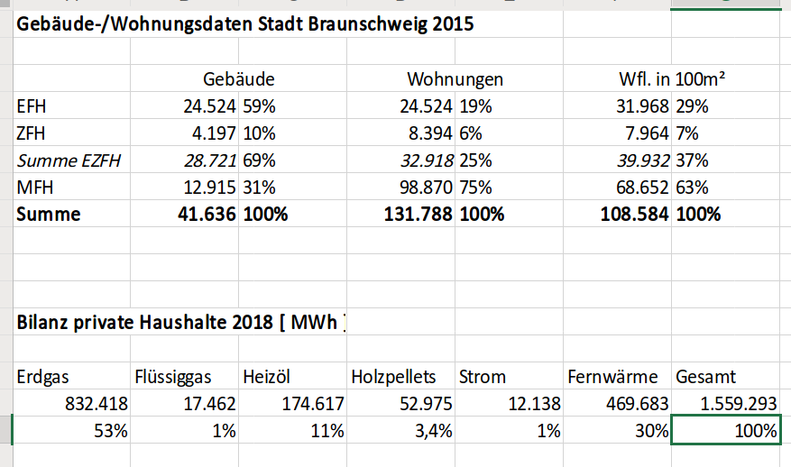

```{r setup, include=FALSE}
knitr::opts_chunk$set(echo = TRUE,message=FALSE,warning=FALSE)
```

# Part 1 - prelims

```{r}
source("/home/kbhaskar/Github_Repos/co2emissions/Braunschweig/mainCO2_braunschweig.R")
et_list <- c("erdgas","waerme","fluessiggas","heizoel","holzpellets","strom")
```

```{r}
sfh_data <- main_function("SFH" , et_list )
mfh_data <- main_function("MFH" , et_list )
```

```{r}
source("/home/kbhaskar/Github_Repos/co2emissions/Berlin/BezirkAnalysis/getCumSums.R")
```

```{r}
ET_shares_sfh <- getCumSums(sfh_data$energy_prop_table , "abrechnungsjahr")
ET_shares_mfh <- getCumSums(mfh_data$energy_prop_table , "abrechnungsjahr")
```

```{r}
require(ggplot2)
col_list <- c("royalblue4","orangered1","gray59","orange","blue","olivedrab4")
cols <- c(
          "erdgas"      = "royalblue4",
          "waerme"      = "orangered1",
          "fluessiggas" = "gray59",
          "heizoel"     = "orange",
          "holzpellets" = "blue",
          "strom"       = "olivedrab4"
          )
plot_title <- NULL
order_legend <- rev(c("erdgas","waerme","fluessiggas","heizoel","holzpellets","strom"))
order_labels <- rev(c("Erdgas","Wärme (N+F)","Flüssiggas","Heizöl","Holzpellets","Strom (D+WP)"))
et_list <- c("erdgas","waerme","fluessiggas","heizoel","holzpellets","strom")
plot_byET <- function(obj,xlabel,ylabel,plottitle,kt_to_mt=FALSE) {
  if (kt_to_mt) {
    source("/home/kbhaskar/Github_Repos/co2emissions/Berlin/BezirkAnalysis/convert_kilo_to_megaton.R")
    obj <- convert_kilo_to_megaton(obj , "abrechnungsjahr")
  }
  ggplot()+geom_line(data=obj,aes(x=abrechnungsjahr,y=get(et_list[1]),color=et_list[1]),size=5
  )+geom_line(data=obj,aes(x=abrechnungsjahr,y=get(et_list[2]),color=et_list[2])
  )+geom_line(data=obj,aes(x=abrechnungsjahr,y=get(et_list[3]),color=et_list[3])
  )+geom_line(data=obj,aes(x=abrechnungsjahr,y=get(et_list[4]),color=et_list[4])
  )+geom_line(data=obj,aes(x=abrechnungsjahr,y=get(et_list[5]),color=et_list[5])
  )+geom_line(data=obj,aes(x=abrechnungsjahr,y=get(et_list[6]),color=et_list[6])
  )+scale_color_manual(labels=order_labels,name=" ",values=cols,breaks=order_legend
  )+geom_ribbon(data=obj,aes(x=abrechnungsjahr,ymin=0,ymax=get(et_list[6])),fill=col_list[6]
  )+geom_ribbon(data=obj,aes(x=abrechnungsjahr,ymin=0,ymax=get(et_list[5])),fill=col_list[5]
  )+geom_ribbon(data=obj,aes(x=abrechnungsjahr,ymin=0,ymax=get(et_list[4])),fill=col_list[4]
  )+geom_ribbon(data=obj,aes(x=abrechnungsjahr,ymin=0,ymax=get(et_list[3])),fill=col_list[3]
  )+geom_ribbon(data=obj,aes(x=abrechnungsjahr,ymin=0,ymax=get(et_list[2])),fill=col_list[2]
  )+geom_ribbon(data=obj,aes(x=abrechnungsjahr,ymin=0,ymax=get(et_list[1])),fill=col_list[1])+theme_bw()+ labs(x=xlabel,y=ylabel,title=plottitle) + theme(
    plot.title=element_text(size=10), 
    axis.title.x=element_text(size=15, face="bold"), 
    axis.title.y = element_text(size=15, face="bold"), 
    legend.text = element_text(size=12), 
    axis.text.x=element_text(size=10,face="bold"), 
    axis.text.y=element_text(size=10,face="bold"), 
    legend.key.size=unit(2, "lines")
  )+scale_x_continuous(breaks=seq(2002,2018,2))
}
```

```{r}
plot_byET(obj = ET_shares_sfh,
          xlabel = "Jahr",
          ylabel = "ET share in %",
          plottitle = "Braunschweig, SFH")
```

```{r}
plot_byET(obj = ET_shares_mfh,
          xlabel = "Jahr",
          ylabel = "ET share in %",
          plottitle = "Braunschweig, MFH")
```

The numbers are as follows for 1-2 FH:
```{r}
sfh_data$energy_prop_table
```

```{r}
mfh_data$energy_prop_table
```


Right now the data given is as follows:



# Part 2

```{r}
names(sfh_data)
```


Plot also the specific verbrauch.

```{r}
ggplot(sfh_data$spz_verbrauch_mean , aes(x=abrechnungsjahr,y=mean_spzverbrauch))+geom_point()+ylim(c(0,190))
```

```{r}
ggplot(mfh_data$spz_verbrauch_mean , aes(x=abrechnungsjahr,y=mean_spzverbrauch))+geom_point()+ylim(c(0,170))
```


I think you should replace the specific verbrauch by its linear trebd in the main script itself - done.


You have `energy_shares_absolute` for both `gtype`.

```{r}
aes_cumsums_sfh <- getCumSums(sfh_data$energy_shares_absolute,dropCols="abrechnungsjahr")
aes_cumsums_mfh <- getCumSums(mfh_data$energy_shares_absolute,dropCols="abrechnungsjahr")
```
  
```{r}
plot_byET(obj = aes_cumsums_sfh,
          xlabel = "Jahr",
          ylabel = "ET shares in kWh",
          plottitle = "Braunschweig, SFH")
```

```{r}
plot_byET(obj = aes_cumsums_mfh,
          xlabel = "Jahr",
          ylabel = "ET shares in kWh",
          plottitle = "Braunschweig, MFH")
```

I don't like the above cumulative way of reperesenting.

I should do something like this, for each ET separately, and show as a grid:

```{r}
ggplot(mfh_data$energy_prop_table,aes(x=abrechnungsjahr,y=erdgas))+geom_point()+ylim(c(0,100))+geom_smooth(method="lm")
```

Anyway, what is the total energy consumption (MFH+SFH) split across all the ETs?

```{r}
aes_all <- sfh_data$energy_shares_absolute + mfh_data$energy_shares_absolute
aes_all$abrechnungsjahr <- 2002:2018
```

The proportions for ET in 2018:

```{r}
ET_prop_2018 <- function(obj) {
  obj_new <- obj[,  names(obj)!="abrechnungsjahr"]
  obj_new$gesamt <- rowSums(obj_new)
  for (varName in names(obj_new)){
    obj_new[[varName]] <- obj_new[[varName]]/obj_new$gesamt
  }
  return(obj_new)
}
```

```{r}
aes_all_prop <- ET_prop_2018(aes_all)
aes_sfh_prop <- ET_prop_2018(sfh_data$energy_shares_absolute)
aes_mfh_prop <- ET_prop_2018(mfh_data$energy_shares_absolute)
aes_all_prop[aes_all_prop<0] <- 0
aes_mfh_prop[aes_mfh_prop<0] <- 0
aes_sfh_prop[aes_sfh_prop<0] <- 0
aes_all_prop <- 100*aes_all_prop
aes_sfh_prop <- 100*aes_sfh_prop
aes_mfh_prop <- 100*aes_mfh_prop
aes_all_prop$abrechnungsjahr <- 2002:2018
aes_sfh_prop$abrechnungsjahr <- 2002:2018
aes_mfh_prop$abrechnungsjahr <- 2002:2018
aes_all_prop <- aes_all_prop[, c("abrechnungsjahr","erdgas","waerme","fluessiggas","heizoel","holzpellets", "strom","gesamt")]
aes_mfh_prop <- aes_all_prop[, c("abrechnungsjahr","erdgas","waerme","fluessiggas","heizoel","holzpellets", "strom","gesamt")]
aes_sfh_prop <- aes_all_prop[, c("abrechnungsjahr","erdgas","waerme","fluessiggas","heizoel","holzpellets", "strom","gesamt")]
namesCol <- c("Jahr","Erdgas","Wärme","Flüssiggas","Heizöl","Holzpellets","Strom","Gesamt")
names(aes_all_prop) <- namesCol
names(aes_sfh_prop) <- namesCol
names(aes_mfh_prop) <- namesCol
wd <- "/home/kbhaskar/Github_Repos/co2emissions/Braunschweig/"
write.csv2(aes_all_prop , file=paste0(wd,"ET_Anteile_alle.csv") , row.names=F,fileEncoding = "UTF-8")
write.csv2(aes_sfh_prop , file=paste0(wd,"ET_Anteile_1-2FH.csv") , row.names=F,fileEncoding = "UTF-8")
write.csv2(aes_mfh_prop , file=paste0(wd,"ET_Anteile_MFH.csv") , row.names=F,fileEncoding = "UTF-8")
```

