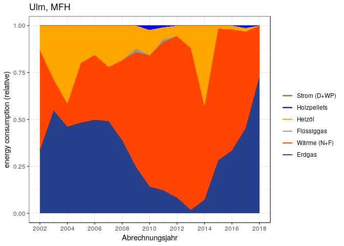
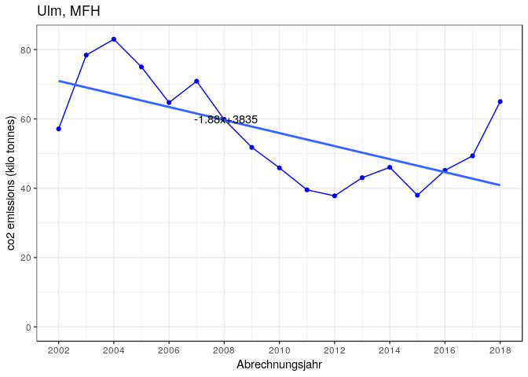
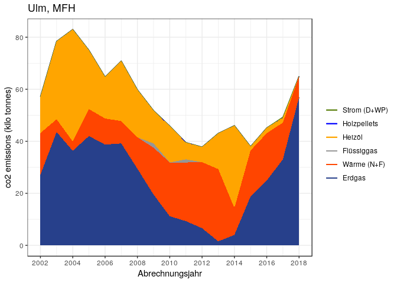
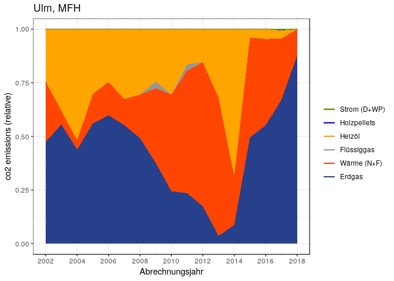
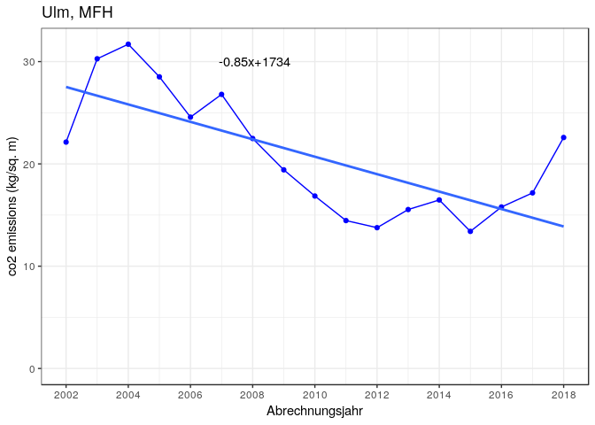
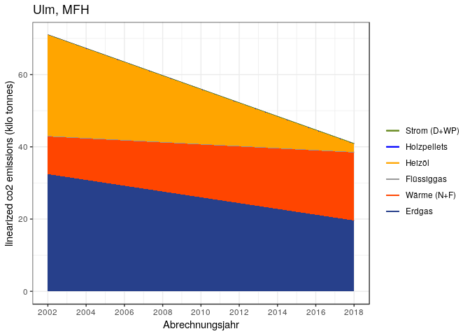
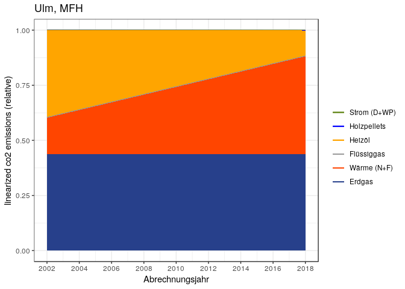

CO<sub>2</sub> emissions in Ulm for MFH buildings
================
Bhaskar Kamble and Johannes Hengstenberg
20 Februar 2019

The aim of this report is to calculate CO<sub>2</sub> emissions in the city of Ulm, Germany, caused by energy consumption for heating by MFH buildings. The calculations are primarily based on the data from [co2online](www.co2online.de). Official statistics from Ulm are also used in the calculations. The data from [co2online](www.co2online.de) is available at [my github repo](https://github.com/bhaskar-kamble/co2online_stats) as R-images.

*Notes to myself:*

-   *`Wohngebaeude 2002 - 2018.xlsx` - the sheet `result` contains data on areas for each year.*

-   *the column for `waerme` in the coefficients file refers includes both `fernmaerme` `nahwaerme`. In practice `nahwaerme` is so insignificant that it is to be neglected.*

The co2online data consists of data from different households in Germany with information on energy consumption within a specific year (`abrechnungsjahr`) and on the building (area, year of construction, fuel type etc.) Each year has a different sample and the sample size also varies from year to year. To find the CO<sub>2</sub> emissions in Ulm, we first extract the data for Ulm for 1-2FH. For each year we find the relative shares of energy produced by the different fuels. We also have the data for the energy consumed per square kilometer from the co2online data (the specific heat energy consumption). From the official statistics of Ulm we know the total heated surface area for each year. The specific heat energy consumption is multiplied with the total heated area for each year to find the total energy consumption for that. We also know the relative shares of the different fuels from the co2online data, so we know how much energy was produced by the different fuels for that year. For the same amount of energy produced, each fuel produces a different amount of CO<sub>2</sub>. This amount is given by the CO<sub>2</sub> coefficient of that fuel, whose units are kWh/g. Hence, the number of grams of CO<sub>2</sub> produced by a fuel equals the kWh of energy produced times the coefficients. Since the amount of energy produced by each fuel is known, the amount of CO<sub>2</sub> produced can be calculated.

The structure of this report is as follows:

1.  **Preliminary steps**

            1a. Get the data

            1b. Introduce some functions

            1c. Get weather data and subset the data for Ulm and 1-2FH

2.  **Absolute and relative shares of energy split according to energy sources**

            2a. Get the absolute consumption of energy split by energietraeger for each year and convert to wide format

            2b. Get the relative shares of energy consumption of each `energietraeger` per year

            2c. Find the cumulative sums of the relative shares of energy consumption according to energietraeger per year

            2d. Add linear trends to the above cumulative data

            2e. collect parameters of linear models

            2f. Plotting preparations

3.  **CO<sub>2</sub> emissions**

            3a. Find the mean spezifischer verbrauch for each year

            3b. Find the total area in Ulm - New Method from official data

            3c. Find the total energy consumption (total area times spezifischer verbrauch)

            3d. Break up the total energy consumption according to the `energietraegers`

            3e. The CO<sub>2</sub> coefficients

            3f. The CO<sub>2</sub> emissions - coefficients times energy

            3g. total CO<sub>2</sub> emissions

            3h. CO<sub>2</sub> emissions according to energietraeger (absolute value)

            3i. relative shares of CO<sub>2</sub> emissions according to energietraeger

            3j. The specific CO<sub>2</sub> emissions (CO<sub>2</sub> emitted per unit surface area)

Now the report starts.

1. Preliminary steps
--------------------

*Note to myself:*

-   *These calculations come from the `03_linearmodels.R` file in the same folder.*

### 1a. Get the data:

The R-image files used here consist of the co2online data and are also available at my github repo.

``` r
setwd("/home/kbhaskar/CO2ONLINE/co2emissions_github")
load("MFH20022018_v2.RData")
#load("SFH20022018.RData")
#In SFH20022018, abrechnungsjahr and verbrauch_gesamt_kwh are character - change then to int and numeric
#SFH20022018$abrechnungsjahr <- as.integer(SFH20022018$abrechnungsjahr)
#SFH20022018$verbrauch_gesamt_kwh <- gsub("," , "." , SFH20022018$verbrauch_gesamt_kwh)
#SFH20022018$verbrauch_gesamt_kwh <- as.numeric(SFH20022018$verbrauch_gesamt_kwh)
#SFH20022018$gtype <- "SFH"
MFH20022018$gtype <- "MFH"
```

### 1b. Introduce some functions:

``` r
find_ET_shares_by_year <- function(inputdata) {
  require(dplyr)
  by_year_ET <- group_by(inputdata,abrechnungsjahr,energietraeger)
  return(as.data.frame(summarize(by_year_ET,sum(verbrauch_gesamt_kwh))))
}

find_et_list <- function(inputdata) {
  ET_list <- unique(inputdata$energietraeger)  
  return(ET_list)
}
subset_data_by_region <- function(inputdata , region) {
  outputdata <- inputdata[inputdata$Landkreis_von_GS == region , ]
  return(outputdata)
}
readweather <- function(filename) {
  weather_data <- read.csv(filename,header=TRUE , sep=";" , dec="," )
  names(weather_data) <- c("Year","wind","sun","bedeckung","temperatur")
  no_of_years <- 17
  if (dim(weather_data)[1] != no_of_years) {
    stop("check number of years in weather data")
  }
  return(weather_data)
}
```

### 1c. Get weather data and subset the data for Ulm and MFH

*This weather data is not used at present*

``` r
weather_ulm <- readweather("ulm_weather.csv")
ulm_mfh <- subset_data_by_region(MFH20022018,"Ulm")
ulm_mfh$energietraeger[ulm_mfh$energietraeger=="fernwaerme"] <- "waerme"
ulm_mfh$energietraeger[ulm_mfh$energietraeger=="nahwaerme"] <- "waerme"
ulm_mfh$energietraeger[ulm_mfh$energietraeger=="waermepumpe"] <- "strom"
et_list <- find_et_list(ulm_mfh)
et_list
```

    ## [1] "heizoel"     "erdgas"      "waerme"      "fluessiggas" "holzpellets"
    ## [6] "strom"

A quick look into how many data are there for each year and energietraeger:

``` r
xtabs(~abrechnungsjahr , data=ulm_mfh)
```

    ## abrechnungsjahr
    ## 2002 2003 2004 2005 2006 2007 2008 2009 2010 2011 2012 2013 2014 2015 2016 
    ##   10   25   38   62   58   55   48   52   26   34   30   18    9   47   56 
    ## 2017 2018 
    ##   69    8

``` r
xtabs(~abrechnungsjahr+energietraeger , data=ulm_mfh)
```

    ##                energietraeger
    ## abrechnungsjahr erdgas fluessiggas heizoel holzpellets strom waerme
    ##            2002      5           0       2           0     0      3
    ##            2003     10           0      10           0     0      5
    ##            2004     12           0      20           0     0      6
    ##            2005     26           0      24           0     0     12
    ##            2006     27           0      19           0     0     12
    ##            2007     18           0      25           0     0     12
    ##            2008     10           0      22           0     0     16
    ##            2009     15           1      16           0     0     20
    ##            2010      5           0      10           1     0     10
    ##            2011      8           1       8           1     0     16
    ##            2012      5           0       7           0     0     18
    ##            2013      2           0       5           0     0     11
    ##            2014      3           0       1           0     0      5
    ##            2015     15           0       3           0     0     29
    ##            2016     20           0       4           0     0     32
    ##            2017     31           0       6           1     2     29
    ##            2018      5           0       0           0     0      3

2. Absolute and relative shares of energy split according to energy sources (`energietraeger`) per year
-------------------------------------------------------------------------------------------------------

### 2a. Get the absolute consumption of energy split by energietraeger for each year and convert to wide format

``` r
#get the data:
ET_shares_by_year <- find_ET_shares_by_year(ulm_mfh)
names(ET_shares_by_year) <- c("abrechnungsjahr" ,"energietraeger" ,"sum_verbrauch_gesamt_kwh")
#change to wide format
detach(package:dplyr)
library(reshape2)
ET_shares_by_year_wide <- dcast(ET_shares_by_year , abrechnungsjahr ~ energietraeger , value.var = "sum_verbrauch_gesamt_kwh")
ET_shares_by_year_wide[is.na(ET_shares_by_year_wide)]=0.0
drop_cols <- "abrechnungsjahr"
ET_shares_by_year_wide$Yearlysum <- rowSums(ET_shares_by_year_wide[ , !(names(ET_shares_by_year_wide) %in% drop_cols)])
ET_shares_by_year_wide
```

    ##    abrechnungsjahr    erdgas fluessiggas   heizoel holzpellets strom
    ## 1             2002  435181.3         0.0  170760.0           0     0
    ## 2             2003 1167290.2         0.0  612479.8           0     0
    ## 3             2004 1363042.4         0.0 1232922.5           0     0
    ## 4             2005 4013620.9         0.0 1650260.2           0     0
    ## 5             2006 3528401.9         0.0 1109717.3           0     0
    ## 6             2007 4570213.3         0.0 2055876.5           0     0
    ## 7             2008 3962688.3         0.0 1876220.6           0     0
    ## 8             2009 1633264.2    119962.7  807720.5           0     0
    ## 9             2010  651735.0         0.0  618781.0      106800     0
    ## 10            2011  887295.9     98400.0  470232.0       63750     0
    ## 11            2012  553709.4         0.0  374784.5           0     0
    ## 12            2013   70275.6         0.0  470060.6           0     0
    ## 13            2014   86108.2         0.0  512850.2           0     0
    ## 14            2015 2119889.1         0.0  127008.0           0     0
    ## 15            2016 2855733.7         0.0  177408.0           0     0
    ## 16            2017 5875756.7         0.0  251596.8      148250 18048
    ## 17            2018  831784.1         0.0       0.0           0     0
    ##     waerme Yearlysum
    ## 1   687960   1293901
    ## 2   350874   2130644
    ## 3   357918   2953883
    ## 4  2640155   8304036
    ## 5  2442196   7080315
    ## 6  2678106   9304196
    ## 7  4347249  10186158
    ## 8  4030016   6590963
    ## 9  3206628   4583944
    ## 10 5752429   7272107
    ## 11 5699915   6628408
    ## 12 3340496   3880832
    ## 13  589926   1188884
    ## 14 5268712   7515609
    ## 15 5507302   8540444
    ## 16 6640065  12933717
    ## 17  311108   1142892

Sometimes it can be that there is no data for certain years - this can happen for especially small regions. This can create an error with the command `final_prop_table$abrechnungsjahr <- 2002:2018`, hence the years must be obtained from the `ET_shares_by_year_wide` dataframe if you want to ignore the missing years.

On the other hand, if you don't want to ignore the missing years, the missing years must be filled with the average (or median, or previous value, whatever). In this case all the years (2002-2018) must be included in `years_for_which_data_exists`.\*

``` r
ignore_missing_years <- TRUE
if (ignore_missing_years) {
  years_for_which_data_exists <- ET_shares_by_year_wide$abrechnungsjahr
} else {
  years_for_which_data_exists <- 2002:2018
  #ET_shares_by_year_wide - fill in missing years by the mean
  years_present <- ET_shares_by_year_wide$abrechnungsjahr
  years_absent <- years_for_which_data_exists[!(years_for_which_data_exists %in% years_present)]
  
  for (y in years_absent) {
    dtemp <- c(y,colMeans(ET_shares_by_year_wide[ , names(ET_shares_by_year_wide)!="abrechnungsjahr"]) )
    ET_shares_by_year_wide <- rbind(ET_shares_by_year_wide , dtemp)
    #df1 <- df1[order(df1$year) , ]
  }
  ET_shares_by_year_wide <- ET_shares_by_year_wide[order(ET_shares_by_year_wide$abrechnungsjahr) , ]
}
ET_shares_by_year_wide
```

    ##    abrechnungsjahr    erdgas fluessiggas   heizoel holzpellets strom
    ## 1             2002  435181.3         0.0  170760.0           0     0
    ## 2             2003 1167290.2         0.0  612479.8           0     0
    ## 3             2004 1363042.4         0.0 1232922.5           0     0
    ## 4             2005 4013620.9         0.0 1650260.2           0     0
    ## 5             2006 3528401.9         0.0 1109717.3           0     0
    ## 6             2007 4570213.3         0.0 2055876.5           0     0
    ## 7             2008 3962688.3         0.0 1876220.6           0     0
    ## 8             2009 1633264.2    119962.7  807720.5           0     0
    ## 9             2010  651735.0         0.0  618781.0      106800     0
    ## 10            2011  887295.9     98400.0  470232.0       63750     0
    ## 11            2012  553709.4         0.0  374784.5           0     0
    ## 12            2013   70275.6         0.0  470060.6           0     0
    ## 13            2014   86108.2         0.0  512850.2           0     0
    ## 14            2015 2119889.1         0.0  127008.0           0     0
    ## 15            2016 2855733.7         0.0  177408.0           0     0
    ## 16            2017 5875756.7         0.0  251596.8      148250 18048
    ## 17            2018  831784.1         0.0       0.0           0     0
    ##     waerme Yearlysum
    ## 1   687960   1293901
    ## 2   350874   2130644
    ## 3   357918   2953883
    ## 4  2640155   8304036
    ## 5  2442196   7080315
    ## 6  2678106   9304196
    ## 7  4347249  10186158
    ## 8  4030016   6590963
    ## 9  3206628   4583944
    ## 10 5752429   7272107
    ## 11 5699915   6628408
    ## 12 3340496   3880832
    ## 13  589926   1188884
    ## 14 5268712   7515609
    ## 15 5507302   8540444
    ## 16 6640065  12933717
    ## 17  311108   1142892

### 2b. Get the relative shares of energy consumption of each `energietraeger` per year

``` r
drop_cols <- c("abrechnungsjahr","Yearlysum")
final_prop_table <- as.data.frame(sapply(ET_shares_by_year_wide[ , !(names(ET_shares_by_year_wide) %in% drop_cols)],function(obj) obj/ET_shares_by_year_wide$Yearlysum))
final_prop_table$abrechnungsjahr <- years_for_which_data_exists
```

This is what it looks like:

``` r
final_prop_table
```

    ##        erdgas fluessiggas    heizoel holzpellets       strom    waerme
    ## 1  0.33633268  0.00000000 0.13197299 0.000000000 0.000000000 0.5316943
    ## 2  0.54785791  0.00000000 0.28746231 0.000000000 0.000000000 0.1646798
    ## 3  0.46144090  0.00000000 0.41739045 0.000000000 0.000000000 0.1211686
    ## 4  0.48333375  0.00000000 0.19872989 0.000000000 0.000000000 0.3179364
    ## 5  0.49833967  0.00000000 0.15673275 0.000000000 0.000000000 0.3449276
    ## 6  0.49119918  0.00000000 0.22096230 0.000000000 0.000000000 0.2878385
    ## 7  0.38902679  0.00000000 0.18419316 0.000000000 0.000000000 0.4267801
    ## 8  0.24780357  0.01820109 0.12254969 0.000000000 0.000000000 0.6114457
    ## 9  0.14217780  0.00000000 0.13498878 0.023298716 0.000000000 0.6995347
    ## 10 0.12201360  0.01353115 0.06466241 0.008766372 0.000000000 0.7910265
    ## 11 0.08353581  0.00000000 0.05654215 0.000000000 0.000000000 0.8599220
    ## 12 0.01810838  0.00000000 0.12112367 0.000000000 0.000000000 0.8607679
    ## 13 0.07242773  0.00000000 0.43137097 0.000000000 0.000000000 0.4962013
    ## 14 0.28206483  0.00000000 0.01689923 0.000000000 0.000000000 0.7010359
    ## 15 0.33437768  0.00000000 0.02077269 0.000000000 0.000000000 0.6448496
    ## 16 0.45429761  0.00000000 0.01945278 0.011462289 0.001395423 0.5133919
    ## 17 0.72778883  0.00000000 0.00000000 0.000000000 0.000000000 0.2722112
    ##    abrechnungsjahr
    ## 1             2002
    ## 2             2003
    ## 3             2004
    ## 4             2005
    ## 5             2006
    ## 6             2007
    ## 7             2008
    ## 8             2009
    ## 9             2010
    ## 10            2011
    ## 11            2012
    ## 12            2013
    ## 13            2014
    ## 14            2015
    ## 15            2016
    ## 16            2017
    ## 17            2018

### 2c. Find the cumulative sums of the relative shares of energy consumption according to energietraeger per year

``` r
final_prop_table <- final_prop_table[,c("erdgas","waerme","fluessiggas","heizoel","holzpellets","strom","abrechnungsjahr")]
final_prop_table_cumsums <- t(apply(final_prop_table[, !(names(final_prop_table)=="abrechnungsjahr")] 
                                    , 1 , cumsum))
final_prop_table_cumsums <- as.data.frame(final_prop_table_cumsums)
final_prop_table_cumsums$abrechnungsjahr <- final_prop_table$abrechnungsjahr
final_prop_table_cumsums
```

    ##        erdgas    waerme fluessiggas   heizoel holzpellets strom
    ## 1  0.33633268 0.8680270   0.8680270 1.0000000   1.0000000     1
    ## 2  0.54785791 0.7125377   0.7125377 1.0000000   1.0000000     1
    ## 3  0.46144090 0.5826096   0.5826096 1.0000000   1.0000000     1
    ## 4  0.48333375 0.8012701   0.8012701 1.0000000   1.0000000     1
    ## 5  0.49833967 0.8432672   0.8432672 1.0000000   1.0000000     1
    ## 6  0.49119918 0.7790377   0.7790377 1.0000000   1.0000000     1
    ## 7  0.38902679 0.8158068   0.8158068 1.0000000   1.0000000     1
    ## 8  0.24780357 0.8592492   0.8774503 1.0000000   1.0000000     1
    ## 9  0.14217780 0.8417125   0.8417125 0.9767013   1.0000000     1
    ## 10 0.12201360 0.9130401   0.9265712 0.9912336   1.0000000     1
    ## 11 0.08353581 0.9434578   0.9434578 1.0000000   1.0000000     1
    ## 12 0.01810838 0.8788763   0.8788763 1.0000000   1.0000000     1
    ## 13 0.07242773 0.5686290   0.5686290 1.0000000   1.0000000     1
    ## 14 0.28206483 0.9831008   0.9831008 1.0000000   1.0000000     1
    ## 15 0.33437768 0.9792273   0.9792273 1.0000000   1.0000000     1
    ## 16 0.45429761 0.9676895   0.9676895 0.9871423   0.9986046     1
    ## 17 0.72778883 1.0000000   1.0000000 1.0000000   1.0000000     1
    ##    abrechnungsjahr
    ## 1             2002
    ## 2             2003
    ## 3             2004
    ## 4             2005
    ## 5             2006
    ## 6             2007
    ## 7             2008
    ## 8             2009
    ## 9             2010
    ## 10            2011
    ## 11            2012
    ## 12            2013
    ## 13            2014
    ## 14            2015
    ## 15            2016
    ## 16            2017
    ## 17            2018

### 2d. Add linear trends to the above cumulative data

``` r
et_list <- names(final_prop_table_cumsums)[names(final_prop_table_cumsums)!="abrechnungsjahr"]
storage <- list()
for (et in et_list) {
  storage[[et]] <- lm(get(et) ~ abrechnungsjahr , data = final_prop_table_cumsums)
}
for (et in et_list) {
  colname <- paste0(et,"_lm")
  final_prop_table_cumsums[[colname]] <- predict(storage[[et]] , newdata = final_prop_table_cumsums)
}#in the predictions, replace any negative numbers by zeros
#final_prop_table_cumsums
```

### 2e. collect parameters of linear models

``` r
slopes <- NULL
intercepts <- NULL
for (et in et_list) {
  intercepts <- c(intercepts , as.numeric(coefficients(storage[[et]])[1]))
  slopes <- c(slopes , as.numeric(coefficients(storage[[et]])[2]))
}
```

### 2f. Plotting preparations

Define the color scheme and plot title:

``` r
datawide <- final_prop_table_cumsums
col_list <- c("royalblue4","orangered1","gray59","orange","blue","olivedrab4")
cols <- c(
          "erdgas"      = "royalblue4",
          "waerme"      = "orangered1",
          "fluessiggas" = "gray59",
          "heizoel"     = "orange",
          "holzpellets" = "blue",
          "strom"       = "olivedrab4"
          )
plot_title <- "Ulm, MFH"
order_legend <- rev(c("erdgas","waerme","fluessiggas","heizoel","holzpellets","strom"))
order_labels <- rev(c("Erdgas","Wärme (N+F)","Flüssiggas","Heizöl","Holzpellets","Strom (D+WP)"))
```

Test plot:

    require(ggplot2)
    ggplot()+geom_point(data=datawide,aes(x=abrechnungsjahr,y=get(et_list[1]),color=et_list[1])
    )+geom_point(data=datawide,aes(x=abrechnungsjahr,y=get(et_list[2]),color=et_list[2])
    )+geom_point(data=datawide,aes(x=abrechnungsjahr,y=get(et_list[3]),color=et_list[3])
    )+geom_point(data=datawide,aes(x=abrechnungsjahr,y=get(et_list[4]),color=et_list[4])
    )+geom_point(data=datawide,aes(x=abrechnungsjahr,y=get(et_list[5]),color=et_list[5])
    )+geom_point(data=datawide,aes(x=abrechnungsjahr,y=get(et_list[6]),color=et_list[6])
    )+geom_abline(intercept=intercepts[1],slope=slopes[1],colour=col_list[1]
    )+geom_abline(intercept=intercepts[2],slope=slopes[2],colour=col_list[2]
    )+geom_abline(intercept=intercepts[3],slope=slopes[3],colour=col_list[3]
    )+geom_abline(intercept=intercepts[4],slope=slopes[4],colour=col_list[4]
    )+geom_abline(intercept=intercepts[5],slope=slopes[5],colour=col_list[5]
    )+geom_abline(intercept=intercepts[6],slope=slopes[6],colour=col_list[6])+labs(
    x="Abrechnungsjahr",y="energy consumption (relative)",title=plot_title
    )+scale_color_manual(labels=order_labels, name=" ",values=cols,breaks=order_legend
    ) + theme_bw()+scale_x_continuous(breaks=seq(2002,2018,2))

#### Save some of the graphs

#### Cumulative Energietraeger Anteile, simple line-plot:

    ggplot()+geom_line(data=datawide,aes(x=abrechnungsjahr,y=get(et_list[1]),color=et_list[1])
    )+geom_line(data=datawide,aes(x=abrechnungsjahr,y=get(et_list[2]),color=et_list[2])
    )+geom_line(data=datawide,aes(x=abrechnungsjahr,y=get(et_list[3]),color=et_list[3])
    )+geom_line(data=datawide,aes(x=abrechnungsjahr,y=get(et_list[4]),color=et_list[4])
    )+geom_line(data=datawide,aes(x=abrechnungsjahr,y=get(et_list[5]),color=et_list[5])
    )+geom_line(data=datawide,aes(x=abrechnungsjahr,y=get(et_list[6]),color=et_list[6])
    )+scale_color_manual(labels=order_labels,name="legend",values=cols,breaks=order_legend) + labs(
    x="Abrechnungsjahr",y="energy consumption (relative)",title=plot_title)+theme_bw(
    )+scale_x_continuous(breaks=seq(2002,2018,2))

#### Cumulative Energietraeger Anteile, filled plot:

``` r
require(ggplot2)
ggplot()+geom_line(data=datawide,aes(x=abrechnungsjahr,y=get(et_list[1]),color=et_list[1])
)+geom_line(data=datawide,aes(x=abrechnungsjahr,y=get(et_list[2]),color=et_list[2])
)+geom_line(data=datawide,aes(x=abrechnungsjahr,y=get(et_list[3]),color=et_list[3])
)+geom_line(data=datawide,aes(x=abrechnungsjahr,y=get(et_list[4]),color=et_list[4])
)+geom_line(data=datawide,aes(x=abrechnungsjahr,y=get(et_list[5]),color=et_list[5])
)+geom_line(data=datawide,aes(x=abrechnungsjahr,y=get(et_list[6]),color=et_list[6])
)+scale_color_manual(labels=order_labels,name=" ",values=cols,breaks=order_legend
)+geom_ribbon(data=datawide,aes(x=abrechnungsjahr,ymin=0,ymax=get(et_list[6])),fill=col_list[6]
)+geom_ribbon(data=datawide,aes(x=abrechnungsjahr,ymin=0,ymax=get(et_list[5])),fill=col_list[5]
)+geom_ribbon(data=datawide,aes(x=abrechnungsjahr,ymin=0,ymax=get(et_list[4])),fill=col_list[4]
)+geom_ribbon(data=datawide,aes(x=abrechnungsjahr,ymin=0,ymax=get(et_list[3])),fill=col_list[3]
)+geom_ribbon(data=datawide,aes(x=abrechnungsjahr,ymin=0,ymax=get(et_list[2])),fill=col_list[2]
)+geom_ribbon(data=datawide,aes(x=abrechnungsjahr,ymin=0,ymax=get(et_list[1])),fill=col_list[1])+theme_bw()+ labs(x="Abrechnungsjahr",y="energy consumption (relative)",title=plot_title
)+scale_x_continuous(breaks=seq(2002,2018,2))
```



3. Now for the CO<sub>2</sub> emissions
---------------------------------------

### 3a. Find the mean spezifischer verbrauch for each year

**Important point: Take the `witterungsbereinigter spezifischer Verbrauch` in the next iteration instead of the raw numbers. Right I've just taken the raw numbers in the first iteration**

``` r
# point - take it for the witterungsbereinigt
#ulm_sfh_omit2018 <- ulm_sfh[ulm_sfh$abrechnungsjahr!=2018 , ]
#detach(package:ggplot2)
#detach(package:dplyr)
#detach(package:reshape2)
library(dplyr)
by_year <- group_by(ulm_mfh , abrechnungsjahr)
spz_verbrauch_mean <- as.data.frame(summarize(by_year,mean(verbrauch_gesamt_kwh_spez)))
names(spz_verbrauch_mean) <- c("abrechnungsjahr" , "mean_spz_verberauch")
#nutzflaeche_mean <- as.data.frame(summarize(by_year,mean(gebaeude_nutzflaeche)))
#names(nutzflaeche_mean) <- c("abrechnungsjahr" , "mean_nutzflaeche")
```

``` r
spz_verbrauch_mean
```

    ##    abrechnungsjahr mean_spz_verberauch
    ## 1             2002            153.9220
    ## 2             2003            151.2400
    ## 3             2004            148.2050
    ## 4             2005            162.7932
    ## 5             2006            145.3407
    ## 6             2007            148.5733
    ## 7             2008            140.1648
    ## 8             2009            145.3956
    ## 9             2010            142.7931
    ## 10            2011            137.3097
    ## 11            2012            141.3923
    ## 12            2013            153.2144
    ## 13            2014             98.1400
    ## 14            2015            117.0619
    ## 15            2016            129.6289
    ## 16            2017            125.9497
    ## 17            2018            135.2363

### 3b. Find the total area in Ulm - New Method from official data

`Wohngebaeude 2002 - 2018.xlsx` - the sheet `result` contains data on areas for each year. I saved this file as `Ulm_wohngebaeude_zahl_flaeche.csv`.

``` r
totalArea <- read.csv("Ulm_wohngebaeude_zahl_flaeche.csv",sep=";")
totalArea <- totalArea[ , c("Year","Flaeche_MFH")]
names(totalArea) <-  c("abrechnungsjahr","totArea")
totalArea <- totalArea[totalArea$abrechnungsjahr %in% years_for_which_data_exists , ]
totalArea
```

    ##    abrechnungsjahr totArea
    ## 1             2002 2580565
    ## 2             2003 2589870
    ## 3             2004 2617947
    ## 4             2005 2630320
    ## 5             2006 2633741
    ## 6             2007 2644747
    ## 7             2008 2659865
    ## 8             2009 2666740
    ## 9             2010 2721233
    ## 10            2011 2733644
    ## 11            2012 2745996
    ## 12            2013 2770454
    ## 13            2014 2793908
    ## 14            2015 2834013
    ## 15            2016 2860302
    ## 16            2017 2873963
    ## 17            2018 2878640

### 3c. Find the total energy consumption (total area times spezifischer verbrauch)

``` r
totalConsumption <- data.frame(abrechnungsjahr = years_for_which_data_exists , gesamtVerbrauch = totalArea$totArea*spz_verbrauch_mean$mean_spz_verberauch)
totalConsumption$inTWh <- totalConsumption$gesamtVerbrauch/1e9
totalConsumption
```

    ##    abrechnungsjahr gesamtVerbrauch     inTWh
    ## 1             2002       397205726 0.3972057
    ## 2             2003       391691939 0.3916919
    ## 3             2004       387992835 0.3879928
    ## 4             2005       428198278 0.4281983
    ## 5             2006       382789733 0.3827897
    ## 6             2007       392938717 0.3929387
    ## 7             2008       372819424 0.3728194
    ## 8             2009       387732201 0.3877322
    ## 9             2010       388573233 0.3885732
    ## 10            2011       375355854 0.3753559
    ## 11            2012       388262782 0.3882628
    ## 12            2013       424473570 0.4244736
    ## 13            2014       274194131 0.2741941
    ## 14            2015       331754989 0.3317550
    ## 15            2016       370777884 0.3707779
    ## 16            2017       361974807 0.3619748
    ## 17            2018       389296479 0.3892965

``` r
#ggplot()+geom_point(data=totalConsumption,aes(x=abrechnungsjahr,y=gesamtVerbrauch))+theme_bw()+labs(y="Energy consumption in kWh")
#ggplot()+geom_point(data=totalConsumption,aes(x=abrechnungsjahr,y=inTWh))+theme_bw()+labs(y="Energy consumption in TWh")
```

### 3d. Break up the total energy consumption according to the `energietraegers`

The shares are in the `final_prop_table`.

``` r
#final_prop_table_omit2018 <- final_prop_table[final_prop_table$abrechnungsjahr!=2018 , ]
is_not_year <- names(final_prop_table) != "abrechnungsjahr"
energy_shares_absolute <- totalConsumption$gesamtVerbrauch * final_prop_table[,is_not_year]
energy_shares_absolute$abrechnungsjahr <- years_for_which_data_exists
energy_shares_absolute
```

    ##       erdgas    waerme fluessiggas   heizoel holzpellets    strom
    ## 1  133593266 211192032           0  52420428           0      0.0
    ## 2  214591528  64503744           0 112596668           0      0.0
    ## 3  179035765  47012567           0 161944503           0      0.0
    ## 4  206962679 136139801           0  85095798           0      0.0
    ## 5  190759308 132034737           0  59995688           0      0.0
    ## 6  193011174 113102901           0  86824642           0      0.0
    ## 7  145036743 159111892           0  68670789           0      0.0
    ## 8   96081423 237077169     7057149  47516460           0      0.0
    ## 9   55246487 271820461           0  52453028     9053257      0.0
    ## 10  45798518 296916414     5078998  24271415     3290509      0.0
    ## 11  32433845 333875724           0  21953213           0      0.0
    ## 12   7686530 365373244           0  51413796           0      0.0
    ## 13  19859258 136055483           0 118279390           0      0.0
    ## 14  93576416 232572169           0   5606403           0      0.0
    ## 15 123979847 239095982           0   7702054           0      0.0
    ## 16 164444291 185834931           0   7041418     4149060 505107.8
    ## 17 283325630 105970849           0         0           0      0.0
    ##    abrechnungsjahr
    ## 1             2002
    ## 2             2003
    ## 3             2004
    ## 4             2005
    ## 5             2006
    ## 6             2007
    ## 7             2008
    ## 8             2009
    ## 9             2010
    ## 10            2011
    ## 11            2012
    ## 12            2013
    ## 13            2014
    ## 14            2015
    ## 15            2016
    ## 16            2017
    ## 17            2018

### 3e. The CO<sub>2</sub> coefficients

I'm using the preliminary coefficients from <https://www.dropbox.com/s/j63ednj6tmzakou/4.3.2.15.3.%20CO2-Koeffizienten%202018.xlsx?dl=0>

I've saved the above as `MunichCO2Koeffizienten.txt`.

``` r
co2_coeff <- read.table("UlmCO2Koeffizienten.txt",header=TRUE)
names(co2_coeff) <- c("abrechnungsjahr","erdgas","waerme","fluessiggas","heizoel","holzpellets","strom")
co2_coeff
```

    ##    abrechnungsjahr erdgas waerme fluessiggas heizoel holzpellets strom
    ## 1             2002    203     76         230     266           6   654
    ## 2             2003    203     76         230     266           6   635
    ## 3             2004    203     76         230     266           6   615
    ## 4             2005    203     76         230     266           6   611
    ## 5             2006    203     76         230     266           6   604
    ## 6             2007    203     76         230     266           6   623
    ## 7             2008    203     76         230     266           6   584
    ## 8             2009    203     76         230     266           6   569
    ## 9             2010    203     76         234     266           6   559
    ## 10            2011    203     76         234     266           6   569
    ## 11            2012    203     76         234     266           6   574
    ## 12            2013    202     76         231     267           6   573
    ## 13            2014    201     76         229     268           6   559
    ## 14            2015    201     76         230     268           6   528
    ## 15            2016    201     76         230     268           6   516
    ## 16            2017    201     76         230     268           6   489
    ## 17            2018    201     76         230     268           6   467

The units for the above coefficients are *g*/*k**W**h*.

### 3f. The CO<sub>2</sub> emissions - coefficients × energy

``` r
names(co2_coeff)
```

    ## [1] "abrechnungsjahr" "erdgas"          "waerme"          "fluessiggas"    
    ## [5] "heizoel"         "holzpellets"     "strom"

``` r
names(energy_shares_absolute)
```

    ## [1] "erdgas"          "waerme"          "fluessiggas"     "heizoel"        
    ## [5] "holzpellets"     "strom"           "abrechnungsjahr"

The names of columns common to `co2_coeff` and `energy_shares_absolute` must be the same. The above command lets you check this. Next, extract only the common columns from `co2_coeff` and retain only the years which are present in the data

``` r
co2_coeff_subset <- co2_coeff[ , names(co2_coeff) %in% names(energy_shares_absolute)]
co2_coeff_subset <- co2_coeff_subset[co2_coeff_subset$abrechnungsjahr %in% years_for_which_data_exists , ]
co2_coeff_subset
```

    ##    abrechnungsjahr erdgas waerme fluessiggas heizoel holzpellets strom
    ## 1             2002    203     76         230     266           6   654
    ## 2             2003    203     76         230     266           6   635
    ## 3             2004    203     76         230     266           6   615
    ## 4             2005    203     76         230     266           6   611
    ## 5             2006    203     76         230     266           6   604
    ## 6             2007    203     76         230     266           6   623
    ## 7             2008    203     76         230     266           6   584
    ## 8             2009    203     76         230     266           6   569
    ## 9             2010    203     76         234     266           6   559
    ## 10            2011    203     76         234     266           6   569
    ## 11            2012    203     76         234     266           6   574
    ## 12            2013    202     76         231     267           6   573
    ## 13            2014    201     76         229     268           6   559
    ## 14            2015    201     76         230     268           6   528
    ## 15            2016    201     76         230     268           6   516
    ## 16            2017    201     76         230     268           6   489
    ## 17            2018    201     76         230     268           6   467

An now you have to multiply the coefficents with the energy consumption:

``` r
###########multiply coefficients with energy consumption##################
# IT is very important that the names of the variables be the same (not 
#necessarily in the same order, but for example the erdgas in both should 
#be named erdgas, and not erdgas in one and Erdgas in another) in the 
#coefficients file and the consumption (energy_shares_absolute) file
#make same names:
#names(energy_shares_absolute)[names(energy_shares_absolute)=="fernwaerme"] <- "waerme"
#same names made
energy_shares_absolute_matchcoeff <- energy_shares_absolute[,names(co2_coeff_subset)]
energy_shares_absolute_matchcoeff
```

    ##    abrechnungsjahr    erdgas    waerme fluessiggas   heizoel holzpellets
    ## 1             2002 133593266 211192032           0  52420428           0
    ## 2             2003 214591528  64503744           0 112596668           0
    ## 3             2004 179035765  47012567           0 161944503           0
    ## 4             2005 206962679 136139801           0  85095798           0
    ## 5             2006 190759308 132034737           0  59995688           0
    ## 6             2007 193011174 113102901           0  86824642           0
    ## 7             2008 145036743 159111892           0  68670789           0
    ## 8             2009  96081423 237077169     7057149  47516460           0
    ## 9             2010  55246487 271820461           0  52453028     9053257
    ## 10            2011  45798518 296916414     5078998  24271415     3290509
    ## 11            2012  32433845 333875724           0  21953213           0
    ## 12            2013   7686530 365373244           0  51413796           0
    ## 13            2014  19859258 136055483           0 118279390           0
    ## 14            2015  93576416 232572169           0   5606403           0
    ## 15            2016 123979847 239095982           0   7702054           0
    ## 16            2017 164444291 185834931           0   7041418     4149060
    ## 17            2018 283325630 105970849           0         0           0
    ##       strom
    ## 1       0.0
    ## 2       0.0
    ## 3       0.0
    ## 4       0.0
    ## 5       0.0
    ## 6       0.0
    ## 7       0.0
    ## 8       0.0
    ## 9       0.0
    ## 10      0.0
    ## 11      0.0
    ## 12      0.0
    ## 13      0.0
    ## 14      0.0
    ## 15      0.0
    ## 16 505107.8
    ## 17      0.0

``` r
co2_emissions <- (energy_shares_absolute_matchcoeff[,
          names(energy_shares_absolute_matchcoeff)!="abrechnungsjahr"])*co2_coeff_subset[,names(co2_coeff_subset)!="abrechnungsjahr"]
co2_emissions
```

    ##         erdgas      waerme fluessiggas     heizoel holzpellets     strom
    ## 1  27119432939 16050594439           0 13943833882           0         0
    ## 2  43562080114  4902284508           0 29950713588           0         0
    ## 3  36344260204  3572955127           0 43077237832           0         0
    ## 4  42013423761 10346624879           0 22635482277           0         0
    ## 5  38724139471 10034640043           0 15958853052           0         0
    ## 6  39181268352  8595820495           0 23095354753           0         0
    ## 7  29442458760 12092503824           0 18266429741           0         0
    ## 8  19504528856 18017864832  1623144273 12639378364           0         0
    ## 9  11215036762 20658355072           0 13952505349    54319545         0
    ## 10  9297099062 22565647451  1188485472  6456196472    19743055         0
    ## 11  6584070487 25374555004           0  5839554729           0         0
    ## 12  1552679133 27768366530           0 13727483608           0         0
    ## 13  3991710901 10340216726           0 31698876432           0         0
    ## 14 18808859607 17675484870           0  1502516087           0         0
    ## 15 24919949346 18171294609           0  2064150595           0         0
    ## 16 33053302414 14123454750           0  1887099937    24894359 246997714
    ## 17 56948451646  8053784495           0           0           0         0

The above answer is in grams. Divide by 1e9 to get the answer in kilo tonnes.

``` r
co2_emissions_in_kilo_tons <- co2_emissions/1e9
co2_emissions_in_kilo_tons$abrechnungsjahr <- years_for_which_data_exists
co2_emissions_in_kilo_tons$total <- rowSums(co2_emissions_in_kilo_tons[,names(co2_emissions_in_kilo_tons)!="abrechnungsjahr"])
co2_emissions_in_kilo_tons
```

    ##       erdgas    waerme fluessiggas   heizoel holzpellets     strom
    ## 1  27.119433 16.050594    0.000000 13.943834  0.00000000 0.0000000
    ## 2  43.562080  4.902285    0.000000 29.950714  0.00000000 0.0000000
    ## 3  36.344260  3.572955    0.000000 43.077238  0.00000000 0.0000000
    ## 4  42.013424 10.346625    0.000000 22.635482  0.00000000 0.0000000
    ## 5  38.724139 10.034640    0.000000 15.958853  0.00000000 0.0000000
    ## 6  39.181268  8.595820    0.000000 23.095355  0.00000000 0.0000000
    ## 7  29.442459 12.092504    0.000000 18.266430  0.00000000 0.0000000
    ## 8  19.504529 18.017865    1.623144 12.639378  0.00000000 0.0000000
    ## 9  11.215037 20.658355    0.000000 13.952505  0.05431954 0.0000000
    ## 10  9.297099 22.565647    1.188485  6.456196  0.01974306 0.0000000
    ## 11  6.584070 25.374555    0.000000  5.839555  0.00000000 0.0000000
    ## 12  1.552679 27.768367    0.000000 13.727484  0.00000000 0.0000000
    ## 13  3.991711 10.340217    0.000000 31.698876  0.00000000 0.0000000
    ## 14 18.808860 17.675485    0.000000  1.502516  0.00000000 0.0000000
    ## 15 24.919949 18.171295    0.000000  2.064151  0.00000000 0.0000000
    ## 16 33.053302 14.123455    0.000000  1.887100  0.02489436 0.2469977
    ## 17 56.948452  8.053784    0.000000  0.000000  0.00000000 0.0000000
    ##    abrechnungsjahr    total
    ## 1             2002 57.11386
    ## 2             2003 78.41508
    ## 3             2004 82.99445
    ## 4             2005 74.99553
    ## 5             2006 64.71763
    ## 6             2007 70.87244
    ## 7             2008 59.80139
    ## 8             2009 51.78492
    ## 9             2010 45.88022
    ## 10            2011 39.52717
    ## 11            2012 37.79818
    ## 12            2013 43.04853
    ## 13            2014 46.03080
    ## 14            2015 37.98686
    ## 15            2016 45.15539
    ## 16            2017 49.33575
    ## 17            2018 65.00224

### 3g. Total CO<sub>2</sub> emissions

``` r
linmod <- lm(data=co2_emissions_in_kilo_tons,formula=total~abrechnungsjahr)
a <- as.numeric(coefficients(linmod)[1])
b <- as.numeric(coefficients(linmod)[2])
if (a<0) {
  asign <- " "
} else {asign <- "+"}
if (b<0) {
  bsign <- " "
} else {bsign <- " "}
ggplot()+geom_line(data=co2_emissions_in_kilo_tons,aes(x=abrechnungsjahr,y=total),color="blue")+geom_point(data=co2_emissions_in_kilo_tons,aes(x=abrechnungsjahr,y=total),color="blue")+theme_bw()+labs(x="Abrechnungsjahr",y="co2 emissions (kilo tonnes)",title=plot_title)+ylim(0,max(co2_emissions_in_kilo_tons$total))+geom_smooth(method="lm",data=co2_emissions_in_kilo_tons,aes(x=abrechnungsjahr,y=total),se=FALSE)+annotate(geom="text",label=paste0(bsign,as.character(round(b,2)),"x",asign,as.character(round(a,0))),x=2008,y=60)+scale_x_continuous(breaks=seq(2002,2018,2))
```



``` r
#https://stackoverflow.com/questions/15633714/adding-a-regression-line-on-a-ggplot  
#ggsave("total_co2_emission.jpg")
```

### 3h. CO<sub>2</sub> emissions according to energietraeger (absolute value):

``` r
co2cumsums <- co2_emissions_in_kilo_tons
#co2cumsums <- co2cumsums[,c("abrechnungsjahr","holzpellets","strom","fluessiggas","erdgas","heizoel")]
co2cumsums <- as.data.frame(t(apply(co2cumsums[,!(names(co2cumsums)%in%c("abrechnungsjahr","total"))],1,cumsum)))
co2cumsums$abrechnungsjahr <- years_for_which_data_exists
co2cumsums
```

    ##       erdgas   waerme fluessiggas  heizoel holzpellets    strom
    ## 1  27.119433 43.17003    43.17003 57.11386    57.11386 57.11386
    ## 2  43.562080 48.46436    48.46436 78.41508    78.41508 78.41508
    ## 3  36.344260 39.91722    39.91722 82.99445    82.99445 82.99445
    ## 4  42.013424 52.36005    52.36005 74.99553    74.99553 74.99553
    ## 5  38.724139 48.75878    48.75878 64.71763    64.71763 64.71763
    ## 6  39.181268 47.77709    47.77709 70.87244    70.87244 70.87244
    ## 7  29.442459 41.53496    41.53496 59.80139    59.80139 59.80139
    ## 8  19.504529 37.52239    39.14554 51.78492    51.78492 51.78492
    ## 9  11.215037 31.87339    31.87339 45.82590    45.88022 45.88022
    ## 10  9.297099 31.86275    33.05123 39.50743    39.52717 39.52717
    ## 11  6.584070 31.95863    31.95863 37.79818    37.79818 37.79818
    ## 12  1.552679 29.32105    29.32105 43.04853    43.04853 43.04853
    ## 13  3.991711 14.33193    14.33193 46.03080    46.03080 46.03080
    ## 14 18.808860 36.48434    36.48434 37.98686    37.98686 37.98686
    ## 15 24.919949 43.09124    43.09124 45.15539    45.15539 45.15539
    ## 16 33.053302 47.17676    47.17676 49.06386    49.08875 49.33575
    ## 17 56.948452 65.00224    65.00224 65.00224    65.00224 65.00224
    ##    abrechnungsjahr
    ## 1             2002
    ## 2             2003
    ## 3             2004
    ## 4             2005
    ## 5             2006
    ## 6             2007
    ## 7             2008
    ## 8             2009
    ## 9             2010
    ## 10            2011
    ## 11            2012
    ## 12            2013
    ## 13            2014
    ## 14            2015
    ## 15            2016
    ## 16            2017
    ## 17            2018

##### simple line curve:

    ggplot()+geom_line(data=co2cumsums,aes(x=abrechnungsjahr,y=get(et_list[1]),color=et_list[1])
    )+geom_line(data=co2cumsums,aes(x=abrechnungsjahr,y=get(et_list[2]),color=et_list[2])
    )+geom_line(data=co2cumsums,aes(x=abrechnungsjahr,y=get(et_list[3]),color=et_list[3])
    )+geom_line(data=co2cumsums,aes(x=abrechnungsjahr,y=get(et_list[4]),color=et_list[4])
    )+geom_line(data=co2cumsums,aes(x=abrechnungsjahr,y=get(et_list[5]),color=et_list[5])
    )+geom_line(data=co2cumsums,aes(x=abrechnungsjahr,y=get(et_list[6]),color=et_list[6])
    )+scale_color_manual(labels=order_labels,name="legend",values=cols,breaks=order_legend) + labs(x="Abrechnungsjahr",y="co2 emissions (kilo tonnes)",title=plot_title)+theme_bw()+scale_x_continuous(breaks=seq(2002,2018,2))

##### filled graph:

``` r
ggplot()+geom_line(data=co2cumsums,aes(x=abrechnungsjahr,y=get(et_list[1]),color=et_list[1])
)+geom_line(data=co2cumsums,aes(x=abrechnungsjahr,y=get(et_list[2]),color=et_list[2])
)+geom_line(data=co2cumsums,aes(x=abrechnungsjahr,y=get(et_list[3]),color=et_list[3])
)+geom_line(data=co2cumsums,aes(x=abrechnungsjahr,y=get(et_list[4]),color=et_list[4])
)+geom_line(data=co2cumsums,aes(x=abrechnungsjahr,y=get(et_list[5]),color=et_list[5])
)+geom_line(data=co2cumsums,aes(x=abrechnungsjahr,y=get(et_list[6]),color=et_list[6])
)+scale_color_manual(labels=order_labels,name=" ",values=cols,breaks=order_legend
)+geom_ribbon(data=co2cumsums,aes(x=abrechnungsjahr,ymin=0,ymax=get(et_list[6])),fill=col_list[6]
)+geom_ribbon(data=co2cumsums,aes(x=abrechnungsjahr,ymin=0,ymax=get(et_list[5])),fill=col_list[5]
)+geom_ribbon(data=co2cumsums,aes(x=abrechnungsjahr,ymin=0,ymax=get(et_list[4])),fill=col_list[4]
)+geom_ribbon(data=co2cumsums,aes(x=abrechnungsjahr,ymin=0,ymax=get(et_list[3])),fill=col_list[3]
)+geom_ribbon(data=co2cumsums,aes(x=abrechnungsjahr,ymin=0,ymax=get(et_list[2])),fill=col_list[2]
)+geom_ribbon(data=co2cumsums,aes(x=abrechnungsjahr,ymin=0,ymax=get(et_list[1])),fill=col_list[1]
)+theme_bw()+ labs(x="Abrechnungsjahr",y="co2 emissions (kilo tonnes)",title=plot_title)+scale_x_continuous(breaks=seq(2002,2018,2))
```



``` r
#ggsave("co2emissions_absolute.jpg")
```

### 3i. relative shares of CO<sub>2</sub> emissions according to energietraeger

**do the witterungsbereinigung later. 1. first address these issues: Area in 2018 (see email from Johannes) and 2. the skype chat regarding waerme, fernwaerme and nahwaerme and 3. linearizing the graphs**

``` r
co2anteile_cumsums <- as.data.frame(sapply(co2cumsums[,names(co2cumsums)!="abrechnungsjahr"] , function(obj) obj/co2cumsums$strom))
co2anteile_cumsums$abrechnungsjahr <- years_for_which_data_exists
co2anteile_cumsums
```

    ##        erdgas    waerme fluessiggas   heizoel holzpellets strom
    ## 1  0.47483102 0.7558590   0.7558590 1.0000000   1.0000000     1
    ## 2  0.55553193 0.6180491   0.6180491 1.0000000   1.0000000     1
    ## 3  0.43791192 0.4809624   0.4809624 1.0000000   1.0000000     1
    ## 4  0.56021237 0.6981756   0.6981756 1.0000000   1.0000000     1
    ## 5  0.59835532 0.7534080   0.7534080 1.0000000   1.0000000     1
    ## 6  0.55284207 0.6741279   0.6741279 1.0000000   1.0000000     1
    ## 7  0.49233735 0.6945484   0.6945484 1.0000000   1.0000000     1
    ## 8  0.37664498 0.7245815   0.7559255 1.0000000   1.0000000     1
    ## 9  0.24444167 0.6947088   0.6947088 0.9988161   1.0000000     1
    ## 10 0.23520780 0.8060973   0.8361649 0.9995005   1.0000000     1
    ## 11 0.17419014 0.8455070   0.8455070 1.0000000   1.0000000     1
    ## 12 0.03606811 0.6811161   0.6811161 1.0000000   1.0000000     1
    ## 13 0.08671825 0.3113551   0.3113551 1.0000000   1.0000000     1
    ## 14 0.49514120 0.9604464   0.9604464 1.0000000   1.0000000     1
    ## 15 0.55187092 0.9542878   0.9542878 1.0000000   1.0000000     1
    ## 16 0.66996657 0.9562388   0.9562388 0.9944889   0.9949935     1
    ## 17 0.87609989 1.0000000   1.0000000 1.0000000   1.0000000     1
    ##    abrechnungsjahr
    ## 1             2002
    ## 2             2003
    ## 3             2004
    ## 4             2005
    ## 5             2006
    ## 6             2007
    ## 7             2008
    ## 8             2009
    ## 9             2010
    ## 10            2011
    ## 11            2012
    ## 12            2013
    ## 13            2014
    ## 14            2015
    ## 15            2016
    ## 16            2017
    ## 17            2018

``` r
ggplot()+geom_line(data=co2anteile_cumsums,aes(x=abrechnungsjahr,y=get(et_list[1]),color=et_list[1])
)+geom_line(data=co2anteile_cumsums,aes(x=abrechnungsjahr,y=get(et_list[2]),color=et_list[2])
)+geom_line(data=co2anteile_cumsums,aes(x=abrechnungsjahr,y=get(et_list[3]),color=et_list[3])
)+geom_line(data=co2anteile_cumsums,aes(x=abrechnungsjahr,y=get(et_list[4]),color=et_list[4])
)+geom_line(data=co2anteile_cumsums,aes(x=abrechnungsjahr,y=get(et_list[5]),color=et_list[5])
)+geom_line(data=co2anteile_cumsums,aes(x=abrechnungsjahr,y=get(et_list[6]),color=et_list[6])
)+scale_color_manual(labels=order_labels,name=" ",values=cols,breaks=order_legend
)+geom_ribbon(data=co2anteile_cumsums,aes(x=abrechnungsjahr,ymin=0,ymax=get(et_list[6])),fill=col_list[6]
)+geom_ribbon(data=co2anteile_cumsums,aes(x=abrechnungsjahr,ymin=0,ymax=get(et_list[5])),fill=col_list[5]
)+geom_ribbon(data=co2anteile_cumsums,aes(x=abrechnungsjahr,ymin=0,ymax=get(et_list[4])),fill=col_list[4]
)+geom_ribbon(data=co2anteile_cumsums,aes(x=abrechnungsjahr,ymin=0,ymax=get(et_list[3])),fill=col_list[3]
)+geom_ribbon(data=co2anteile_cumsums,aes(x=abrechnungsjahr,ymin=0,ymax=get(et_list[2])),fill=col_list[2]
)+geom_ribbon(data=co2anteile_cumsums,aes(x=abrechnungsjahr,ymin=0,ymax=get(et_list[1])),fill=col_list[1]
)+theme_bw()+ labs(x="Abrechnungsjahr",y="co2 emissions (relative)",title=plot_title)+scale_x_continuous(breaks=seq(2002,2018,2))
```



``` r
#ggsave("co2emissions_relative.jpg")
```

### 3j. Specific CO<sub>2</sub> emissions

Now we calculate the total CO<sub>2</sub> emissions per square meter for each year in kg/m<sup>2</sup>

``` r
spez_co2_emission <- data.frame(abrechnungsjahr = years_for_which_data_exists , spez_co2 = 0.001*rowSums(co2_emissions)/totalArea$totArea)
spez_co2_emission
```

    ##    abrechnungsjahr spez_co2
    ## 1             2002 22.13231
    ## 2             2003 30.27761
    ## 3             2004 31.70211
    ## 4             2005 28.51194
    ## 5             2006 24.57251
    ## 6             2007 26.79744
    ## 7             2008 22.48287
    ## 8             2009 19.41881
    ## 9             2010 16.86008
    ## 10            2011 14.45952
    ## 11            2012 13.76483
    ## 12            2013 15.53844
    ## 13            2014 16.47542
    ## 14            2015 13.40391
    ## 15            2016 15.78693
    ## 16            2017 17.16645
    ## 17            2018 22.58088

``` r
linmod_spez <- lm(data=spez_co2_emission,formula=spez_co2~abrechnungsjahr)
a_spez <- as.numeric(coefficients(linmod_spez)[1])
b_spez <- as.numeric(coefficients(linmod_spez)[2])
if (a_spez<0) {
  asign_spez <- " "
} else {asign_spez <- "+"}
if (b_spez<0) {
  bsign_spez <- " "
} else {bsign_spez <- " "}
ggplot()+geom_line(data=spez_co2_emission,aes(x=abrechnungsjahr,y=spez_co2),color="blue")+geom_point(
  data=spez_co2_emission,aes(x=abrechnungsjahr,y=spez_co2),color="blue")+theme_bw()+labs(x="Abrechnungsjahr",
  y="co2 emissions (kg/sq. m)",title=plot_title)+ylim(0,max(spez_co2_emission$spez_co2))+geom_smooth(
  method="lm",data=spez_co2_emission,aes(x=abrechnungsjahr,y=spez_co2),se=FALSE)+annotate(
  geom="text",label=paste0(bsign_spez,as.character(round(b_spez,2)),"x",asign_spez,as.character(round(a_spez,0))
  ),x=2008,y=30)+scale_x_continuous(breaks=seq(2002,2018,2))
```



Make linear trends
==================

-   for co2 emissions absolute and relative.

-   show both the points and linear fits for the absolute in one graph and relative in another.

-   Then show the fills for the linear trends- one in absolute and one in relative

`co2anteile_cumsums` and `co2cumsums`

``` r
co2cumsums
```

    ##       erdgas   waerme fluessiggas  heizoel holzpellets    strom
    ## 1  27.119433 43.17003    43.17003 57.11386    57.11386 57.11386
    ## 2  43.562080 48.46436    48.46436 78.41508    78.41508 78.41508
    ## 3  36.344260 39.91722    39.91722 82.99445    82.99445 82.99445
    ## 4  42.013424 52.36005    52.36005 74.99553    74.99553 74.99553
    ## 5  38.724139 48.75878    48.75878 64.71763    64.71763 64.71763
    ## 6  39.181268 47.77709    47.77709 70.87244    70.87244 70.87244
    ## 7  29.442459 41.53496    41.53496 59.80139    59.80139 59.80139
    ## 8  19.504529 37.52239    39.14554 51.78492    51.78492 51.78492
    ## 9  11.215037 31.87339    31.87339 45.82590    45.88022 45.88022
    ## 10  9.297099 31.86275    33.05123 39.50743    39.52717 39.52717
    ## 11  6.584070 31.95863    31.95863 37.79818    37.79818 37.79818
    ## 12  1.552679 29.32105    29.32105 43.04853    43.04853 43.04853
    ## 13  3.991711 14.33193    14.33193 46.03080    46.03080 46.03080
    ## 14 18.808860 36.48434    36.48434 37.98686    37.98686 37.98686
    ## 15 24.919949 43.09124    43.09124 45.15539    45.15539 45.15539
    ## 16 33.053302 47.17676    47.17676 49.06386    49.08875 49.33575
    ## 17 56.948452 65.00224    65.00224 65.00224    65.00224 65.00224
    ##    abrechnungsjahr
    ## 1             2002
    ## 2             2003
    ## 3             2004
    ## 4             2005
    ## 5             2006
    ## 6             2007
    ## 7             2008
    ## 8             2009
    ## 9             2010
    ## 10            2011
    ## 11            2012
    ## 12            2013
    ## 13            2014
    ## 14            2015
    ## 15            2016
    ## 16            2017
    ## 17            2018

``` r
co2anteile_cumsums
```

    ##        erdgas    waerme fluessiggas   heizoel holzpellets strom
    ## 1  0.47483102 0.7558590   0.7558590 1.0000000   1.0000000     1
    ## 2  0.55553193 0.6180491   0.6180491 1.0000000   1.0000000     1
    ## 3  0.43791192 0.4809624   0.4809624 1.0000000   1.0000000     1
    ## 4  0.56021237 0.6981756   0.6981756 1.0000000   1.0000000     1
    ## 5  0.59835532 0.7534080   0.7534080 1.0000000   1.0000000     1
    ## 6  0.55284207 0.6741279   0.6741279 1.0000000   1.0000000     1
    ## 7  0.49233735 0.6945484   0.6945484 1.0000000   1.0000000     1
    ## 8  0.37664498 0.7245815   0.7559255 1.0000000   1.0000000     1
    ## 9  0.24444167 0.6947088   0.6947088 0.9988161   1.0000000     1
    ## 10 0.23520780 0.8060973   0.8361649 0.9995005   1.0000000     1
    ## 11 0.17419014 0.8455070   0.8455070 1.0000000   1.0000000     1
    ## 12 0.03606811 0.6811161   0.6811161 1.0000000   1.0000000     1
    ## 13 0.08671825 0.3113551   0.3113551 1.0000000   1.0000000     1
    ## 14 0.49514120 0.9604464   0.9604464 1.0000000   1.0000000     1
    ## 15 0.55187092 0.9542878   0.9542878 1.0000000   1.0000000     1
    ## 16 0.66996657 0.9562388   0.9562388 0.9944889   0.9949935     1
    ## 17 0.87609989 1.0000000   1.0000000 1.0000000   1.0000000     1
    ##    abrechnungsjahr
    ## 1             2002
    ## 2             2003
    ## 3             2004
    ## 4             2005
    ## 5             2006
    ## 6             2007
    ## 7             2008
    ## 8             2009
    ## 9             2010
    ## 10            2011
    ## 11            2012
    ## 12            2013
    ## 13            2014
    ## 14            2015
    ## 15            2016
    ## 16            2017
    ## 17            2018

``` r
#co2cumsums
#co2anteile_cumsums
et_list_2 <- names(co2cumsums)[names(co2cumsums)!="abrechnungsjahr"]
co2cumsums_linear <- co2cumsums
storage_co2 <- list()
for (et in et_list_2) {
  storage_co2[[et]] <- lm(get(et) ~ abrechnungsjahr , data = co2cumsums)
}
for (et in et_list_2) {
  #colname <- paste0(et,"_lm")
  co2cumsums_linear[[et]] <- predict(storage_co2[[et]] , newdata = co2cumsums)
}


storage_co2_anteile <- list()
co2anteile_cumsums_linear <- co2anteile_cumsums
for (et in et_list_2) {
  storage_co2_anteile[[et]] <- lm(get(et) ~ abrechnungsjahr , data = co2anteile_cumsums)
}
for (et in et_list_2) {
  #colname <- paste0(et,"_lm")
  co2anteile_cumsums_linear[[et]] <- predict(storage_co2_anteile[[et]] , newdata = co2anteile_cumsums)
}
```

``` r
slopes_co2 <- NULL
intercepts_co2 <- NULL
for (et in et_list_2) {
  intercepts_co2 <- c(intercepts_co2 , as.numeric(coefficients(storage_co2[[et]])[1]))
  slopes_co2     <-     c(slopes_co2 , as.numeric(coefficients(storage_co2[[et]])[2]))
}
slopes_co2_anteile <- NULL
intercepts_co2_anteile <- NULL
for (et in et_list_2) {
  intercepts_co2_anteile <- c(intercepts_co2_anteile , as.numeric(coefficients(storage_co2_anteile[[et]])[1]))
  slopes_co2_anteile     <- c(slopes_co2_anteile , as.numeric(coefficients(storage_co2_anteile[[et]])[2]))
}
```

    require(ggplot2)
    ggplot()+geom_point(data=co2cumsums,aes(x=abrechnungsjahr,y=get(et_list[1]),color=et_list[1])
    )+geom_point(data=co2cumsums,aes(x=abrechnungsjahr,y=get(et_list[2]),color=et_list[2])
    )+geom_point(data=co2cumsums,aes(x=abrechnungsjahr,y=get(et_list[3]),color=et_list[3])
    )+geom_point(data=co2cumsums,aes(x=abrechnungsjahr,y=get(et_list[4]),color=et_list[4])
    )+geom_point(data=co2cumsums,aes(x=abrechnungsjahr,y=get(et_list[5]),color=et_list[5])
    )+geom_point(data=co2cumsums,aes(x=abrechnungsjahr,y=get(et_list[6]),color=et_list[6])
    )+geom_abline(intercept=intercepts_co2[1],slope=slopes_co2[1],colour=col_list[1]
    )+geom_abline(intercept=intercepts_co2[2],slope=slopes_co2[2],colour=col_list[2]
    )+geom_abline(intercept=intercepts_co2[3],slope=slopes_co2[3],colour=col_list[3]
    )+geom_abline(intercept=intercepts_co2[4],slope=slopes_co2[4],colour=col_list[4]
    )+geom_abline(intercept=intercepts_co2[5],slope=slopes_co2[5],colour=col_list[5]
    )+geom_abline(intercept=intercepts_co2[6],slope=slopes_co2[6],colour=col_list[6]
    )+labs(x="Abrechnungsjahr",y="co2 emissions (kilo tonnes)",title=plot_title
    )+scale_color_manual(labels=order_labels,name=" ",values=cols,breaks=order_legend) + theme_bw()+scale_x_continuous(breaks=seq(2002,2018,2))

    require(ggplot2)
    ggplot()+geom_point(data=co2anteile_cumsums,aes(x=abrechnungsjahr,y=get(et_list[1]),color=et_list[1])
    )+geom_point(data=co2anteile_cumsums,aes(x=abrechnungsjahr,y=get(et_list[2]),color=et_list[2])
    )+geom_point(data=co2anteile_cumsums,aes(x=abrechnungsjahr,y=get(et_list[3]),color=et_list[3])
    )+geom_point(data=co2anteile_cumsums,aes(x=abrechnungsjahr,y=get(et_list[4]),color=et_list[4])
    )+geom_point(data=co2anteile_cumsums,aes(x=abrechnungsjahr,y=get(et_list[5]),color=et_list[5])
    )+geom_point(data=co2anteile_cumsums,aes(x=abrechnungsjahr,y=get(et_list[6]),color=et_list[6])
    )+geom_abline(intercept=intercepts_co2_anteile[1],slope=slopes_co2_anteile[1],colour=col_list[1]
    )+geom_abline(intercept=intercepts_co2_anteile[2],slope=slopes_co2_anteile[2],colour=col_list[2]
    )+geom_abline(intercept=intercepts_co2_anteile[3],slope=slopes_co2_anteile[3],colour=col_list[3]
    )+geom_abline(intercept=intercepts_co2_anteile[4],slope=slopes_co2_anteile[4],colour=col_list[4]
    )+geom_abline(intercept=intercepts_co2_anteile[5],slope=slopes_co2_anteile[5],colour=col_list[5]
    )+geom_abline(intercept=intercepts_co2_anteile[6],slope=slopes_co2_anteile[6],colour=col_list[6]
    )+labs(x="Abrechnungsjahr",y="co2 emissions (relative)",title=plot_title
    )+scale_color_manual(labels=order_labels,name=" ",values=cols,breaks=order_legend) + theme_bw()+scale_x_continuous(breaks=seq(2002,2018,2))

Graph of linear trends of absolute CO<sub>2</sub> emissions:
------------------------------------------------------------

``` r
ggplot()+geom_line(data=co2cumsums_linear,aes(x=abrechnungsjahr,y=get(et_list[1]),color=et_list[1])
)+geom_line(data=co2cumsums_linear,aes(x=abrechnungsjahr,y=get(et_list[2]),color=et_list[2])
)+geom_line(data=co2cumsums_linear,aes(x=abrechnungsjahr,y=get(et_list[3]),color=et_list[3])
)+geom_line(data=co2cumsums_linear,aes(x=abrechnungsjahr,y=get(et_list[4]),color=et_list[4])
)+geom_line(data=co2cumsums_linear,aes(x=abrechnungsjahr,y=get(et_list[5]),color=et_list[5])
)+geom_line(data=co2cumsums_linear,aes(x=abrechnungsjahr,y=get(et_list[6]),color=et_list[6])
)+scale_color_manual(labels=order_labels,name=" ",values=cols,breaks=order_legend
)+geom_ribbon(data=co2cumsums_linear,aes(x=abrechnungsjahr,ymin=0,ymax=get(et_list[6])),fill=col_list[6]
)+geom_ribbon(data=co2cumsums_linear,aes(x=abrechnungsjahr,ymin=0,ymax=get(et_list[5])),fill=col_list[5]
)+geom_ribbon(data=co2cumsums_linear,aes(x=abrechnungsjahr,ymin=0,ymax=get(et_list[4])),fill=col_list[4]
)+geom_ribbon(data=co2cumsums_linear,aes(x=abrechnungsjahr,ymin=0,ymax=get(et_list[3])),fill=col_list[3]
)+geom_ribbon(data=co2cumsums_linear,aes(x=abrechnungsjahr,ymin=0,ymax=get(et_list[2])),fill=col_list[2]
)+geom_ribbon(data=co2cumsums_linear,aes(x=abrechnungsjahr,ymin=0,ymax=get(et_list[1])),fill=col_list[1]
)+theme_bw()+ labs(x="Abrechnungsjahr",y="linearized co2 emissions (kilo tonnes)",title=plot_title)+scale_x_continuous(breaks=seq(2002,2018,2))
```



``` r
#ggsave("co2emissions_absolute_linearized.jpg")
```

Graph of linear trends of relative CO<sub>2</sub> emissions:
------------------------------------------------------------

``` r
ggplot()+geom_line(data=co2anteile_cumsums_linear,aes(x=abrechnungsjahr,y=get(et_list[1]),color=et_list[1])
)+geom_line(data=co2anteile_cumsums_linear,aes(x=abrechnungsjahr,y=get(et_list[2]),color=et_list[2])
)+geom_line(data=co2anteile_cumsums_linear,aes(x=abrechnungsjahr,y=get(et_list[3]),color=et_list[3])
)+geom_line(data=co2anteile_cumsums_linear,aes(x=abrechnungsjahr,y=get(et_list[4]),color=et_list[4])
)+geom_line(data=co2anteile_cumsums_linear,aes(x=abrechnungsjahr,y=get(et_list[5]),color=et_list[5])
)+geom_line(data=co2anteile_cumsums_linear,aes(x=abrechnungsjahr,y=get(et_list[6]),color=et_list[6])
)+scale_color_manual(labels=order_labels,name=" ",values=cols,breaks=order_legend
)+geom_ribbon(data=co2anteile_cumsums_linear,aes(x=abrechnungsjahr,ymin=0,ymax=get(et_list[6])),fill=col_list[6]
)+geom_ribbon(data=co2anteile_cumsums_linear,aes(x=abrechnungsjahr,ymin=0,ymax=get(et_list[5])),fill=col_list[5]
)+geom_ribbon(data=co2anteile_cumsums_linear,aes(x=abrechnungsjahr,ymin=0,ymax=get(et_list[4])),fill=col_list[4]
)+geom_ribbon(data=co2anteile_cumsums_linear,aes(x=abrechnungsjahr,ymin=0,ymax=get(et_list[3])),fill=col_list[3]
)+geom_ribbon(data=co2anteile_cumsums_linear,aes(x=abrechnungsjahr,ymin=0,ymax=get(et_list[2])),fill=col_list[2]
)+geom_ribbon(data=co2anteile_cumsums_linear,aes(x=abrechnungsjahr,ymin=0,ymax=get(et_list[1])),fill=col_list[1]
)+theme_bw()+ labs(x="Abrechnungsjahr",y="linearized co2 emissions (relative)",title=plot_title)+scale_x_continuous(breaks=seq(2002,2018,2))
```



``` r
#ggsave("co2emissions_relative_linearized.jpg")
```

Save the data
-------------

``` r
write.csv2(co2_emissions_in_kilo_tons,file="./data/ulm/mfh/01_MFH_absolut_nachET.csv",row.names=FALSE)
write.csv2(co2cumsums,file="./data/ulm/mfh/02_MFH_absolut_nachET_kumulativ.csv",row.names=FALSE)
write.csv2(co2anteile_cumsums,file="./data/ulm/mfh/03_MFH_relativ_nachET_kumulativ.csv",row.names=FALSE)
write.csv2(spez_co2_emission,file="./data/ulm/mfh/04_MFH_co2_spez.csv",row.names=FALSE)
write.csv2(co2anteile_cumsums_linear,file="./data/ulm/mfh/05_MFH_relativ_nachET_kumulativ_linear.csv",row.names=FALSE)
write.csv2(co2cumsums_linear,file="./data/ulm/mfh/06_MFH_absolut_nachET_kumulativ_linear.csv",row.names=FALSE)
```

<https://ggplot2.tidyverse.org/reference/scale_manual.html> <https://stackoverflow.com/questions/14762181/adding-a-y-axis-label-to-secondary-y-axis-in-matplotlib>
