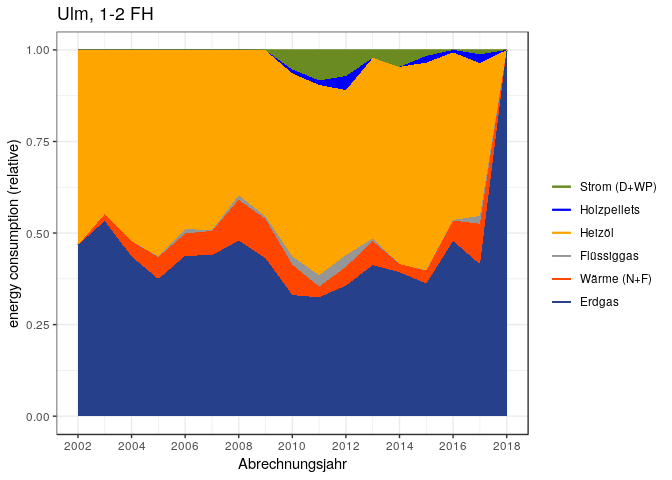
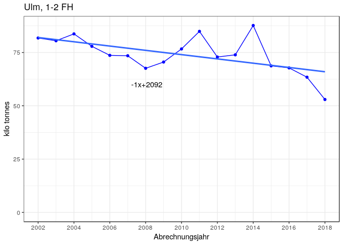
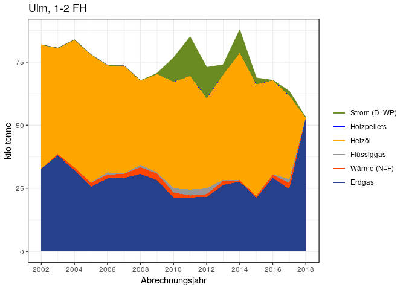
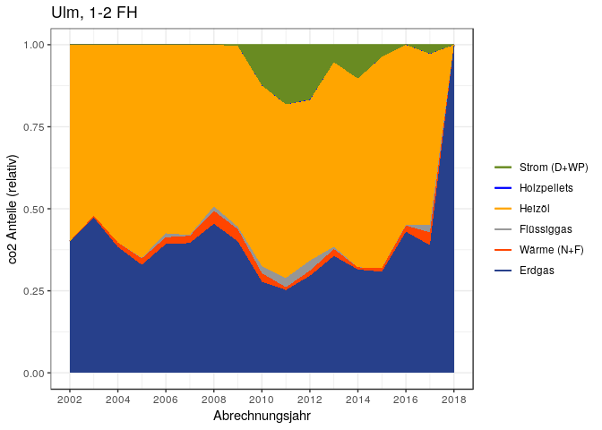
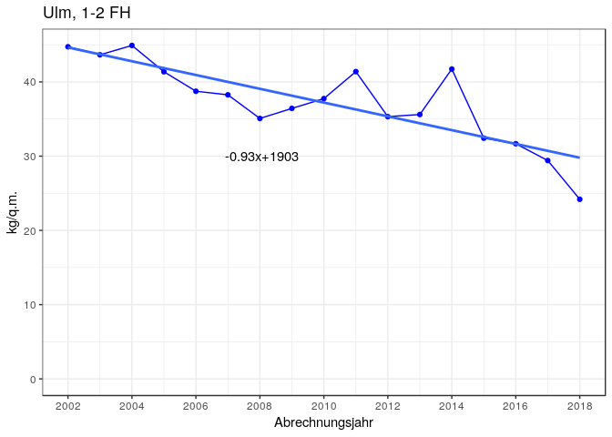
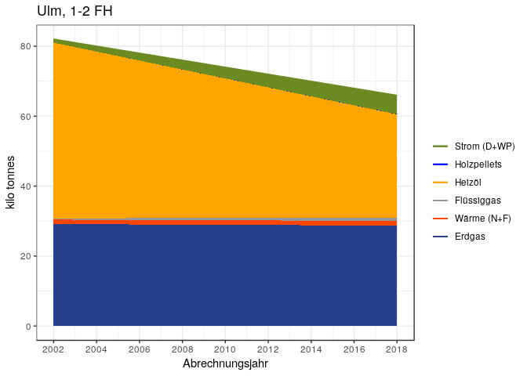
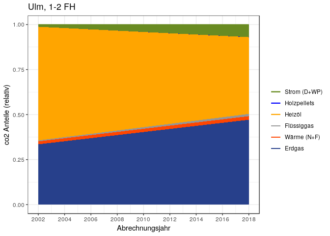

CO<sub>2</sub> emissions in Ulm for 1-2FH
================
Bhaskar Kamble and Johannes Hengstenberg
20 Februar 2019

The aim of this report is to calculate CO<sub>2</sub> emissions in the city of Ulm, Germany, caused by energy consumption for heating by 1-2FH. The calculations are primarily based on the data from [co2online](www.co2online.de). Official statistics from Ulm are also used in the calculations. The data from [co2online](www.co2online.de) is available at [my github repo](https://github.com/bhaskar-kamble/co2online_stats) as R-images.

*Notes to myself:*

-   *`Wohngebaeude 2002 - 2018.xlsx` - the sheet `result` contains data on areas for each year.*

-   *the column for `waerme` in the coefficients file refers includes both `fernmaerme` `nahwaerme`. In practice `nahwaerme` is so insignificant that it is to be neglected.*

-   *In this version (v3), the waermepumpe is also considered as strom.*

The co2online data consists of data from different households in Germany with information on energy consumption within a specific year (`abrechnungsjahr`) and on the building (area, year of construction, fuel type etc.) Each year has a different sample and the sample size also varies from year to year. To find the CO<sub>2</sub> emissions in Ulm, we first extract the data for Ulm for 1-2FH. For each year we find the relative shares of energy produced by the different fuels. We also have the data for the energy consumed per square kilometer from the co2online data (the specific heat energy consumption). From the official statistics of Ulm we know the total heated surface area for each year. The specific heat energy consumption is multiplied with the total heated area for each year to find the total energy consumption for that. We also know the relative shares of the different fuels from the co2online data, so we know how much energy was produced by the different fuels for that year. For the same amount of energy produced, each fuel produces a different amount of CO<sub>2</sub>. This amount is given by the CO<sub>2</sub> coefficient of that fuel, whose units are kWh/g. Hence, the number of grams of CO<sub>2</sub> produced by a fuel equals the kWh of energy produced times the coefficients. Since the amount of energy produced by each fuel is known, the amount of CO<sub>2</sub> produced can be calculated.

The structure of this report is as follows:

1.  **Preliminary steps**

            1a. Get the data

            1b. Introduce some functions

            1c. Get weather data and subset the data for Ulm and 1-2FH

2.  **Absolute and relative shares of energy split according to energy sources**

            2a. Get the absolute consumption of energy split by energietraeger for each year and convert to wide format

            2b. Get the relative shares of energy consumption of each `energietraeger` per year

            2c. Find the cumulative sums of the relative shares of energy consumption according to energietraeger per year

            2d. Add linear trends to the above cumulative data

            2e. collect parameters of linear models

            2f. Plotting preparations

3.  **CO<sub>2</sub> emissions**

            3a. Find the mean spezifischer verbrauch for each year

            3b. Find the total area in Ulm - New Method from official data

            3c. Find the total energy consumption (total area times spezifischer verbrauch)

            3d. Break up the total energy consumption according to the `energietraegers`

            3e. The CO<sub>2</sub> coefficients

            3f. The CO<sub>2</sub> emissions - coefficients times energy

            3g. total CO<sub>2</sub> emissions

            3h. CO<sub>2</sub> emissions according to energietraeger (absolute value)

            3i. relative shares of CO<sub>2</sub> emissions according to energietraeger

            3j. The specific CO<sub>2</sub> emissions (CO<sub>2</sub> emitted per unit surface area)

Now the report starts.

1. Preliminary steps
--------------------

*Note to myself:*

-   *These calculations come from the `03_linearmodels.R` file in the same folder.*

-   *I've used the R-images `MFH20022018_v2.RData` and `MFH20022018_v2.RData` as these contain more data compared to `MFH20022018.RData` and `MFH20022018.RData`.*

### 1a. Get the data:

The R-image files used here consist of the co2online data and are also available at my github repo.

``` r
setwd("/home/kbhaskar/CO2ONLINE/co2emissions_github")
load("MFH20022018_v2.RData")
load("SFH20022018_v2.RData")
#In SFH20022018, abrechnungsjahr and verbrauch_gesamt_kwh are character - change then to int and numeric
SFH20022018$abrechnungsjahr <- as.integer(SFH20022018$abrechnungsjahr)
SFH20022018$verbrauch_gesamt_kwh <- gsub("," , "." , SFH20022018$verbrauch_gesamt_kwh)
SFH20022018$verbrauch_gesamt_kwh <- as.numeric(SFH20022018$verbrauch_gesamt_kwh)
SFH20022018$gtype <- "SFH"
MFH20022018$gtype <- "MFH"
```

### 1b. Introduce some functions:

``` r
find_ET_shares_by_year <- function(inputdata) {
  require(dplyr)
  by_year_ET <- group_by(inputdata,abrechnungsjahr,energietraeger)
  return(as.data.frame(summarize(by_year_ET,sum(verbrauch_gesamt_kwh))))
}

find_et_list <- function(inputdata) {
  ET_list <- unique(inputdata$energietraeger)  
  return(ET_list)
}
subset_data_by_region <- function(inputdata , region) {
  outputdata <- inputdata[inputdata$Landkreis_von_GS == region , ]
  return(outputdata)
}
readweather <- function(filename) {
  weather_data <- read.csv(filename,header=TRUE , sep=";" , dec="," )
  names(weather_data) <- c("Year","wind","sun","bedeckung","temperatur")
  no_of_years <- 17
  if (dim(weather_data)[1] != no_of_years) {
    stop("check number of years in weather data")
  }
  return(weather_data)
}
```

### 1c. Get weather data and subset the data for Ulm and 1-2FH

*This weather data is not used at present*

``` r
weather_ulm <- readweather("ulm_weather.csv")
ulm_sfh <- subset_data_by_region(SFH20022018,"Ulm")
ulm_sfh$energietraeger[ulm_sfh$energietraeger=="fernwaerme"] <- "waerme"
ulm_sfh$energietraeger[ulm_sfh$energietraeger=="nahwaerme"] <- "waerme"
ulm_sfh$energietraeger[ulm_sfh$energietraeger=="waermepumpe"] <- "strom"
et_list <- find_et_list(ulm_sfh)
et_list
```

    ## [1] "erdgas"      "heizoel"     "waerme"      "fluessiggas" "strom"      
    ## [6] "holzpellets"

2. Absolute and relative shares of energy split according to energy sources (`energietraeger`) per year
-------------------------------------------------------------------------------------------------------

### 2a. Get the absolute consumption of energy split by energietraeger for each year and convert to wide format

``` r
#get the data:
ET_shares_by_year <- find_ET_shares_by_year(ulm_sfh)
names(ET_shares_by_year) <- c("abrechnungsjahr" ,"energietraeger" ,"sum_verbrauch_gesamt_kwh")
#change to wide format
detach(package:dplyr)
library(reshape2)
ET_shares_by_year_wide <- dcast(ET_shares_by_year , abrechnungsjahr ~ energietraeger , value.var = "sum_verbrauch_gesamt_kwh")
ET_shares_by_year_wide[is.na(ET_shares_by_year_wide)]=0.0
drop_cols <- "abrechnungsjahr"
ET_shares_by_year_wide$Yearlysum <- rowSums(ET_shares_by_year_wide[ , !(names(ET_shares_by_year_wide) %in% drop_cols)])
ET_shares_by_year_wide
```

    ##    abrechnungsjahr    erdgas fluessiggas   heizoel holzpellets  strom
    ## 1             2002  393228.0        0.00  448031.9           0      0
    ## 2             2003 1432109.8        0.00 1204345.9           0      0
    ## 3             2004 2454372.2        0.00 2942614.2           0      0
    ## 4             2005 2443543.6    10732.16 3682247.2           0      0
    ## 5             2006 2813231.4    75695.84 3143036.9           0      0
    ## 6             2007 2410064.8    13120.00 2697292.1           0      0
    ## 7             2008 1982276.7    51980.00 1641538.1           0      0
    ## 8             2009 1792725.5    28314.00 1885545.4           0   6193
    ## 9             2010 1171256.8    78720.00 1771897.0       37480 189767
    ## 10            2011  987968.6    95120.00 1581136.0       37480 253567
    ## 11            2012  879074.7    78720.00 1111927.5       94230 176156
    ## 12            2013  736346.4    13120.00  880235.0           0  38800
    ## 13            2014  588070.2        0.00  806070.2           0  69300
    ## 14            2015  663145.7     2151.72 1038496.3       33350  30000
    ## 15            2016  630516.7     2244.60  603254.9        8750      0
    ## 16            2017  552317.2    28802.41  555382.8       32500  15900
    ## 17            2018   18053.1        0.00       0.0           0      0
    ##      waerme Yearlysum
    ## 1       0.0  841259.9
    ## 2   49800.0 2686255.7
    ## 3  234820.0 5631806.4
    ## 4  392506.0 6529028.9
    ## 5  391137.0 6423101.1
    ## 6  362015.2 5482492.0
    ## 7  460573.2 4136368.0
    ## 8  444359.0 4157136.9
    ## 9  293876.0 3542996.8
    ## 10  88779.0 3044050.6
    ## 11 126907.0 2467015.2
    ## 12 116086.0 1784587.4
    ## 13  33000.0 1496440.4
    ## 14  64247.3 1831391.1
    ## 15  73021.3 1317787.5
    ## 16 147916.0 1332818.4
    ## 17      0.0   18053.1

### 2b. Get the relative shares of energy consumption of each `energietraeger` per year

``` r
drop_cols <- c("abrechnungsjahr","Yearlysum")
final_prop_table <- as.data.frame(sapply(ET_shares_by_year_wide[ , !(names(ET_shares_by_year_wide) %in% drop_cols)],function(obj) obj/ET_shares_by_year_wide$Yearlysum))
final_prop_table$abrechnungsjahr <- 2002:2018
```

This is what it looks like:

``` r
final_prop_table
```

    ##       erdgas fluessiggas   heizoel holzpellets       strom     waerme
    ## 1  0.4674275 0.000000000 0.5325725 0.000000000 0.000000000 0.00000000
    ## 2  0.5331249 0.000000000 0.4483363 0.000000000 0.000000000 0.01853882
    ## 3  0.4358055 0.000000000 0.5224992 0.000000000 0.000000000 0.04169533
    ## 4  0.3742584 0.001643761 0.5639808 0.000000000 0.000000000 0.06011706
    ## 5  0.4379865 0.011784937 0.4893332 0.000000000 0.000000000 0.06089535
    ## 6  0.4395929 0.002393072 0.4919829 0.000000000 0.000000000 0.06603114
    ## 7  0.4792312 0.012566580 0.3968549 0.000000000 0.000000000 0.11134725
    ## 8  0.4312404 0.006810938 0.4535683 0.000000000 0.001489727 0.10689063
    ## 9  0.3305836 0.022218479 0.5001125 0.010578615 0.053561155 0.08294560
    ## 10 0.3245572 0.031247838 0.5194184 0.012312542 0.083299207 0.02916476
    ## 11 0.3563313 0.031909004 0.4507177 0.038195954 0.071404504 0.05144151
    ## 12 0.4126144 0.007351839 0.4932429 0.000000000 0.021741720 0.06504921
    ## 13 0.3929793 0.000000000 0.5386584 0.000000000 0.046309896 0.02205233
    ## 14 0.3620995 0.001174910 0.5670533 0.018210201 0.016380991 0.03508115
    ## 15 0.4784662 0.001703310 0.4577786 0.006639917 0.000000000 0.05541204
    ## 16 0.4143979 0.021610154 0.4166980 0.024384418 0.011929607 0.11097986
    ## 17 1.0000000 0.000000000 0.0000000 0.000000000 0.000000000 0.00000000
    ##    abrechnungsjahr
    ## 1             2002
    ## 2             2003
    ## 3             2004
    ## 4             2005
    ## 5             2006
    ## 6             2007
    ## 7             2008
    ## 8             2009
    ## 9             2010
    ## 10            2011
    ## 11            2012
    ## 12            2013
    ## 13            2014
    ## 14            2015
    ## 15            2016
    ## 16            2017
    ## 17            2018

### 2c. Find the cumulative sums of the relative shares of energy consumption according to energietraeger per year

``` r
final_prop_table <- final_prop_table[,c("erdgas","waerme","fluessiggas","heizoel","holzpellets","strom","abrechnungsjahr")]
final_prop_table_cumsums <- t(apply(final_prop_table[, !(names(final_prop_table)=="abrechnungsjahr")] 
                                    , 1 , cumsum))
final_prop_table_cumsums <- as.data.frame(final_prop_table_cumsums)
final_prop_table_cumsums$abrechnungsjahr <- final_prop_table$abrechnungsjahr
final_prop_table_cumsums
```

    ##       erdgas    waerme fluessiggas   heizoel holzpellets strom
    ## 1  0.4674275 0.4674275   0.4674275 1.0000000   1.0000000     1
    ## 2  0.5331249 0.5516637   0.5516637 1.0000000   1.0000000     1
    ## 3  0.4358055 0.4775008   0.4775008 1.0000000   1.0000000     1
    ## 4  0.3742584 0.4343754   0.4360192 1.0000000   1.0000000     1
    ## 5  0.4379865 0.4988818   0.5106668 1.0000000   1.0000000     1
    ## 6  0.4395929 0.5056241   0.5080171 1.0000000   1.0000000     1
    ## 7  0.4792312 0.5905785   0.6031451 1.0000000   1.0000000     1
    ## 8  0.4312404 0.5381311   0.5449420 0.9985103   0.9985103     1
    ## 9  0.3305836 0.4135293   0.4357477 0.9358602   0.9464388     1
    ## 10 0.3245572 0.3537220   0.3849698 0.9043883   0.9167008     1
    ## 11 0.3563313 0.4077728   0.4396818 0.8903995   0.9285955     1
    ## 12 0.4126144 0.4776636   0.4850154 0.9782583   0.9782583     1
    ## 13 0.3929793 0.4150317   0.4150317 0.9536901   0.9536901     1
    ## 14 0.3620995 0.3971806   0.3983555 0.9654088   0.9836190     1
    ## 15 0.4784662 0.5338782   0.5355815 0.9933601   1.0000000     1
    ## 16 0.4143979 0.5253778   0.5469880 0.9636860   0.9880704     1
    ## 17 1.0000000 1.0000000   1.0000000 1.0000000   1.0000000     1
    ##    abrechnungsjahr
    ## 1             2002
    ## 2             2003
    ## 3             2004
    ## 4             2005
    ## 5             2006
    ## 6             2007
    ## 7             2008
    ## 8             2009
    ## 9             2010
    ## 10            2011
    ## 11            2012
    ## 12            2013
    ## 13            2014
    ## 14            2015
    ## 15            2016
    ## 16            2017
    ## 17            2018

### 2d. Add linear trends to the above cumulative data

``` r
#final_prop_table_cumsums_omit2018 <- final_prop_table_cumsums[final_prop_table_cumsums$abrechnungsjahr!=2018 , ]
et_list <- names(final_prop_table_cumsums)[names(final_prop_table_cumsums)!="abrechnungsjahr"]
storage <- list()
for (et in et_list) {
  storage[[et]] <- lm(get(et) ~ abrechnungsjahr , data = final_prop_table_cumsums)
}
for (et in et_list) {
  colname <- paste0(et,"_lm")
  final_prop_table_cumsums[[colname]] <- predict(storage[[et]] , newdata = final_prop_table_cumsums)
}#in the predictions, replace any negative numbers by zeros
#final_prop_table_cumsums
```

### 2e. collect parameters of linear models

``` r
slopes <- NULL
intercepts <- NULL
for (et in et_list) {
  intercepts <- c(intercepts , as.numeric(coefficients(storage[[et]])[1]))
  slopes <- c(slopes , as.numeric(coefficients(storage[[et]])[2]))
}
```

### 2f. Plotting preparations

Define the color scheme:

``` r
datawide <- final_prop_table_cumsums
col_list <- c("royalblue4","orangered1","gray59","orange","blue","olivedrab4")
cols <- c(
          "erdgas"      = "royalblue4",
          "waerme"      = "orangered1",
          "fluessiggas" = "gray59",
          "heizoel"     = "orange",
          "holzpellets" = "blue",
          "strom"       = "olivedrab4"
          )
plot_title <- "Ulm, 1-2 FH"
order_legend <- rev(c("erdgas","waerme","fluessiggas","heizoel","holzpellets","strom"))
order_labels <- rev(c("Erdgas","Wärme (N+F)","Flüssiggas","Heizöl","Holzpellets","Strom (D+WP)"))
```

Test plot:

    require(ggplot2)
    ggplot()+geom_point(data=datawide,aes(x=abrechnungsjahr,y=get(et_list[1]),color=et_list[1])
    )+geom_point(data=datawide,aes(x=abrechnungsjahr,y=get(et_list[2]),color=et_list[2])
    )+geom_point(data=datawide,aes(x=abrechnungsjahr,y=get(et_list[3]),color=et_list[3])
    )+geom_point(data=datawide,aes(x=abrechnungsjahr,y=get(et_list[4]),color=et_list[4])
    )+geom_point(data=datawide,aes(x=abrechnungsjahr,y=get(et_list[5]),color=et_list[5])
    )+geom_point(data=datawide,aes(x=abrechnungsjahr,y=get(et_list[6]),color=et_list[6])
    )+geom_abline(intercept=intercepts[1],slope=slopes[1],colour=col_list[1]
    )+geom_abline(intercept=intercepts[2],slope=slopes[2],colour=col_list[2]
    )+geom_abline(intercept=intercepts[3],slope=slopes[3],colour=col_list[3]
    )+geom_abline(intercept=intercepts[4],slope=slopes[4],colour=col_list[4]
    )+geom_abline(intercept=intercepts[5],slope=slopes[5],colour=col_list[5]
    )+geom_abline(intercept=intercepts[6],slope=slopes[6],colour=col_list[6])+labs(
    x="Abrechnungsjahr",y="energy consumption (relative)",title=plot_title
    )+scale_color_manual(labels=order_labels, name=" ",values=cols,breaks=order_legend
    ) + theme_bw()+scale_x_continuous(breaks=seq(2002,2018,2))

#### Save some of the graphs

#### Cumulative Energietraeger Anteile, simple line-plot:

    ggplot()+geom_line(data=datawide,aes(x=abrechnungsjahr,y=get(et_list[1]),color=et_list[1])
    )+geom_line(data=datawide,aes(x=abrechnungsjahr,y=get(et_list[2]),color=et_list[2])
    )+geom_line(data=datawide,aes(x=abrechnungsjahr,y=get(et_list[3]),color=et_list[3])
    )+geom_line(data=datawide,aes(x=abrechnungsjahr,y=get(et_list[4]),color=et_list[4])
    )+geom_line(data=datawide,aes(x=abrechnungsjahr,y=get(et_list[5]),color=et_list[5])
    )+geom_line(data=datawide,aes(x=abrechnungsjahr,y=get(et_list[6]),color=et_list[6])
    )+scale_color_manual(labels=order_labels,name="legend",values=cols,breaks=order_legend) + labs(
    x="Abrechnungsjahr",y="energy consumption (relative)",title=plot_title)+theme_bw(
    )+scale_x_continuous(breaks=seq(2002,2018,2))

#### Cumulative Energietraeger Anteile, filled plot:

``` r
require(ggplot2)
ggplot()+geom_line(data=datawide,aes(x=abrechnungsjahr,y=get(et_list[1]),color=et_list[1])
)+geom_line(data=datawide,aes(x=abrechnungsjahr,y=get(et_list[2]),color=et_list[2])
)+geom_line(data=datawide,aes(x=abrechnungsjahr,y=get(et_list[3]),color=et_list[3])
)+geom_line(data=datawide,aes(x=abrechnungsjahr,y=get(et_list[4]),color=et_list[4])
)+geom_line(data=datawide,aes(x=abrechnungsjahr,y=get(et_list[5]),color=et_list[5])
)+geom_line(data=datawide,aes(x=abrechnungsjahr,y=get(et_list[6]),color=et_list[6])
)+scale_color_manual(labels=order_labels,name=" ",values=cols,breaks=order_legend
)+geom_ribbon(data=datawide,aes(x=abrechnungsjahr,ymin=0,ymax=get(et_list[6])),fill=col_list[6]
)+geom_ribbon(data=datawide,aes(x=abrechnungsjahr,ymin=0,ymax=get(et_list[5])),fill=col_list[5]
)+geom_ribbon(data=datawide,aes(x=abrechnungsjahr,ymin=0,ymax=get(et_list[4])),fill=col_list[4]
)+geom_ribbon(data=datawide,aes(x=abrechnungsjahr,ymin=0,ymax=get(et_list[3])),fill=col_list[3]
)+geom_ribbon(data=datawide,aes(x=abrechnungsjahr,ymin=0,ymax=get(et_list[2])),fill=col_list[2]
)+geom_ribbon(data=datawide,aes(x=abrechnungsjahr,ymin=0,ymax=get(et_list[1])),fill=col_list[1])+theme_bw()+ labs(x="Abrechnungsjahr",y="energy consumption (relative)",title=plot_title
)+scale_x_continuous(breaks=seq(2002,2018,2))
```



3. Now for the CO<sub>2</sub> emissions
---------------------------------------

### 3a. Find the mean spezifischer verbrauch for each year

**Important point: Take the `witterungsbereinigter spezifischer Verbrauch` in the next iteration instead of the raw numbers. Right I've just taken the raw numbers in the first iteration**

``` r
# point - take it for the witterungsbereinigt
#ulm_sfh_omit2018 <- ulm_sfh[ulm_sfh$abrechnungsjahr!=2018 , ]
#detach(package:ggplot2)
#detach(package:dplyr)
#detach(package:reshape2)
library(dplyr)
by_year <- group_by(ulm_sfh , abrechnungsjahr)
spz_verbrauch_mean <- as.data.frame(summarize(by_year,mean(verbrauch_gesamt_kwh_spez)))
names(spz_verbrauch_mean) <- c("abrechnungsjahr" , "mean_spz_verberauch")
#nutzflaeche_mean <- as.data.frame(summarize(by_year,mean(gebaeude_nutzflaeche)))
#names(nutzflaeche_mean) <- c("abrechnungsjahr" , "mean_nutzflaeche")
```

``` r
spz_verbrauch_mean
```

    ##    abrechnungsjahr mean_spz_verberauch
    ## 1             2002            189.0947
    ## 2             2003            190.7076
    ## 3             2004            194.7272
    ## 4             2005            179.1125
    ## 5             2006            171.1097
    ## 6             2007            169.5213
    ## 7             2008            163.7512
    ## 8             2009            166.5581
    ## 9             2010            156.2149
    ## 10            2011            158.5341
    ## 11            2012            144.2672
    ## 12            2013            152.0769
    ## 13            2014            166.3102
    ## 14            2015            137.1177
    ## 15            2016            141.6906
    ## 16            2017            137.1973
    ## 17            2018            120.3500

### 3b. Find the total area in Ulm - New Method from official data

`Wohngebaeude 2002 - 2018.xlsx` - the sheet `result` contains data on areas for each year.

``` r
totalArea <- read.table("wohngebaeude_2002_2018.txt",header=TRUE)
totalArea <- totalArea[ , c("abrechnungsjahr","totArea")]
totalArea
```

    ##    abrechnungsjahr totArea
    ## 1             2002 1828590
    ## 2             2003 1844057
    ## 3             2004 1864416
    ## 4             2005 1882860
    ## 5             2006 1901300
    ## 6             2007 1920586
    ## 7             2008 1926832
    ## 8             2009 1935717
    ## 9             2010 2031031
    ## 10            2011 2051682
    ## 11            2012 2063471
    ## 12            2013 2075502
    ## 13            2014 2100844
    ## 14            2015 2119416
    ## 15            2016 2139915
    ## 16            2017 2156116
    ## 17            2018 2189266

### 3c. Find the total energy consumption (total area times spezifischer verbrauch)

``` r
totalConsumption <- data.frame(abrechnungsjahr = 2002:2018,gesamtVerbrauch = totalArea$totArea*spz_verbrauch_mean$mean_spz_verberauch)
totalConsumption$inTWh <- totalConsumption$gesamtVerbrauch/1e9
totalConsumption
```

    ##    abrechnungsjahr gesamtVerbrauch     inTWh
    ## 1             2002       345776688 0.3457767
    ## 2             2003       351675692 0.3516757
    ## 3             2004       363052527 0.3630525
    ## 4             2005       337243742 0.3372437
    ## 5             2006       325330820 0.3253308
    ## 6             2007       325580151 0.3255802
    ## 7             2008       315521034 0.3155210
    ## 8             2009       322409387 0.3224094
    ## 9             2010       317277240 0.3172772
    ## 10            2011       325261541 0.3252615
    ## 11            2012       297691176 0.2976912
    ## 12            2013       315635979 0.3156360
    ## 13            2014       349391699 0.3493917
    ## 14            2015       290609505 0.2906095
    ## 15            2016       303205873 0.3032059
    ## 16            2017       295813235 0.2958132
    ## 17            2018       263478163 0.2634782

``` r
#ggplot()+geom_point(data=totalConsumption,aes(x=abrechnungsjahr,y=gesamtVerbrauch))+theme_bw()+labs(y="Energy consumption in kWh")
#ggplot()+geom_point(data=totalConsumption,aes(x=abrechnungsjahr,y=inTWh))+theme_bw()+labs(y="Energy consumption in TWh")
```

### 3d. Break up the total energy consumption according to the `energietraegers`

The shares are in the `final_prop_table`.

``` r
#final_prop_table_omit2018 <- final_prop_table[final_prop_table$abrechnungsjahr!=2018 , ]
is_not_year <- names(final_prop_table) != "abrechnungsjahr"
energy_shares_absolute <- totalConsumption$gesamtVerbrauch * final_prop_table[,is_not_year]
energy_shares_absolute$abrechnungsjahr <- 2002:2018
energy_shares_absolute
```

    ##       erdgas   waerme fluessiggas   heizoel holzpellets    strom
    ## 1  161625524        0         0.0 184151164           0        0
    ## 2  187487067  6519651         0.0 157668974           0        0
    ## 3  158220289 15137593         0.0 189694645           0        0
    ## 4  126216286 20274101    554347.9 190199006           0        0
    ## 5  142490498 19811135   3834003.1 159195184           0        0
    ## 6  143122734 21498429    779136.8 160179852           0        0
    ## 7  151207532 35132400   3965020.4 125216082           0        0
    ## 8  139035961 34462544   2195910.2 146234670           0   480302
    ## 9  104886668 26316752   7049417.8 158674313     3356354 16993736
    ## 10 105565982  9486174  10163720.0 168946840     4004796 27094028
    ## 11 106076678 15313685   9499029.0 134174695    11370598 21256491
    ## 12 130235940 20531871   2320505.0 155685193           0  6862469
    ## 13 137303721  7704902         0.0 188202783           0 16180293
    ## 14 105229546 10194915    341440.1 164791075     5292058  4760472
    ## 15 145073750 16801257    516453.4 138801151     2013262        0
    ## 16 122584397 32829312   6392569.5 123264787     7213233  3528936
    ## 17 263478163        0         0.0         0           0        0
    ##    abrechnungsjahr
    ## 1             2002
    ## 2             2003
    ## 3             2004
    ## 4             2005
    ## 5             2006
    ## 6             2007
    ## 7             2008
    ## 8             2009
    ## 9             2010
    ## 10            2011
    ## 11            2012
    ## 12            2013
    ## 13            2014
    ## 14            2015
    ## 15            2016
    ## 16            2017
    ## 17            2018

### 3e. The CO<sub>2</sub> coefficients

I'm using the preliminary coefficients from <https://www.dropbox.com/s/j63ednj6tmzakou/4.3.2.15.3.%20CO2-Koeffizienten%202018.xlsx?dl=0>

I've saved the above as `MunichCO2Koeffizienten.txt`.

``` r
co2_coeff <- read.table("UlmCO2Koeffizienten.txt",header=TRUE)
names(co2_coeff) <- c("abrechnungsjahr","erdgas","waerme","fluessiggas","heizoel","holzpellets","strom")
co2_coeff
```

    ##    abrechnungsjahr erdgas waerme fluessiggas heizoel holzpellets strom
    ## 1             2002    203     76         230     266           6   654
    ## 2             2003    203     76         230     266           6   635
    ## 3             2004    203     76         230     266           6   615
    ## 4             2005    203     76         230     266           6   611
    ## 5             2006    203     76         230     266           6   604
    ## 6             2007    203     76         230     266           6   623
    ## 7             2008    203     76         230     266           6   584
    ## 8             2009    203     76         230     266           6   569
    ## 9             2010    203     76         234     266           6   559
    ## 10            2011    203     76         234     266           6   569
    ## 11            2012    203     76         234     266           6   574
    ## 12            2013    202     76         231     267           6   573
    ## 13            2014    201     76         229     268           6   559
    ## 14            2015    201     76         230     268           6   528
    ## 15            2016    201     76         230     268           6   516
    ## 16            2017    201     76         230     268           6   489
    ## 17            2018    201     76         230     268           6   467

The units for the above coefficients are *g*/*k**W**h*.

### 3f. The CO<sub>2</sub> emissions - coefficients × energy

``` r
co2_coeff_subset <- co2_coeff#[ , names(co2_coeff)!="waerme"]
co2_coeff_subset
```

    ##    abrechnungsjahr erdgas waerme fluessiggas heizoel holzpellets strom
    ## 1             2002    203     76         230     266           6   654
    ## 2             2003    203     76         230     266           6   635
    ## 3             2004    203     76         230     266           6   615
    ## 4             2005    203     76         230     266           6   611
    ## 5             2006    203     76         230     266           6   604
    ## 6             2007    203     76         230     266           6   623
    ## 7             2008    203     76         230     266           6   584
    ## 8             2009    203     76         230     266           6   569
    ## 9             2010    203     76         234     266           6   559
    ## 10            2011    203     76         234     266           6   569
    ## 11            2012    203     76         234     266           6   574
    ## 12            2013    202     76         231     267           6   573
    ## 13            2014    201     76         229     268           6   559
    ## 14            2015    201     76         230     268           6   528
    ## 15            2016    201     76         230     268           6   516
    ## 16            2017    201     76         230     268           6   489
    ## 17            2018    201     76         230     268           6   467

``` r
names(energy_shares_absolute)
```

    ## [1] "erdgas"          "waerme"          "fluessiggas"     "heizoel"        
    ## [5] "holzpellets"     "strom"           "abrechnungsjahr"

``` r
names(co2_coeff_subset)
```

    ## [1] "abrechnungsjahr" "erdgas"          "waerme"          "fluessiggas"    
    ## [5] "heizoel"         "holzpellets"     "strom"

So you have to multiply the coefficents with the energy consumption:

``` r
###########multiply coefficients with energy consumption##################
# IT is very important that the names of the variables be the same (not 
#necessarily in the same order, but for example the erdgas in both should 
#be named erdgas, and not erdgas in one and Erdgas in another) in the 
#coefficients file and the consumption (energy_shares_absolute) file
#make same names:
#names(energy_shares_absolute)[names(energy_shares_absolute)=="fernwaerme"] <- "waerme"
#same names made
energy_shares_absolute_matchcoeff <- energy_shares_absolute[,names(co2_coeff_subset)]
energy_shares_absolute_matchcoeff
```

    ##    abrechnungsjahr    erdgas   waerme fluessiggas   heizoel holzpellets
    ## 1             2002 161625524        0         0.0 184151164           0
    ## 2             2003 187487067  6519651         0.0 157668974           0
    ## 3             2004 158220289 15137593         0.0 189694645           0
    ## 4             2005 126216286 20274101    554347.9 190199006           0
    ## 5             2006 142490498 19811135   3834003.1 159195184           0
    ## 6             2007 143122734 21498429    779136.8 160179852           0
    ## 7             2008 151207532 35132400   3965020.4 125216082           0
    ## 8             2009 139035961 34462544   2195910.2 146234670           0
    ## 9             2010 104886668 26316752   7049417.8 158674313     3356354
    ## 10            2011 105565982  9486174  10163720.0 168946840     4004796
    ## 11            2012 106076678 15313685   9499029.0 134174695    11370598
    ## 12            2013 130235940 20531871   2320505.0 155685193           0
    ## 13            2014 137303721  7704902         0.0 188202783           0
    ## 14            2015 105229546 10194915    341440.1 164791075     5292058
    ## 15            2016 145073750 16801257    516453.4 138801151     2013262
    ## 16            2017 122584397 32829312   6392569.5 123264787     7213233
    ## 17            2018 263478163        0         0.0         0           0
    ##       strom
    ## 1         0
    ## 2         0
    ## 3         0
    ## 4         0
    ## 5         0
    ## 6         0
    ## 7         0
    ## 8    480302
    ## 9  16993736
    ## 10 27094028
    ## 11 21256491
    ## 12  6862469
    ## 13 16180293
    ## 14  4760472
    ## 15        0
    ## 16  3528936
    ## 17        0

``` r
co2_emissions <- (energy_shares_absolute_matchcoeff[,
          names(energy_shares_absolute_matchcoeff)!="abrechnungsjahr"])*co2_coeff_subset[,names(co2_coeff_subset)!="abrechnungsjahr"]
co2_emissions
```

    ##         erdgas     waerme fluessiggas     heizoel holzpellets       strom
    ## 1  32809981413          0           0 48984209632           0           0
    ## 2  38059874696  495493469           0 41939947095           0           0
    ## 3  32118718588 1150457091           0 50458775578           0           0
    ## 4  25621906156 1540831676   127500028 50592935719           0           0
    ## 5  28925571090 1505646229   881820715 42345918929           0           0
    ## 6  29053914915 1633880569   179201475 42607840540           0           0
    ## 7  30695128925 2670062411   911954685 33307477727           0           0
    ## 8  28224300129 2619153313   505059345 38898422131           0   273291859
    ## 9  21291993629 2000073136  1649563761 42207367328    20138123  9499498187
    ## 10 21429894364  720949245  2378310479 44939859320    24028778 15416502202
    ## 11 21533565615 1163840053  2222772790 35690468798    68223590 12201225719
    ## 12 26307659972 1560422205   536036666 41567946656           0  3932194851
    ## 13 27598047890  585572519           0 50438345955           0  9044783946
    ## 14 21151138671  774813535    78531215 44164008155    31752346  2513529014
    ## 15 29159823714 1276895556   118784293 37198708395    12079571           0
    ## 16 24639463826 2495027713  1470290976 33034962930    43279401  1725649584
    ## 17 52959110783          0           0           0           0           0

The above answer is in grams. Divide by 1e9 to get the answer in kilo tonnes.

``` r
co2_emissions_in_kilo_tons <- co2_emissions/1e9
co2_emissions_in_kilo_tons$abrechnungsjahr <- 2002:2018
co2_emissions_in_kilo_tons$total <- rowSums(co2_emissions_in_kilo_tons[,names(co2_emissions_in_kilo_tons)!="abrechnungsjahr"])
co2_emissions_in_kilo_tons
```

    ##      erdgas    waerme fluessiggas  heizoel holzpellets      strom
    ## 1  32.80998 0.0000000  0.00000000 48.98421  0.00000000  0.0000000
    ## 2  38.05987 0.4954935  0.00000000 41.93995  0.00000000  0.0000000
    ## 3  32.11872 1.1504571  0.00000000 50.45878  0.00000000  0.0000000
    ## 4  25.62191 1.5408317  0.12750003 50.59294  0.00000000  0.0000000
    ## 5  28.92557 1.5056462  0.88182072 42.34592  0.00000000  0.0000000
    ## 6  29.05391 1.6338806  0.17920148 42.60784  0.00000000  0.0000000
    ## 7  30.69513 2.6700624  0.91195469 33.30748  0.00000000  0.0000000
    ## 8  28.22430 2.6191533  0.50505935 38.89842  0.00000000  0.2732919
    ## 9  21.29199 2.0000731  1.64956376 42.20737  0.02013812  9.4994982
    ## 10 21.42989 0.7209492  2.37831048 44.93986  0.02402878 15.4165022
    ## 11 21.53357 1.1638401  2.22277279 35.69047  0.06822359 12.2012257
    ## 12 26.30766 1.5604222  0.53603667 41.56795  0.00000000  3.9321949
    ## 13 27.59805 0.5855725  0.00000000 50.43835  0.00000000  9.0447839
    ## 14 21.15114 0.7748135  0.07853122 44.16401  0.03175235  2.5135290
    ## 15 29.15982 1.2768956  0.11878429 37.19871  0.01207957  0.0000000
    ## 16 24.63946 2.4950277  1.47029098 33.03496  0.04327940  1.7256496
    ## 17 52.95911 0.0000000  0.00000000  0.00000  0.00000000  0.0000000
    ##    abrechnungsjahr    total
    ## 1             2002 81.79419
    ## 2             2003 80.49532
    ## 3             2004 83.72795
    ## 4             2005 77.88317
    ## 5             2006 73.65896
    ## 6             2007 73.47484
    ## 7             2008 67.58462
    ## 8             2009 70.52023
    ## 9             2010 76.66863
    ## 10            2011 84.90954
    ## 11            2012 72.88010
    ## 12            2013 73.90426
    ## 13            2014 87.66675
    ## 14            2015 68.71377
    ## 15            2016 67.76629
    ## 16            2017 63.40867
    ## 17            2018 52.95911

### 3g. Total CO<sub>2</sub> emissions

``` r
linmod <- lm(data=co2_emissions_in_kilo_tons,formula=total~abrechnungsjahr)
a <- as.numeric(coefficients(linmod)[1])
b <- as.numeric(coefficients(linmod)[2])
if (a<0) {
  asign <- " "
} else {asign <- "+"}
if (b<0) {
  bsign <- " "
} else {bsign <- " "}
ggplot()+geom_line(data=co2_emissions_in_kilo_tons,aes(x=abrechnungsjahr,y=total),color="blue")+geom_point(data=co2_emissions_in_kilo_tons,aes(x=abrechnungsjahr,y=total),color="blue")+theme_bw()+labs(x="Abrechnungsjahr",y="kilo tonnes",title=plot_title)+ylim(0,max(co2_emissions_in_kilo_tons$total))+geom_smooth(method="lm",data=co2_emissions_in_kilo_tons,aes(x=abrechnungsjahr,y=total),se=FALSE)+annotate(geom="text",label=paste0(bsign,as.character(round(b,2)),"x",asign,as.character(round(a,0))),x=2008,y=60)+scale_x_continuous(breaks=seq(2002,2018,2))
```



``` r
#https://stackoverflow.com/questions/15633714/adding-a-regression-line-on-a-ggplot  
#ggsave("total_co2_emission.jpg")
```

### 3h. CO<sub>2</sub> emissions according to energietraeger (absolute value):

``` r
co2cumsums <- co2_emissions_in_kilo_tons
#co2cumsums <- co2cumsums[,c("abrechnungsjahr","holzpellets","strom","fluessiggas","erdgas","heizoel")]
co2cumsums <- as.data.frame(t(apply(co2cumsums[,!(names(co2cumsums)%in%c("abrechnungsjahr","total"))],1,cumsum)))
co2cumsums$abrechnungsjahr <- 2002:2018
co2cumsums
```

    ##      erdgas   waerme fluessiggas  heizoel holzpellets    strom
    ## 1  32.80998 32.80998    32.80998 81.79419    81.79419 81.79419
    ## 2  38.05987 38.55537    38.55537 80.49532    80.49532 80.49532
    ## 3  32.11872 33.26918    33.26918 83.72795    83.72795 83.72795
    ## 4  25.62191 27.16274    27.29024 77.88317    77.88317 77.88317
    ## 5  28.92557 30.43122    31.31304 73.65896    73.65896 73.65896
    ## 6  29.05391 30.68780    30.86700 73.47484    73.47484 73.47484
    ## 7  30.69513 33.36519    34.27715 67.58462    67.58462 67.58462
    ## 8  28.22430 30.84345    31.34851 70.24693    70.24693 70.52023
    ## 9  21.29199 23.29207    24.94163 67.14900    67.16914 76.66863
    ## 10 21.42989 22.15084    24.52915 69.46901    69.49304 84.90954
    ## 11 21.53357 22.69741    24.92018 60.61065    60.67887 72.88010
    ## 12 26.30766 27.86808    28.40412 69.97207    69.97207 73.90426
    ## 13 27.59805 28.18362    28.18362 78.62197    78.62197 87.66675
    ## 14 21.15114 21.92595    22.00448 66.16849    66.20024 68.71377
    ## 15 29.15982 30.43672    30.55550 67.75421    67.76629 67.76629
    ## 16 24.63946 27.13449    28.60478 61.63975    61.68302 63.40867
    ## 17 52.95911 52.95911    52.95911 52.95911    52.95911 52.95911
    ##    abrechnungsjahr
    ## 1             2002
    ## 2             2003
    ## 3             2004
    ## 4             2005
    ## 5             2006
    ## 6             2007
    ## 7             2008
    ## 8             2009
    ## 9             2010
    ## 10            2011
    ## 11            2012
    ## 12            2013
    ## 13            2014
    ## 14            2015
    ## 15            2016
    ## 16            2017
    ## 17            2018

##### simple line curve:

    ggplot()+geom_line(data=co2cumsums,aes(x=abrechnungsjahr,y=get(et_list[1]),color=et_list[1])
    )+geom_line(data=co2cumsums,aes(x=abrechnungsjahr,y=get(et_list[2]),color=et_list[2])
    )+geom_line(data=co2cumsums,aes(x=abrechnungsjahr,y=get(et_list[3]),color=et_list[3])
    )+geom_line(data=co2cumsums,aes(x=abrechnungsjahr,y=get(et_list[4]),color=et_list[4])
    )+geom_line(data=co2cumsums,aes(x=abrechnungsjahr,y=get(et_list[5]),color=et_list[5])
    )+geom_line(data=co2cumsums,aes(x=abrechnungsjahr,y=get(et_list[6]),color=et_list[6])
    )+scale_color_manual(labels=order_labels,name="legend",values=cols,breaks=order_legend) + labs(x="Abrechnungsjahr",y="co2 emissions (kilo tonnes)",title=plot_title)+theme_bw()+scale_x_continuous(breaks=seq(2002,2018,2))

##### filled graph:

``` r
ggplot()+geom_line(data=co2cumsums,aes(x=abrechnungsjahr,y=get(et_list[1]),color=et_list[1])
)+geom_line(data=co2cumsums,aes(x=abrechnungsjahr,y=get(et_list[2]),color=et_list[2])
)+geom_line(data=co2cumsums,aes(x=abrechnungsjahr,y=get(et_list[3]),color=et_list[3])
)+geom_line(data=co2cumsums,aes(x=abrechnungsjahr,y=get(et_list[4]),color=et_list[4])
)+geom_line(data=co2cumsums,aes(x=abrechnungsjahr,y=get(et_list[5]),color=et_list[5])
)+geom_line(data=co2cumsums,aes(x=abrechnungsjahr,y=get(et_list[6]),color=et_list[6])
)+scale_color_manual(labels=order_labels,name=" ",values=cols,breaks=order_legend
)+geom_ribbon(data=co2cumsums,aes(x=abrechnungsjahr,ymin=0,ymax=get(et_list[6])),fill=col_list[6]
)+geom_ribbon(data=co2cumsums,aes(x=abrechnungsjahr,ymin=0,ymax=get(et_list[5])),fill=col_list[5]
)+geom_ribbon(data=co2cumsums,aes(x=abrechnungsjahr,ymin=0,ymax=get(et_list[4])),fill=col_list[4]
)+geom_ribbon(data=co2cumsums,aes(x=abrechnungsjahr,ymin=0,ymax=get(et_list[3])),fill=col_list[3]
)+geom_ribbon(data=co2cumsums,aes(x=abrechnungsjahr,ymin=0,ymax=get(et_list[2])),fill=col_list[2]
)+geom_ribbon(data=co2cumsums,aes(x=abrechnungsjahr,ymin=0,ymax=get(et_list[1])),fill=col_list[1]
)+theme_bw()+ labs(x="Abrechnungsjahr",y="kilo tonne",title=plot_title)+scale_x_continuous(breaks=seq(2002,2018,2))
```



``` r
#ggsave("co2emissions_absolute.jpg")
```

### 3i. relative shares of CO<sub>2</sub> emissions according to energietraeger

**do the witterungsbereinigung later. 1. first address these issues: Area in 2018 (see email from Johannes) and 2. the skype chat regarding waerme, fernwaerme and nahwaerme and 3. linearizing the graphs**

``` r
co2anteile_cumsums <- as.data.frame(sapply(co2cumsums[,names(co2cumsums)!="abrechnungsjahr"] , function(obj) obj/co2cumsums$strom))
co2anteile_cumsums$abrechnungsjahr <- 2002:2018
co2anteile_cumsums
```

    ##       erdgas    waerme fluessiggas   heizoel holzpellets strom
    ## 1  0.4011285 0.4011285   0.4011285 1.0000000   1.0000000     1
    ## 2  0.4728210 0.4789765   0.4789765 1.0000000   1.0000000     1
    ## 3  0.3836081 0.3973485   0.3973485 1.0000000   1.0000000     1
    ## 4  0.3289787 0.3487626   0.3503997 1.0000000   1.0000000     1
    ## 5  0.3926959 0.4131367   0.4251084 1.0000000   1.0000000     1
    ## 6  0.3954267 0.4176640   0.4201030 1.0000000   1.0000000     1
    ## 7  0.4541733 0.4936802   0.5071737 1.0000000   1.0000000     1
    ## 8  0.4002299 0.4373703   0.4445322 0.9961246   0.9961246     1
    ## 9  0.2777145 0.3038018   0.3253173 0.8758340   0.8760967     1
    ## 10 0.2523850 0.2608758   0.2888857 0.8181532   0.8184362     1
    ## 11 0.2954657 0.3114349   0.3419339 0.8316488   0.8325849     1
    ## 12 0.3559695 0.3770836   0.3843367 0.9467934   0.9467934     1
    ## 13 0.3148063 0.3214859   0.3214859 0.8968277   0.8968277     1
    ## 14 0.3078151 0.3190911   0.3202340 0.9629582   0.9634203     1
    ## 15 0.4302998 0.4491425   0.4508953 0.9998217   1.0000000     1
    ## 16 0.3885819 0.4279303   0.4511178 0.9721027   0.9727853     1
    ## 17 1.0000000 1.0000000   1.0000000 1.0000000   1.0000000     1
    ##    abrechnungsjahr
    ## 1             2002
    ## 2             2003
    ## 3             2004
    ## 4             2005
    ## 5             2006
    ## 6             2007
    ## 7             2008
    ## 8             2009
    ## 9             2010
    ## 10            2011
    ## 11            2012
    ## 12            2013
    ## 13            2014
    ## 14            2015
    ## 15            2016
    ## 16            2017
    ## 17            2018

``` r
ggplot()+geom_line(data=co2anteile_cumsums,aes(x=abrechnungsjahr,y=get(et_list[1]),color=et_list[1])
)+geom_line(data=co2anteile_cumsums,aes(x=abrechnungsjahr,y=get(et_list[2]),color=et_list[2])
)+geom_line(data=co2anteile_cumsums,aes(x=abrechnungsjahr,y=get(et_list[3]),color=et_list[3])
)+geom_line(data=co2anteile_cumsums,aes(x=abrechnungsjahr,y=get(et_list[4]),color=et_list[4])
)+geom_line(data=co2anteile_cumsums,aes(x=abrechnungsjahr,y=get(et_list[5]),color=et_list[5])
)+geom_line(data=co2anteile_cumsums,aes(x=abrechnungsjahr,y=get(et_list[6]),color=et_list[6])
)+scale_color_manual(labels=order_labels,name=" ",values=cols,breaks=order_legend
)+geom_ribbon(data=co2anteile_cumsums,aes(x=abrechnungsjahr,ymin=0,ymax=get(et_list[6])),fill=col_list[6]
)+geom_ribbon(data=co2anteile_cumsums,aes(x=abrechnungsjahr,ymin=0,ymax=get(et_list[5])),fill=col_list[5]
)+geom_ribbon(data=co2anteile_cumsums,aes(x=abrechnungsjahr,ymin=0,ymax=get(et_list[4])),fill=col_list[4]
)+geom_ribbon(data=co2anteile_cumsums,aes(x=abrechnungsjahr,ymin=0,ymax=get(et_list[3])),fill=col_list[3]
)+geom_ribbon(data=co2anteile_cumsums,aes(x=abrechnungsjahr,ymin=0,ymax=get(et_list[2])),fill=col_list[2]
)+geom_ribbon(data=co2anteile_cumsums,aes(x=abrechnungsjahr,ymin=0,ymax=get(et_list[1])),fill=col_list[1]
)+theme_bw()+ labs(x="Abrechnungsjahr",y="co2 Anteile (relativ)",title=plot_title)+scale_x_continuous(breaks=seq(2002,2018,2))
```



``` r
#ggsave("co2emissions_relative.jpg")
```

### 3j. Specific CO<sub>2</sub> emissions

Now we calculate the total CO<sub>2</sub> emissions per square meter for each year in kg/m<sup>2</sup>

``` r
spez_co2_emission <- data.frame(abrechnungsjahr = 2002:2018 , spez_co2 = 0.001*rowSums(co2_emissions)/totalArea$totArea)
spez_co2_emission
```

    ##    abrechnungsjahr spez_co2
    ## 1             2002 44.73074
    ## 2             2003 43.65121
    ## 3             2004 44.90841
    ## 4             2005 41.36429
    ## 5             2006 38.74136
    ## 6             2007 38.25647
    ## 7             2008 35.07551
    ## 8             2009 36.43106
    ## 9             2010 37.74863
    ## 10            2011 41.38533
    ## 11            2012 35.31918
    ## 12            2013 35.60790
    ## 13            2014 41.72930
    ## 14            2015 32.42109
    ## 15            2016 31.66775
    ## 16            2017 29.40875
    ## 17            2018 24.19035

``` r
linmod_spez <- lm(data=spez_co2_emission,formula=spez_co2~abrechnungsjahr)
a_spez <- as.numeric(coefficients(linmod_spez)[1])
b_spez <- as.numeric(coefficients(linmod_spez)[2])
if (a_spez<0) {
  asign_spez <- " "
} else {asign_spez <- "+"}
if (b_spez<0) {
  bsign_spez <- " "
} else {bsign_spez <- " "}
ggplot()+geom_line(data=spez_co2_emission,aes(x=abrechnungsjahr,y=spez_co2),color="blue")+geom_point(
  data=spez_co2_emission,aes(x=abrechnungsjahr,y=spez_co2),color="blue")+theme_bw()+labs(x="Abrechnungsjahr",
  y="kg/q.m.",title=plot_title)+ylim(0,max(spez_co2_emission$spez_co2))+geom_smooth(
  method="lm",data=spez_co2_emission,aes(x=abrechnungsjahr,y=spez_co2),se=FALSE)+annotate(
  geom="text",label=paste0(bsign_spez,as.character(round(b_spez,2)),"x",asign_spez,as.character(round(a_spez,0))
  ),x=2008,y=30)+scale_x_continuous(breaks=seq(2002,2018,2))
```



Make linear trends
==================

-   for co2 emissions absolute and relative.

-   show both the points and linear fits for the absolute in one graph and relative in another.

-   Then show the fills for the linear trends- one in absolute and one in relative

`co2anteile_cumsums` and `co2cumsums`

``` r
co2cumsums
```

    ##      erdgas   waerme fluessiggas  heizoel holzpellets    strom
    ## 1  32.80998 32.80998    32.80998 81.79419    81.79419 81.79419
    ## 2  38.05987 38.55537    38.55537 80.49532    80.49532 80.49532
    ## 3  32.11872 33.26918    33.26918 83.72795    83.72795 83.72795
    ## 4  25.62191 27.16274    27.29024 77.88317    77.88317 77.88317
    ## 5  28.92557 30.43122    31.31304 73.65896    73.65896 73.65896
    ## 6  29.05391 30.68780    30.86700 73.47484    73.47484 73.47484
    ## 7  30.69513 33.36519    34.27715 67.58462    67.58462 67.58462
    ## 8  28.22430 30.84345    31.34851 70.24693    70.24693 70.52023
    ## 9  21.29199 23.29207    24.94163 67.14900    67.16914 76.66863
    ## 10 21.42989 22.15084    24.52915 69.46901    69.49304 84.90954
    ## 11 21.53357 22.69741    24.92018 60.61065    60.67887 72.88010
    ## 12 26.30766 27.86808    28.40412 69.97207    69.97207 73.90426
    ## 13 27.59805 28.18362    28.18362 78.62197    78.62197 87.66675
    ## 14 21.15114 21.92595    22.00448 66.16849    66.20024 68.71377
    ## 15 29.15982 30.43672    30.55550 67.75421    67.76629 67.76629
    ## 16 24.63946 27.13449    28.60478 61.63975    61.68302 63.40867
    ## 17 52.95911 52.95911    52.95911 52.95911    52.95911 52.95911
    ##    abrechnungsjahr
    ## 1             2002
    ## 2             2003
    ## 3             2004
    ## 4             2005
    ## 5             2006
    ## 6             2007
    ## 7             2008
    ## 8             2009
    ## 9             2010
    ## 10            2011
    ## 11            2012
    ## 12            2013
    ## 13            2014
    ## 14            2015
    ## 15            2016
    ## 16            2017
    ## 17            2018

``` r
co2anteile_cumsums
```

    ##       erdgas    waerme fluessiggas   heizoel holzpellets strom
    ## 1  0.4011285 0.4011285   0.4011285 1.0000000   1.0000000     1
    ## 2  0.4728210 0.4789765   0.4789765 1.0000000   1.0000000     1
    ## 3  0.3836081 0.3973485   0.3973485 1.0000000   1.0000000     1
    ## 4  0.3289787 0.3487626   0.3503997 1.0000000   1.0000000     1
    ## 5  0.3926959 0.4131367   0.4251084 1.0000000   1.0000000     1
    ## 6  0.3954267 0.4176640   0.4201030 1.0000000   1.0000000     1
    ## 7  0.4541733 0.4936802   0.5071737 1.0000000   1.0000000     1
    ## 8  0.4002299 0.4373703   0.4445322 0.9961246   0.9961246     1
    ## 9  0.2777145 0.3038018   0.3253173 0.8758340   0.8760967     1
    ## 10 0.2523850 0.2608758   0.2888857 0.8181532   0.8184362     1
    ## 11 0.2954657 0.3114349   0.3419339 0.8316488   0.8325849     1
    ## 12 0.3559695 0.3770836   0.3843367 0.9467934   0.9467934     1
    ## 13 0.3148063 0.3214859   0.3214859 0.8968277   0.8968277     1
    ## 14 0.3078151 0.3190911   0.3202340 0.9629582   0.9634203     1
    ## 15 0.4302998 0.4491425   0.4508953 0.9998217   1.0000000     1
    ## 16 0.3885819 0.4279303   0.4511178 0.9721027   0.9727853     1
    ## 17 1.0000000 1.0000000   1.0000000 1.0000000   1.0000000     1
    ##    abrechnungsjahr
    ## 1             2002
    ## 2             2003
    ## 3             2004
    ## 4             2005
    ## 5             2006
    ## 6             2007
    ## 7             2008
    ## 8             2009
    ## 9             2010
    ## 10            2011
    ## 11            2012
    ## 12            2013
    ## 13            2014
    ## 14            2015
    ## 15            2016
    ## 16            2017
    ## 17            2018

``` r
#co2cumsums
#co2anteile_cumsums
et_list_2 <- names(co2cumsums)[names(co2cumsums)!="abrechnungsjahr"]
co2cumsums_linear <- co2cumsums
storage_co2 <- list()
for (et in et_list_2) {
  storage_co2[[et]] <- lm(get(et) ~ abrechnungsjahr , data = co2cumsums)
}
for (et in et_list_2) {
  #colname <- paste0(et,"_lm")
  co2cumsums_linear[[et]] <- predict(storage_co2[[et]] , newdata = co2cumsums)
}


storage_co2_anteile <- list()
co2anteile_cumsums_linear <- co2anteile_cumsums
for (et in et_list_2) {
  storage_co2_anteile[[et]] <- lm(get(et) ~ abrechnungsjahr , data = co2anteile_cumsums)
}
for (et in et_list_2) {
  #colname <- paste0(et,"_lm")
  co2anteile_cumsums_linear[[et]] <- predict(storage_co2_anteile[[et]] , newdata = co2anteile_cumsums)
}
```

``` r
slopes_co2 <- NULL
intercepts_co2 <- NULL
for (et in et_list_2) {
  intercepts_co2 <- c(intercepts_co2 , as.numeric(coefficients(storage_co2[[et]])[1]))
  slopes_co2     <-     c(slopes_co2 , as.numeric(coefficients(storage_co2[[et]])[2]))
}
slopes_co2_anteile <- NULL
intercepts_co2_anteile <- NULL
for (et in et_list_2) {
  intercepts_co2_anteile <- c(intercepts_co2_anteile , as.numeric(coefficients(storage_co2_anteile[[et]])[1]))
  slopes_co2_anteile     <- c(slopes_co2_anteile , as.numeric(coefficients(storage_co2_anteile[[et]])[2]))
}
```

    require(ggplot2)
    ggplot()+geom_point(data=co2cumsums,aes(x=abrechnungsjahr,y=get(et_list[1]),color=et_list[1])
    )+geom_point(data=co2cumsums,aes(x=abrechnungsjahr,y=get(et_list[2]),color=et_list[2])
    )+geom_point(data=co2cumsums,aes(x=abrechnungsjahr,y=get(et_list[3]),color=et_list[3])
    )+geom_point(data=co2cumsums,aes(x=abrechnungsjahr,y=get(et_list[4]),color=et_list[4])
    )+geom_point(data=co2cumsums,aes(x=abrechnungsjahr,y=get(et_list[5]),color=et_list[5])
    )+geom_point(data=co2cumsums,aes(x=abrechnungsjahr,y=get(et_list[6]),color=et_list[6])
    )+geom_abline(intercept=intercepts_co2[1],slope=slopes_co2[1],colour=col_list[1]
    )+geom_abline(intercept=intercepts_co2[2],slope=slopes_co2[2],colour=col_list[2]
    )+geom_abline(intercept=intercepts_co2[3],slope=slopes_co2[3],colour=col_list[3]
    )+geom_abline(intercept=intercepts_co2[4],slope=slopes_co2[4],colour=col_list[4]
    )+geom_abline(intercept=intercepts_co2[5],slope=slopes_co2[5],colour=col_list[5]
    )+geom_abline(intercept=intercepts_co2[6],slope=slopes_co2[6],colour=col_list[6]
    )+labs(x="Abrechnungsjahr",y="co2 emissions (kilo tonnes)",title=plot_title
    )+scale_color_manual(labels=order_labels,name=" ",values=cols,breaks=order_legend) + theme_bw()+scale_x_continuous(breaks=seq(2002,2018,2))
    #ggsave("co2emissions_absolute_real_and_linearized.jpg")

    require(ggplot2)
    ggplot()+geom_point(data=co2anteile_cumsums,aes(x=abrechnungsjahr,y=get(et_list[1]),color=et_list[1])
    )+geom_point(data=co2anteile_cumsums,aes(x=abrechnungsjahr,y=get(et_list[2]),color=et_list[2])
    )+geom_point(data=co2anteile_cumsums,aes(x=abrechnungsjahr,y=get(et_list[3]),color=et_list[3])
    )+geom_point(data=co2anteile_cumsums,aes(x=abrechnungsjahr,y=get(et_list[4]),color=et_list[4])
    )+geom_point(data=co2anteile_cumsums,aes(x=abrechnungsjahr,y=get(et_list[5]),color=et_list[5])
    )+geom_point(data=co2anteile_cumsums,aes(x=abrechnungsjahr,y=get(et_list[6]),color=et_list[6])
    )+geom_abline(intercept=intercepts_co2_anteile[1],slope=slopes_co2_anteile[1],colour=col_list[1]
    )+geom_abline(intercept=intercepts_co2_anteile[2],slope=slopes_co2_anteile[2],colour=col_list[2]
    )+geom_abline(intercept=intercepts_co2_anteile[3],slope=slopes_co2_anteile[3],colour=col_list[3]
    )+geom_abline(intercept=intercepts_co2_anteile[4],slope=slopes_co2_anteile[4],colour=col_list[4]
    )+geom_abline(intercept=intercepts_co2_anteile[5],slope=slopes_co2_anteile[5],colour=col_list[5]
    )+geom_abline(intercept=intercepts_co2_anteile[6],slope=slopes_co2_anteile[6],colour=col_list[6]
    )+labs(x="Abrechnungsjahr",y="co2 emissions (relative)",title=plot_title
    )+scale_color_manual(labels=order_labels,name=" ",values=cols,breaks=order_legend) + theme_bw()+scale_x_continuous(breaks=seq(2002,2018,2))
    #ggsave("co2emissions_absolute_real_and_linearized.jpg")

Graph of linear trends of absolute CO<sub>2</sub> emissions:
------------------------------------------------------------

``` r
ggplot()+geom_line(data=co2cumsums_linear,aes(x=abrechnungsjahr,y=get(et_list[1]),color=et_list[1])
)+geom_line(data=co2cumsums_linear,aes(x=abrechnungsjahr,y=get(et_list[2]),color=et_list[2])
)+geom_line(data=co2cumsums_linear,aes(x=abrechnungsjahr,y=get(et_list[3]),color=et_list[3])
)+geom_line(data=co2cumsums_linear,aes(x=abrechnungsjahr,y=get(et_list[4]),color=et_list[4])
)+geom_line(data=co2cumsums_linear,aes(x=abrechnungsjahr,y=get(et_list[5]),color=et_list[5])
)+geom_line(data=co2cumsums_linear,aes(x=abrechnungsjahr,y=get(et_list[6]),color=et_list[6])
)+scale_color_manual(labels=order_labels,name=" ",values=cols,breaks=order_legend
)+geom_ribbon(data=co2cumsums_linear,aes(x=abrechnungsjahr,ymin=0,ymax=get(et_list[6])),fill=col_list[6]
)+geom_ribbon(data=co2cumsums_linear,aes(x=abrechnungsjahr,ymin=0,ymax=get(et_list[5])),fill=col_list[5]
)+geom_ribbon(data=co2cumsums_linear,aes(x=abrechnungsjahr,ymin=0,ymax=get(et_list[4])),fill=col_list[4]
)+geom_ribbon(data=co2cumsums_linear,aes(x=abrechnungsjahr,ymin=0,ymax=get(et_list[3])),fill=col_list[3]
)+geom_ribbon(data=co2cumsums_linear,aes(x=abrechnungsjahr,ymin=0,ymax=get(et_list[2])),fill=col_list[2]
)+geom_ribbon(data=co2cumsums_linear,aes(x=abrechnungsjahr,ymin=0,ymax=get(et_list[1])),fill=col_list[1]
)+theme_bw()+ labs(x="Abrechnungsjahr",y="kilo tonnes",title=plot_title)+scale_x_continuous(breaks=seq(2002,2018,2))
```



``` r
#ggsave("co2emissions_absolute_linearized.jpg")
```

Graph of linear trends of relative CO<sub>2</sub> emissions:
------------------------------------------------------------

``` r
ggplot()+geom_line(data=co2anteile_cumsums_linear,aes(x=abrechnungsjahr,y=get(et_list[1]),color=et_list[1])
)+geom_line(data=co2anteile_cumsums_linear,aes(x=abrechnungsjahr,y=get(et_list[2]),color=et_list[2])
)+geom_line(data=co2anteile_cumsums_linear,aes(x=abrechnungsjahr,y=get(et_list[3]),color=et_list[3])
)+geom_line(data=co2anteile_cumsums_linear,aes(x=abrechnungsjahr,y=get(et_list[4]),color=et_list[4])
)+geom_line(data=co2anteile_cumsums_linear,aes(x=abrechnungsjahr,y=get(et_list[5]),color=et_list[5])
)+geom_line(data=co2anteile_cumsums_linear,aes(x=abrechnungsjahr,y=get(et_list[6]),color=et_list[6])
)+scale_color_manual(labels=order_labels,name=" ",values=cols,breaks=order_legend
)+geom_ribbon(data=co2anteile_cumsums_linear,aes(x=abrechnungsjahr,ymin=0,ymax=get(et_list[6])),fill=col_list[6]
)+geom_ribbon(data=co2anteile_cumsums_linear,aes(x=abrechnungsjahr,ymin=0,ymax=get(et_list[5])),fill=col_list[5]
)+geom_ribbon(data=co2anteile_cumsums_linear,aes(x=abrechnungsjahr,ymin=0,ymax=get(et_list[4])),fill=col_list[4]
)+geom_ribbon(data=co2anteile_cumsums_linear,aes(x=abrechnungsjahr,ymin=0,ymax=get(et_list[3])),fill=col_list[3]
)+geom_ribbon(data=co2anteile_cumsums_linear,aes(x=abrechnungsjahr,ymin=0,ymax=get(et_list[2])),fill=col_list[2]
)+geom_ribbon(data=co2anteile_cumsums_linear,aes(x=abrechnungsjahr,ymin=0,ymax=get(et_list[1])),fill=col_list[1]
)+theme_bw()+ labs(x="Abrechnungsjahr",y="co2 Anteile (relativ)",title=plot_title)+scale_x_continuous(breaks=seq(2002,2018,2))
```



``` r
#ggsave("co2emissions_relative_linearized.jpg")
```

Save the data
-------------

``` r
write.csv2(co2_emissions_in_kilo_tons,file="./data/ulm/sfh/01_SFH_absolut_nachET.csv",row.names=FALSE)
write.csv2(co2cumsums,file="./data/ulm/sfh/02_SFH_absolut_nachET_kumulativ.csv",row.names=FALSE)
write.csv2(co2anteile_cumsums,file="./data/ulm/sfh/03_SFH_relativ_nachET_kumulativ.csv",row.names=FALSE)
write.csv2(spez_co2_emission,file="./data/ulm/sfh/04_SFH_co2_spez.csv",row.names=FALSE)
write.csv2(co2anteile_cumsums_linear,file="./data/ulm/sfh/05_SFH_relativ_nachET_kumulativ_linear.csv",row.names=FALSE)
write.csv2(co2cumsums_linear,file="./data/ulm/sfh/06_SFH_absolut_nachET_kumulativ_linear.csv",row.names=FALSE)
```

<https://ggplot2.tidyverse.org/reference/scale_manual.html> <https://stackoverflow.com/questions/14762181/adding-a-y-axis-label-to-secondary-y-axis-in-matplotlib>
