CO<sub>2</sub> emissions in Ulm for all (MFH + 1-2FH) buildings
================
Bhaskar Kamble and Johannes Hengstenberg
20 Februar 2019

The aim of this report is to calculate CO<sub>2</sub> emissions in the city of Ulm, Germany, caused by energy consumption for heating by all (MFH + 1-2FH) buildings. The calculations are primarily based on the data from [co2online](www.co2online.de). Official statistics from Ulm are also used in the calculations. The data from [co2online](www.co2online.de) is available at [my github repo](https://github.com/bhaskar-kamble/co2online_stats) as R-images.

*Notes to myself:*

-   *`Wohngebaeude 2002 - 2018.xlsx` - the sheet `result` contains data on areas for each year.*

-   *the column for `waerme` in the coefficients file refers includes both `fernmaerme` `nahwaerme`. In practice `nahwaerme` is so insignificant that it is to be neglected.*

The co2online data consists of data from different households in Germany with information on energy consumption within a specific year (`abrechnungsjahr`) and on the building (area, year of construction, fuel type etc.) Each year has a different sample and the sample size also varies from year to year. To find the CO<sub>2</sub> emissions in Ulm, we first extract the data for Ulm for 1-2FH. For each year we find the relative shares of energy produced by the different fuels. We also have the data for the energy consumed per square kilometer from the co2online data (the specific heat energy consumption). From the official statistics of Ulm we know the total heated surface area for each year. The specific heat energy consumption is multiplied with the total heated area for each year to find the total energy consumption for that. We also know the relative shares of the different fuels from the co2online data, so we know how much energy was produced by the different fuels for that year. For the same amount of energy produced, each fuel produces a different amount of CO<sub>2</sub>. This amount is given by the CO<sub>2</sub> coefficient of that fuel, whose units are kWh/g. Hence, the number of grams of CO<sub>2</sub> produced by a fuel equals the kWh of energy produced times the coefficients. Since the amount of energy produced by each fuel is known, the amount of CO<sub>2</sub> produced can be calculated.

The structure of this report is as follows:

1.  **Preliminary steps**

            1a. Get the data

            1b. Introduce some functions

            1c. Get weather data and subset the data for Ulm and 1-2FH

2.  **Absolute and relative shares of energy split according to energy sources**

            2a. Get the absolute consumption of energy split by energietraeger for each year and convert to wide format

            2b. Get the relative shares of energy consumption of each `energietraeger` per year

            2c. Find the cumulative sums of the relative shares of energy consumption according to energietraeger per year

            2d. Add linear trends to the above cumulative data

            2e. collect parameters of linear models

            2f. Plotting preparations

3.  **CO<sub>2</sub> emissions**

            3a. Find the mean spezifischer verbrauch for each year

            3b. Find the total area in Ulm - New Method from official data

            3c. Find the total energy consumption (total area times spezifischer verbrauch)

            3d. Break up the total energy consumption according to the `energietraegers`

            3e. The CO<sub>2</sub> coefficients

            3f. The CO<sub>2</sub> emissions - coefficients times energy

            3g. total CO<sub>2</sub> emissions

            3h. CO<sub>2</sub> emissions according to energietraeger (absolute value)

            3i. relative shares of CO<sub>2</sub> emissions according to energietraeger

            3j. The specific CO<sub>2</sub> emissions (CO<sub>2</sub> emitted per unit surface area)

Now the report starts.

1. Preliminary steps
--------------------

*Note to myself:*

-   *These calculations come from the `03_linearmodels.R` file in the same folder.*

### 1a. Get the data:

The R-image files used here consist of the co2online data and are also available at my github repo.

``` r
setwd("/home/kbhaskar/CO2ONLINE/co2emissions_github")
load("MFH20022018_v2.RData")
load("SFH20022018_v2.RData")
#In SFH20022018, abrechnungsjahr and verbrauch_gesamt_kwh are character - change then to int and numeric
SFH20022018$abrechnungsjahr <- as.integer(SFH20022018$abrechnungsjahr)
SFH20022018$verbrauch_gesamt_kwh <- gsub("," , "." , SFH20022018$verbrauch_gesamt_kwh)
SFH20022018$verbrauch_gesamt_kwh <- as.numeric(SFH20022018$verbrauch_gesamt_kwh)
SFH20022018$gtype <- "SFH"
MFH20022018$gtype <- "MFH"
ALL20022018 <- rbind(SFH20022018,MFH20022018)
```

### 1b. Introduce some functions:

``` r
find_ET_shares_by_year <- function(inputdata) {
  require(dplyr)
  by_year_ET <- group_by(inputdata,abrechnungsjahr,energietraeger)
  return(as.data.frame(summarize(by_year_ET,sum(verbrauch_gesamt_kwh))))
}

find_et_list <- function(inputdata) {
  ET_list <- unique(inputdata$energietraeger)  
  return(ET_list)
}
subset_data_by_region <- function(inputdata , region) {
  outputdata <- inputdata[inputdata$Landkreis_von_GS == region , ]
  return(outputdata)
}
readweather <- function(filename) {
  weather_data <- read.csv(filename,header=TRUE , sep=";" , dec="," )
  names(weather_data) <- c("Year","wind","sun","bedeckung","temperatur")
  no_of_years <- 17
  if (dim(weather_data)[1] != no_of_years) {
    stop("check number of years in weather data")
  }
  return(weather_data)
}
```

### 1c. Get weather data and subset the data for Ulm and MFH

*This weather data is not used at present*

``` r
weather_ulm <- readweather("ulm_weather.csv")
ulm_all <- subset_data_by_region(ALL20022018,"Ulm")
ulm_all$energietraeger[ulm_all$energietraeger=="fernwaerme"] <- "waerme"
ulm_all$energietraeger[ulm_all$energietraeger=="nahwaerme"] <- "waerme"
et_list <- find_et_list(ulm_all)
et_list
```

    ## [1] "erdgas"      "heizoel"     "waerme"      "fluessiggas" "waermepumpe"
    ## [6] "strom"       "holzpellets"

``` r
#et_list <- c("heizoel","erdgas","waerme","fluessiggas","holzpellets")
```

A quick look into how many data are there for each year and energietraeger:

``` r
xtabs(~abrechnungsjahr , data=ulm_all)
```

    ## abrechnungsjahr
    ## 2002 2003 2004 2005 2006 2007 2008 2009 2010 2011 2012 2013 2014 2015 2016 
    ##   44  121  228  299  302  270  216  217  178  166  137   93   72  135  121 
    ## 2017 2018 
    ##  135    9

``` r
xtabs(~abrechnungsjahr+energietraeger , data=ulm_all)
```

    ##                energietraeger
    ## abrechnungsjahr erdgas fluessiggas heizoel holzpellets strom waerme
    ##            2002     25           0      16           0     0      3
    ##            2003     66           0      47           0     0      8
    ##            2004    100           0     112           0     0     16
    ##            2005    126           1     142           0     0     30
    ##            2006    146           3     123           0     0     30
    ##            2007    127           1     111           0     0     31
    ##            2008     95           2      79           0     0     40
    ##            2009     90           2      83           0     0     41
    ##            2010     63           2      75           3     9     24
    ##            2011     52           4      74           3    11     21
    ##            2012     45           2      50           5     8     27
    ##            2013     37           1      33           0     3     19
    ##            2014     31           0      30           0     3      8
    ##            2015     54           1      38           2     3     36
    ##            2016     57           1      23           1     0     39
    ##            2017     62           4      24           3     3     38
    ##            2018      6           0       0           0     0      3
    ##                energietraeger
    ## abrechnungsjahr waermepumpe
    ##            2002           0
    ##            2003           0
    ##            2004           0
    ##            2005           0
    ##            2006           0
    ##            2007           0
    ##            2008           0
    ##            2009           1
    ##            2010           2
    ##            2011           1
    ##            2012           0
    ##            2013           0
    ##            2014           0
    ##            2015           1
    ##            2016           0
    ##            2017           1
    ##            2018           0

2. Absolute and relative shares of energy split according to energy sources (`energietraeger`) per year
-------------------------------------------------------------------------------------------------------

### 2a. Get the absolute consumption of energy split by energietraeger for each year and convert to wide format

``` r
#get the data:
ET_shares_by_year <- find_ET_shares_by_year(ulm_all)
names(ET_shares_by_year) <- c("abrechnungsjahr" ,"energietraeger" ,"sum_verbrauch_gesamt_kwh")
#change to wide format
detach(package:dplyr)
library(reshape2)
ET_shares_by_year_wide <- dcast(ET_shares_by_year , abrechnungsjahr ~ energietraeger , value.var = "sum_verbrauch_gesamt_kwh")
ET_shares_by_year_wide[is.na(ET_shares_by_year_wide)]=0.0
drop_cols <- "abrechnungsjahr"
ET_shares_by_year_wide$Yearlysum <- rowSums(ET_shares_by_year_wide[ , !(names(ET_shares_by_year_wide) %in% drop_cols)])
ET_shares_by_year_wide
```

    ##    abrechnungsjahr    erdgas fluessiggas   heizoel holzpellets  strom
    ## 1             2002  828409.3        0.00  618791.9           0      0
    ## 2             2003 2599400.0        0.00 1816825.8           0      0
    ## 3             2004 3817414.6        0.00 4175536.7           0      0
    ## 4             2005 6457164.5    10732.16 5332507.4           0      0
    ## 5             2006 6341633.3    75695.84 4252754.2           0      0
    ## 6             2007 6980278.1    13120.00 4753168.6           0      0
    ## 7             2008 5944965.0    51980.00 3517758.7           0      0
    ## 8             2009 3425989.7   148276.72 2693265.9           0      0
    ## 9             2010 1822991.8    78720.00 2390677.9      144280 175805
    ## 10            2011 1875264.6   193520.00 2051368.0      101230 247409
    ## 11            2012 1432784.1    78720.00 1486712.0       94230 176156
    ## 12            2013  806622.0    13120.00 1350295.6           0  38800
    ## 13            2014  674178.4        0.00 1318920.5           0  69300
    ## 14            2015 2783034.8     2151.72 1165504.3       33350  23000
    ## 15            2016 3486250.5     2244.60  780662.9        8750      0
    ## 16            2017 6428073.9    28802.41  806979.6      180750  29248
    ## 17            2018  849837.2        0.00       0.0           0      0
    ##     waerme waermepumpe Yearlysum
    ## 1   687960           0   2135161
    ## 2   400674           0   4816900
    ## 3   592738           0   8585689
    ## 4  3032661           0  14833065
    ## 5  2833333           0  13503416
    ## 6  3040121           0  14786688
    ## 7  4807822           0  14322526
    ## 8  4474375        6193  10748100
    ## 9  3500504       13962   8126940
    ## 10 5841208        6158  10316158
    ## 11 5826822           0   9095424
    ## 12 3456582           0   5665420
    ## 13  622926           0   2685325
    ## 14 5332960        7000   9347000
    ## 15 5580323           0   9858231
    ## 16 6787981        4700  14266535
    ## 17  311108           0   1160945

Sometimes it can be that there is no data for certain years - this can happen for especially small regions. This can create an error with the command `final_prop_table$abrechnungsjahr <- 2002:2018`, hence the years must be obtained from the `ET_shares_by_year_wide` dataframe if you want to ignore the missing years.

On the other hand, if you don't want to ignore the missing years, the missing years must be filled with the average (or median, or previous value, whatever). In this case all the years (2002-2018) must be included in `years_for_which_data_exists`.

``` r
ignore_missing_years <- TRUE
if (ignore_missing_years) {
  years_for_which_data_exists <- ET_shares_by_year_wide$abrechnungsjahr
} else {
  years_for_which_data_exists <- 2002:2018
  #ET_shares_by_year_wide - fill in missing years by the mean
  years_present <- ET_shares_by_year_wide$abrechnungsjahr
  years_absent <- years_for_which_data_exists[!(years_for_which_data_exists %in% years_present)]
  
  for (y in years_absent) {
    dtemp <- c(y,colMeans(ET_shares_by_year_wide[ , names(ET_shares_by_year_wide)!="abrechnungsjahr"]) )
    ET_shares_by_year_wide <- rbind(ET_shares_by_year_wide , dtemp)
    #df1 <- df1[order(df1$year) , ]
  }
  ET_shares_by_year_wide <- ET_shares_by_year_wide[order(ET_shares_by_year_wide$abrechnungsjahr) , ]
}
ET_shares_by_year_wide
```

    ##    abrechnungsjahr    erdgas fluessiggas   heizoel holzpellets  strom
    ## 1             2002  828409.3        0.00  618791.9           0      0
    ## 2             2003 2599400.0        0.00 1816825.8           0      0
    ## 3             2004 3817414.6        0.00 4175536.7           0      0
    ## 4             2005 6457164.5    10732.16 5332507.4           0      0
    ## 5             2006 6341633.3    75695.84 4252754.2           0      0
    ## 6             2007 6980278.1    13120.00 4753168.6           0      0
    ## 7             2008 5944965.0    51980.00 3517758.7           0      0
    ## 8             2009 3425989.7   148276.72 2693265.9           0      0
    ## 9             2010 1822991.8    78720.00 2390677.9      144280 175805
    ## 10            2011 1875264.6   193520.00 2051368.0      101230 247409
    ## 11            2012 1432784.1    78720.00 1486712.0       94230 176156
    ## 12            2013  806622.0    13120.00 1350295.6           0  38800
    ## 13            2014  674178.4        0.00 1318920.5           0  69300
    ## 14            2015 2783034.8     2151.72 1165504.3       33350  23000
    ## 15            2016 3486250.5     2244.60  780662.9        8750      0
    ## 16            2017 6428073.9    28802.41  806979.6      180750  29248
    ## 17            2018  849837.2        0.00       0.0           0      0
    ##     waerme waermepumpe Yearlysum
    ## 1   687960           0   2135161
    ## 2   400674           0   4816900
    ## 3   592738           0   8585689
    ## 4  3032661           0  14833065
    ## 5  2833333           0  13503416
    ## 6  3040121           0  14786688
    ## 7  4807822           0  14322526
    ## 8  4474375        6193  10748100
    ## 9  3500504       13962   8126940
    ## 10 5841208        6158  10316158
    ## 11 5826822           0   9095424
    ## 12 3456582           0   5665420
    ## 13  622926           0   2685325
    ## 14 5332960        7000   9347000
    ## 15 5580323           0   9858231
    ## 16 6787981        4700  14266535
    ## 17  311108           0   1160945

### 2b. Get the relative shares of energy consumption of each `energietraeger` per year

``` r
drop_cols <- c("abrechnungsjahr","Yearlysum")
final_prop_table <- as.data.frame(sapply(ET_shares_by_year_wide[ , !(names(ET_shares_by_year_wide) %in% drop_cols)],function(obj) obj/ET_shares_by_year_wide$Yearlysum))
final_prop_table$abrechnungsjahr <- years_for_which_data_exists
```

This is what it looks like:

``` r
final_prop_table
```

    ##       erdgas  fluessiggas    heizoel  holzpellets       strom     waerme
    ## 1  0.3879844 0.0000000000 0.28981041 0.0000000000 0.000000000 0.32220517
    ## 2  0.5396417 0.0000000000 0.37717741 0.0000000000 0.000000000 0.08318089
    ## 3  0.4446253 0.0000000000 0.48633680 0.0000000000 0.000000000 0.06903790
    ## 4  0.4353223 0.0007235295 0.35950138 0.0000000000 0.000000000 0.20445275
    ## 5  0.4696318 0.0056056807 0.31493913 0.0000000000 0.000000000 0.20982342
    ## 6  0.4720650 0.0008872846 0.32144917 0.0000000000 0.000000000 0.20559852
    ## 7  0.4150780 0.0036292481 0.24561022 0.0000000000 0.000000000 0.33568256
    ## 8  0.3187531 0.0137956214 0.25058065 0.0000000000 0.000000000 0.41629448
    ## 9  0.2243147 0.0096863022 0.29416703 0.0177532988 0.021632372 0.43072835
    ## 10 0.1817794 0.0187589221 0.19885000 0.0098127619 0.023982669 0.56621936
    ## 11 0.1575280 0.0086549019 0.16345715 0.0103601551 0.019367542 0.64063223
    ## 12 0.1423764 0.0023158037 0.23833991 0.0000000000 0.006848566 0.61011932
    ## 13 0.2510603 0.0000000000 0.49115863 0.0000000000 0.025806934 0.23197417
    ## 14 0.2977463 0.0002302043 0.12469287 0.0035679895 0.002460682 0.57055305
    ## 15 0.3536385 0.0002276879 0.07918894 0.0008875832 0.000000000 0.56605725
    ## 16 0.4505701 0.0020188791 0.05656451 0.0126695092 0.002050112 0.47579747
    ## 17 0.7320218 0.0000000000 0.00000000 0.0000000000 0.000000000 0.26797819
    ##     waermepumpe abrechnungsjahr
    ## 1  0.0000000000            2002
    ## 2  0.0000000000            2003
    ## 3  0.0000000000            2004
    ## 4  0.0000000000            2005
    ## 5  0.0000000000            2006
    ## 6  0.0000000000            2007
    ## 7  0.0000000000            2008
    ## 8  0.0005761949            2009
    ## 9  0.0017179897            2010
    ## 10 0.0005969277            2011
    ## 11 0.0000000000            2012
    ## 12 0.0000000000            2013
    ## 13 0.0000000000            2014
    ## 14 0.0007489034            2015
    ## 15 0.0000000000            2016
    ## 16 0.0003294423            2017
    ## 17 0.0000000000            2018

### 2c. Find the cumulative sums of the relative shares of energy consumption according to energietraeger per year

``` r
final_prop_table <- final_prop_table[,c("waermepumpe","erdgas","waerme","fluessiggas","heizoel","holzpellets","strom","abrechnungsjahr")]
final_prop_table_cumsums <- t(apply(final_prop_table[, !(names(final_prop_table)=="abrechnungsjahr")] 
                                    , 1 , cumsum))
final_prop_table_cumsums <- as.data.frame(final_prop_table_cumsums)
final_prop_table_cumsums$abrechnungsjahr <- final_prop_table$abrechnungsjahr
final_prop_table_cumsums
```

    ##     waermepumpe    erdgas    waerme fluessiggas   heizoel holzpellets
    ## 1  0.0000000000 0.3879844 0.7101896   0.7101896 1.0000000   1.0000000
    ## 2  0.0000000000 0.5396417 0.6228226   0.6228226 1.0000000   1.0000000
    ## 3  0.0000000000 0.4446253 0.5136632   0.5136632 1.0000000   1.0000000
    ## 4  0.0000000000 0.4353223 0.6397751   0.6404986 1.0000000   1.0000000
    ## 5  0.0000000000 0.4696318 0.6794552   0.6850609 1.0000000   1.0000000
    ## 6  0.0000000000 0.4720650 0.6776635   0.6785508 1.0000000   1.0000000
    ## 7  0.0000000000 0.4150780 0.7507605   0.7543898 1.0000000   1.0000000
    ## 8  0.0005761949 0.3193292 0.7356237   0.7494194 1.0000000   1.0000000
    ## 9  0.0017179897 0.2260326 0.6567610   0.6664473 0.9606143   0.9783676
    ## 10 0.0005969277 0.1823763 0.7485956   0.7673546 0.9662046   0.9760173
    ## 11 0.0000000000 0.1575280 0.7981603   0.8068152 0.9702723   0.9806325
    ## 12 0.0000000000 0.1423764 0.7524957   0.7548115 0.9931514   0.9931514
    ## 13 0.0000000000 0.2510603 0.4830344   0.4830344 0.9741931   0.9741931
    ## 14 0.0007489034 0.2984952 0.8690483   0.8692785 0.9939713   0.9975393
    ## 15 0.0000000000 0.3536385 0.9196958   0.9199235 0.9991124   1.0000000
    ## 16 0.0003294423 0.4508995 0.9266970   0.9287159 0.9852804   0.9979499
    ## 17 0.0000000000 0.7320218 1.0000000   1.0000000 1.0000000   1.0000000
    ##    strom abrechnungsjahr
    ## 1      1            2002
    ## 2      1            2003
    ## 3      1            2004
    ## 4      1            2005
    ## 5      1            2006
    ## 6      1            2007
    ## 7      1            2008
    ## 8      1            2009
    ## 9      1            2010
    ## 10     1            2011
    ## 11     1            2012
    ## 12     1            2013
    ## 13     1            2014
    ## 14     1            2015
    ## 15     1            2016
    ## 16     1            2017
    ## 17     1            2018

### 2d. Add linear trends to the above cumulative data

``` r
et_list <- names(final_prop_table_cumsums)[names(final_prop_table_cumsums)!="abrechnungsjahr"]
storage <- list()
for (et in et_list) {
  storage[[et]] <- lm(get(et) ~ abrechnungsjahr , data = final_prop_table_cumsums)
}
for (et in et_list) {
  colname <- paste0(et,"_lm")
  final_prop_table_cumsums[[colname]] <- predict(storage[[et]] , newdata = final_prop_table_cumsums)
}#in the predictions, replace any negative numbers by zeros
#final_prop_table_cumsums
```

### 2e. collect parameters of linear models

``` r
slopes <- NULL
intercepts <- NULL
for (et in et_list) {
  intercepts <- c(intercepts , as.numeric(coefficients(storage[[et]])[1]))
  slopes <- c(slopes , as.numeric(coefficients(storage[[et]])[2]))
}
```

### 2f. Plotting preparations

Define the color scheme and plot title:

``` r
datawide <- final_prop_table_cumsums
col_list <- c("black","royalblue4","orangered1","gray59","orange","blue","olivedrab4")
cols <- c("waermepumpe" = "black",
          "erdgas"      = "royalblue4",
          "waerme"      = "orangered1",
          "fluessiggas" = "gray59",
          "heizoel"     = "orange",
          "holzpellets" = "blue",
          "strom"       = "olivedrab4")
plot_title <- "Ulm, All buildings"
order_legend <- rev(c("erdgas","waerme","fluessiggas","heizoel","holzpellets","strom","waermepumpe"))
```

Test plot:

``` r
require(ggplot2)
ggplot()+geom_point(data=datawide,aes(x=abrechnungsjahr,y=get(et_list[1]),color=et_list[1])
)+geom_point(data=datawide,aes(x=abrechnungsjahr,y=get(et_list[2]),color=et_list[2])
)+geom_point(data=datawide,aes(x=abrechnungsjahr,y=get(et_list[3]),color=et_list[3])
)+geom_point(data=datawide,aes(x=abrechnungsjahr,y=get(et_list[4]),color=et_list[4])
)+geom_point(data=datawide,aes(x=abrechnungsjahr,y=get(et_list[5]),color=et_list[5])
)+geom_point(data=datawide,aes(x=abrechnungsjahr,y=get(et_list[6]),color=et_list[6])
)+geom_point(data=datawide,aes(x=abrechnungsjahr,y=get(et_list[7]),color=et_list[7])
)+geom_abline(intercept=intercepts[1],slope=slopes[1],colour=col_list[1]
)+geom_abline(intercept=intercepts[2],slope=slopes[2],colour=col_list[2]
)+geom_abline(intercept=intercepts[3],slope=slopes[3],colour=col_list[3]
)+geom_abline(intercept=intercepts[4],slope=slopes[4],colour=col_list[4]
)+geom_abline(intercept=intercepts[5],slope=slopes[5],colour=col_list[5]
)+geom_abline(intercept=intercepts[6],slope=slopes[6],colour=col_list[6]
)+geom_abline(intercept=intercepts[7],slope=slopes[7],colour=col_list[7])+labs(
x="Abrechnungsjahr",y="energy consumption (relative)",title=plot_title
)+scale_color_manual(name="legend",values=cols,breaks=order_legend
) + theme_bw()+scale_x_continuous(breaks=seq(2002,2018,2))
```

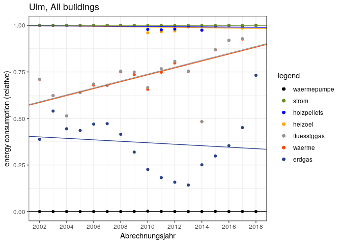

#### Save some of the graphs

#### Cumulative Energietraeger Anteile, simple line-plot:

``` r
ggplot()+geom_line(data=datawide,aes(x=abrechnungsjahr,y=get(et_list[1]),color=et_list[1])
)+geom_line(data=datawide,aes(x=abrechnungsjahr,y=get(et_list[2]),color=et_list[2])
)+geom_line(data=datawide,aes(x=abrechnungsjahr,y=get(et_list[3]),color=et_list[3])
)+geom_line(data=datawide,aes(x=abrechnungsjahr,y=get(et_list[4]),color=et_list[4])
)+geom_line(data=datawide,aes(x=abrechnungsjahr,y=get(et_list[5]),color=et_list[5])
)+geom_line(data=datawide,aes(x=abrechnungsjahr,y=get(et_list[6]),color=et_list[6])
)+geom_line(data=datawide,aes(x=abrechnungsjahr,y=get(et_list[7]),color=et_list[7])
)+scale_color_manual(name="legend",values=cols,breaks=order_legend) + labs(
x="Abrechnungsjahr",y="energy consumption (relative)",title=plot_title)+theme_bw(
)+scale_x_continuous(breaks=seq(2002,2018,2))
```

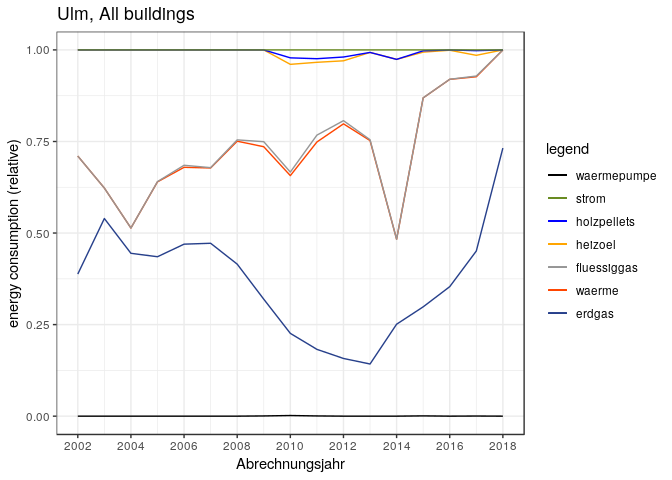

#### Cumulative Energietraeger Anteile, filled plot:

``` r
ggplot()+geom_line(data=datawide,aes(x=abrechnungsjahr,y=get(et_list[1]),color=et_list[1])
)+geom_line(data=datawide,aes(x=abrechnungsjahr,y=get(et_list[2]),color=et_list[2])
)+geom_line(data=datawide,aes(x=abrechnungsjahr,y=get(et_list[3]),color=et_list[3])
)+geom_line(data=datawide,aes(x=abrechnungsjahr,y=get(et_list[4]),color=et_list[4])
)+geom_line(data=datawide,aes(x=abrechnungsjahr,y=get(et_list[5]),color=et_list[5])
)+geom_line(data=datawide,aes(x=abrechnungsjahr,y=get(et_list[6]),color=et_list[6])
)+geom_line(data=datawide,aes(x=abrechnungsjahr,y=get(et_list[7]),color=et_list[7])
)+scale_color_manual(name=" ",values=cols,breaks=order_legend
)+geom_ribbon(data=datawide,aes(x=abrechnungsjahr,ymin=0,ymax=get(et_list[7])),fill=col_list[7]
)+geom_ribbon(data=datawide,aes(x=abrechnungsjahr,ymin=0,ymax=get(et_list[6])),fill=col_list[6]
)+geom_ribbon(data=datawide,aes(x=abrechnungsjahr,ymin=0,ymax=get(et_list[5])),fill=col_list[5]
)+geom_ribbon(data=datawide,aes(x=abrechnungsjahr,ymin=0,ymax=get(et_list[4])),fill=col_list[4]
)+geom_ribbon(data=datawide,aes(x=abrechnungsjahr,ymin=0,ymax=get(et_list[3])),fill=col_list[3]
)+geom_ribbon(data=datawide,aes(x=abrechnungsjahr,ymin=0,ymax=get(et_list[2])),fill=col_list[2]
)+geom_ribbon(data=datawide,aes(x=abrechnungsjahr,ymin=0,ymax=get(et_list[1])),fill=col_list[1])+theme_bw()+ labs(x="Abrechnungsjahr",y="energy consumption (relative)",title=plot_title
)+scale_x_continuous(breaks=seq(2002,2018,2))
```

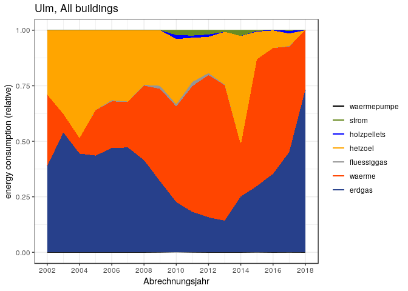

3. Now for the CO<sub>2</sub> emissions
---------------------------------------

### 3a. Find the mean spezifischer verbrauch for each year

**Important point: Take the `witterungsbereinigter spezifischer Verbrauch` in the next iteration instead of the raw numbers. Right I've just taken the raw numbers in the first iteration**

``` r
# point - take it for the witterungsbereinigt
#ulm_sfh_omit2018 <- ulm_sfh[ulm_sfh$abrechnungsjahr!=2018 , ]
#detach(package:ggplot2)
#detach(package:dplyr)
#detach(package:reshape2)
library(dplyr)
by_year <- group_by(ulm_all , abrechnungsjahr)
spz_verbrauch_mean <- as.data.frame(summarize(by_year,mean(verbrauch_gesamt_kwh_spez)))
names(spz_verbrauch_mean) <- c("abrechnungsjahr" , "mean_spz_verberauch")
#nutzflaeche_mean <- as.data.frame(summarize(by_year,mean(gebaeude_nutzflaeche)))
#names(nutzflaeche_mean) <- c("abrechnungsjahr" , "mean_nutzflaeche")
```

``` r
spz_verbrauch_mean
```

    ##    abrechnungsjahr mean_spz_verberauch
    ## 1             2002            181.1009
    ## 2             2003            182.5531
    ## 3             2004            186.9735
    ## 4             2005            175.7286
    ## 5             2006            166.1607
    ## 6             2007            165.2541
    ## 7             2008            158.5098
    ## 8             2009            161.4869
    ## 9             2010            154.2544
    ## 10            2011            154.1869
    ## 11            2012            143.6377
    ## 12            2013            152.2971
    ## 13            2014            157.7889
    ## 14            2015            130.1353
    ## 15            2016            136.1083
    ## 16            2017            131.4485
    ## 17            2018            133.5822

### 3b. Find the total area in Ulm - New Method from official data

`Wohngebaeude 2002 - 2018.xlsx` - the sheet `result` contains data on areas for each year. I saved this file as `Ulm_wohngebaeude_zahl_flaeche.csv`.

``` r
totalArea <- read.csv("Ulm_wohngebaeude_zahl_flaeche.csv",sep=";")
totalArea <- totalArea[ , c("Year","Flaeche_MFH","Flaeche_SFH")]
totalArea$totArea <- totalArea$Flaeche_MFH + totalArea$Flaeche_SFH
totalArea <- totalArea[ , c("Year","totArea")]
names(totalArea) <-  c("abrechnungsjahr","totArea")
totalArea <- totalArea[totalArea$abrechnungsjahr %in% years_for_which_data_exists , ]
totalArea
```

    ##    abrechnungsjahr totArea
    ## 1             2002 4409155
    ## 2             2003 4433927
    ## 3             2004 4482363
    ## 4             2005 4513180
    ## 5             2006 4535041
    ## 6             2007 4565333
    ## 7             2008 4586697
    ## 8             2009 4602457
    ## 9             2010 4752264
    ## 10            2011 4785326
    ## 11            2012 4809467
    ## 12            2013 4845956
    ## 13            2014 4894752
    ## 14            2015 4953429
    ## 15            2016 5000217
    ## 16            2017 5030079
    ## 17            2018 5067906

### 3c. Find the total energy consumption (total area times spezifischer verbrauch)

``` r
totalConsumption <- data.frame(abrechnungsjahr = years_for_which_data_exists , gesamtVerbrauch = totalArea$totArea*spz_verbrauch_mean$mean_spz_verberauch)
totalConsumption$inTWh <- totalConsumption$gesamtVerbrauch/1e9
totalConsumption
```

    ##    abrechnungsjahr gesamtVerbrauch     inTWh
    ## 1             2002       798501979 0.7985020
    ## 2             2003       809427299 0.8094273
    ## 3             2004       838083138 0.8380831
    ## 4             2005       793094631 0.7930946
    ## 5             2006       753545416 0.7535454
    ## 6             2007       754439878 0.7544399
    ## 7             2008       727036280 0.7270363
    ## 8             2009       743236571 0.7432366
    ## 9             2010       733057547 0.7330575
    ## 10            2011       737834714 0.7378347
    ## 11            2012       690820606 0.6908206
    ## 12            2013       738025030 0.7380250
    ## 13            2014       772337479 0.7723375
    ## 14            2015       644616134 0.6446161
    ## 15            2016       680571271 0.6805713
    ## 16            2017       661196433 0.6611964
    ## 17            2018       676982145 0.6769821

``` r
#ggplot()+geom_point(data=totalConsumption,aes(x=abrechnungsjahr,y=gesamtVerbrauch))+theme_bw()+labs(y="Energy consumption in kWh")
#ggplot()+geom_point(data=totalConsumption,aes(x=abrechnungsjahr,y=inTWh))+theme_bw()+labs(y="Energy consumption in TWh")
```

### 3d. Break up the total energy consumption according to the `energietraegers`

The shares are in the `final_prop_table`.

``` r
is_not_year <- names(final_prop_table) != "abrechnungsjahr"
energy_shares_absolute <- totalConsumption$gesamtVerbrauch * final_prop_table[,is_not_year]
energy_shares_absolute$abrechnungsjahr <- years_for_which_data_exists
energy_shares_absolute
```

    ##    waermepumpe    erdgas    waerme fluessiggas   heizoel holzpellets
    ## 1          0.0 309806327 257281468         0.0 231414183         0.0
    ## 2          0.0 436800728  67328882         0.0 305297689         0.0
    ## 3          0.0 372632960  57859504         0.0 407590674         0.0
    ## 4          0.0 345251806 162150381    573827.4 285118616         0.0
    ## 5          0.0 353888868 158111477   4224135.0 237320936         0.0
    ## 6          0.0 356144675 155111726    669402.9 242514074         0.0
    ## 7          0.0 301776744 244053402   2638595.0 178567539         0.0
    ## 8     428249.1 236908924 309405285  10253410.3 186240702         0.0
    ## 9    1259385.3 164435549 315748668   7100616.9 215641363  13014189.7
    ## 10    440434.0 134123122 417776299  13840983.9 146718433   7240196.4
    ## 11         0.0 108823607 442561943   5978984.6 112919566   7157008.6
    ## 12         0.0 105077340 450283333   1709121.1 175900822         0.0
    ## 13         0.0 193903253 179162345         0.0 379340220         0.0
    ## 14    482755.2 191932071 367787699    148393.4  80379036   2299983.6
    ## 15         0.0 240676228 385242304    154957.8  53893717    604063.6
    ## 16    217826.1 297915328 314595590   1334875.7  37400252   8377034.3
    ## 17         0.0 495565696 181416449         0.0         0         0.0
    ##       strom abrechnungsjahr
    ## 1         0            2002
    ## 2         0            2003
    ## 3         0            2004
    ## 4         0            2005
    ## 5         0            2006
    ## 6         0            2007
    ## 7         0            2008
    ## 8         0            2009
    ## 9  15857774            2010
    ## 10 17695246            2011
    ## 11 13379497            2012
    ## 12  5054413            2013
    ## 13 19931662            2014
    ## 14  1586196            2015
    ## 15        0            2016
    ## 16  1355527            2017
    ## 17        0            2018

### 3e. The CO<sub>2</sub> coefficients

I'm using the preliminary coefficients from <https://www.dropbox.com/s/j63ednj6tmzakou/4.3.2.15.3.%20CO2-Koeffizienten%202018.xlsx?dl=0>

I've saved the above as `MunichCO2Koeffizienten.txt`. Modified to `UlmCO2Koeffizienten.txt` with the only change occuring in the `waerme` coefficient.

``` r
co2_coeff <- read.table("UlmCO2Koeffizienten.txt",header=TRUE)
names(co2_coeff) <- c("abrechnungsjahr","erdgas","waerme","fluessiggas","heizoel","holzpellets","strom")
co2_coeff
```

    ##    abrechnungsjahr erdgas waerme fluessiggas heizoel holzpellets strom
    ## 1             2002    203     76         230     266           6   654
    ## 2             2003    203     76         230     266           6   635
    ## 3             2004    203     76         230     266           6   615
    ## 4             2005    203     76         230     266           6   611
    ## 5             2006    203     76         230     266           6   604
    ## 6             2007    203     76         230     266           6   623
    ## 7             2008    203     76         230     266           6   584
    ## 8             2009    203     76         230     266           6   569
    ## 9             2010    203     76         234     266           6   559
    ## 10            2011    203     76         234     266           6   569
    ## 11            2012    203     76         234     266           6   574
    ## 12            2013    202     76         231     267           6   573
    ## 13            2014    201     76         229     268           6   559
    ## 14            2015    201     76         230     268           6   528
    ## 15            2016    201     76         230     268           6   516
    ## 16            2017    201     76         230     268           6   489
    ## 17            2018    201     76         230     268           6   467

The units for the above coefficients are *g*/*k**W**h*.

### 3f. The CO<sub>2</sub> emissions - coefficients × energy

``` r
names(co2_coeff)
```

    ## [1] "abrechnungsjahr" "erdgas"          "waerme"          "fluessiggas"    
    ## [5] "heizoel"         "holzpellets"     "strom"

``` r
names(energy_shares_absolute)
```

    ## [1] "waermepumpe"     "erdgas"          "waerme"          "fluessiggas"    
    ## [5] "heizoel"         "holzpellets"     "strom"           "abrechnungsjahr"

The names of columns common to `co2_coeff` and `energy_shares_absolute` must be the same. The above command lets you check this. Next, extract only the common columns from `co2_coeff` and retain only the years which are present in the data

``` r
co2_coeff_subset <- co2_coeff[ , names(co2_coeff) %in% names(energy_shares_absolute)]
co2_coeff_subset <- co2_coeff_subset[co2_coeff_subset$abrechnungsjahr %in% years_for_which_data_exists , ]
co2_coeff_subset
```

    ##    abrechnungsjahr erdgas waerme fluessiggas heizoel holzpellets strom
    ## 1             2002    203     76         230     266           6   654
    ## 2             2003    203     76         230     266           6   635
    ## 3             2004    203     76         230     266           6   615
    ## 4             2005    203     76         230     266           6   611
    ## 5             2006    203     76         230     266           6   604
    ## 6             2007    203     76         230     266           6   623
    ## 7             2008    203     76         230     266           6   584
    ## 8             2009    203     76         230     266           6   569
    ## 9             2010    203     76         234     266           6   559
    ## 10            2011    203     76         234     266           6   569
    ## 11            2012    203     76         234     266           6   574
    ## 12            2013    202     76         231     267           6   573
    ## 13            2014    201     76         229     268           6   559
    ## 14            2015    201     76         230     268           6   528
    ## 15            2016    201     76         230     268           6   516
    ## 16            2017    201     76         230     268           6   489
    ## 17            2018    201     76         230     268           6   467

An now you have to multiply the coefficents with the energy consumption:

``` r
###########multiply coefficients with energy consumption##################
# IT is very important that the names of the variables be the same (not 
#necessarily in the same order, but for example the erdgas in both should 
#be named erdgas, and not erdgas in one and Erdgas in another) in the 
#coefficients file and the consumption (energy_shares_absolute) file
#make same names:
#names(energy_shares_absolute)[names(energy_shares_absolute)=="fernwaerme"] <- "waerme"
#same names made
energy_shares_absolute_matchcoeff <- energy_shares_absolute[,names(co2_coeff_subset)]
energy_shares_absolute_matchcoeff
```

    ##    abrechnungsjahr    erdgas    waerme fluessiggas   heizoel holzpellets
    ## 1             2002 309806327 257281468         0.0 231414183         0.0
    ## 2             2003 436800728  67328882         0.0 305297689         0.0
    ## 3             2004 372632960  57859504         0.0 407590674         0.0
    ## 4             2005 345251806 162150381    573827.4 285118616         0.0
    ## 5             2006 353888868 158111477   4224135.0 237320936         0.0
    ## 6             2007 356144675 155111726    669402.9 242514074         0.0
    ## 7             2008 301776744 244053402   2638595.0 178567539         0.0
    ## 8             2009 236908924 309405285  10253410.3 186240702         0.0
    ## 9             2010 164435549 315748668   7100616.9 215641363  13014189.7
    ## 10            2011 134123122 417776299  13840983.9 146718433   7240196.4
    ## 11            2012 108823607 442561943   5978984.6 112919566   7157008.6
    ## 12            2013 105077340 450283333   1709121.1 175900822         0.0
    ## 13            2014 193903253 179162345         0.0 379340220         0.0
    ## 14            2015 191932071 367787699    148393.4  80379036   2299983.6
    ## 15            2016 240676228 385242304    154957.8  53893717    604063.6
    ## 16            2017 297915328 314595590   1334875.7  37400252   8377034.3
    ## 17            2018 495565696 181416449         0.0         0         0.0
    ##       strom
    ## 1         0
    ## 2         0
    ## 3         0
    ## 4         0
    ## 5         0
    ## 6         0
    ## 7         0
    ## 8         0
    ## 9  15857774
    ## 10 17695246
    ## 11 13379497
    ## 12  5054413
    ## 13 19931662
    ## 14  1586196
    ## 15        0
    ## 16  1355527
    ## 17        0

``` r
co2_emissions <- (energy_shares_absolute_matchcoeff[,
          names(energy_shares_absolute_matchcoeff)!="abrechnungsjahr"])*co2_coeff_subset[,names(co2_coeff_subset)!="abrechnungsjahr"]
co2_emissions
```

    ##         erdgas      waerme fluessiggas      heizoel holzpellets
    ## 1  62890684468 19553391587           0  61556172717           0
    ## 2  88670547702  5116994999           0  81209185386           0
    ## 3  75644490781  4397322301           0 108419119345           0
    ## 4  70086116599 12323428992   131980291  75841551892           0
    ## 5  71839440114 12016472241   971551047  63127369108           0
    ## 6  72297369002 11788491160   153962659  64508743741           0
    ## 7  61260678972 18548058524   606876858  47498965471           0
    ## 8  48092511546 23514801645  2358284375  49540026861           0
    ## 9  33380416523 23996898765  1661544363  57360602655    78085138
    ## 10 27226993684 31750998712  3238790238  39027103289    43441178
    ## 11 22091192212 33634707654  1399082392  30036604580    42942052
    ## 12 21225622714 34221533309   394806981  46965519606           0
    ## 13 38974553881 13616338196           0 101663178861           0
    ## 14 38578346343 27951865111    34130488  21541581656    13799902
    ## 15 48375921851 29278415115    35640304  14443516250     3624382
    ## 16 59880980951 23909264821   307021402  10023267474    50262206
    ## 17 99608704959 13787650138           0            0           0
    ##          strom
    ## 1            0
    ## 2            0
    ## 3            0
    ## 4            0
    ## 5            0
    ## 6            0
    ## 7            0
    ## 8            0
    ## 9   8864495601
    ## 10 10068594933
    ## 11  7679831306
    ## 12  2896178703
    ## 13 11141799061
    ## 14   837511279
    ## 15           0
    ## 16   662852684
    ## 17           0

The above answer is in grams. Divide by 1e9 to get the answer in kilo tonnes.

``` r
co2_emissions_in_kilo_tons <- co2_emissions/1e9
co2_emissions_in_kilo_tons$abrechnungsjahr <- years_for_which_data_exists
co2_emissions_in_kilo_tons$total <- rowSums(co2_emissions_in_kilo_tons[,names(co2_emissions_in_kilo_tons)!="abrechnungsjahr"])
co2_emissions_in_kilo_tons
```

    ##      erdgas    waerme fluessiggas   heizoel holzpellets      strom
    ## 1  62.89068 19.553392  0.00000000  61.55617 0.000000000  0.0000000
    ## 2  88.67055  5.116995  0.00000000  81.20919 0.000000000  0.0000000
    ## 3  75.64449  4.397322  0.00000000 108.41912 0.000000000  0.0000000
    ## 4  70.08612 12.323429  0.13198029  75.84155 0.000000000  0.0000000
    ## 5  71.83944 12.016472  0.97155105  63.12737 0.000000000  0.0000000
    ## 6  72.29737 11.788491  0.15396266  64.50874 0.000000000  0.0000000
    ## 7  61.26068 18.548059  0.60687686  47.49897 0.000000000  0.0000000
    ## 8  48.09251 23.514802  2.35828438  49.54003 0.000000000  0.0000000
    ## 9  33.38042 23.996899  1.66154436  57.36060 0.078085138  8.8644956
    ## 10 27.22699 31.750999  3.23879024  39.02710 0.043441178 10.0685949
    ## 11 22.09119 33.634708  1.39908239  30.03660 0.042942052  7.6798313
    ## 12 21.22562 34.221533  0.39480698  46.96552 0.000000000  2.8961787
    ## 13 38.97455 13.616338  0.00000000 101.66318 0.000000000 11.1417991
    ## 14 38.57835 27.951865  0.03413049  21.54158 0.013799902  0.8375113
    ## 15 48.37592 29.278415  0.03564030  14.44352 0.003624382  0.0000000
    ## 16 59.88098 23.909265  0.30702140  10.02327 0.050262206  0.6628527
    ## 17 99.60870 13.787650  0.00000000   0.00000 0.000000000  0.0000000
    ##    abrechnungsjahr     total
    ## 1             2002 144.00025
    ## 2             2003 174.99673
    ## 3             2004 188.46093
    ## 4             2005 158.38308
    ## 5             2006 147.95483
    ## 6             2007 148.74857
    ## 7             2008 127.91458
    ## 8             2009 123.50562
    ## 9             2010 125.34204
    ## 10            2011 111.35592
    ## 11            2012  94.88436
    ## 12            2013 105.70366
    ## 13            2014 165.39587
    ## 14            2015  88.95723
    ## 15            2016  92.13712
    ## 16            2017  94.83365
    ## 17            2018 113.39636

### 3g. Total CO<sub>2</sub> emissions

``` r
linmod <- lm(data=co2_emissions_in_kilo_tons,formula=total~abrechnungsjahr)
a <- as.numeric(coefficients(linmod)[1])
b <- as.numeric(coefficients(linmod)[2])
if (a<0) {
  asign <- " "
} else {asign <- "+"}
if (b<0) {
  bsign <- " "
} else {bsign <- " "}
ggplot()+geom_line(data=co2_emissions_in_kilo_tons,aes(x=abrechnungsjahr,y=total),color="blue")+geom_point(data=co2_emissions_in_kilo_tons,aes(x=abrechnungsjahr,y=total),color="blue")+theme_bw()+labs(x="Abrechnungsjahr",y="co2 emissions (kilo tonnes)",title=plot_title)+ylim(0,max(co2_emissions_in_kilo_tons$total))+geom_smooth(method="lm",data=co2_emissions_in_kilo_tons,aes(x=abrechnungsjahr,y=total),se=FALSE)+annotate(geom="text",label=paste0(bsign,as.character(round(b,2)),"x",asign,as.character(round(a,0))),x=2008,y=60)+scale_x_continuous(breaks=seq(2002,2018,2))
```

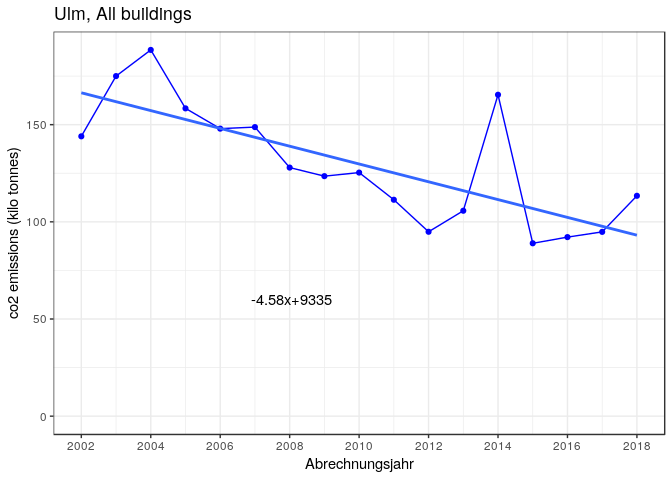

``` r
#https://stackoverflow.com/questions/15633714/adding-a-regression-line-on-a-ggplot  
#ggsave("total_co2_emission.jpg")
```

### 3h. CO<sub>2</sub> emissions according to energietraeger (absolute value):

``` r
co2cumsums <- co2_emissions_in_kilo_tons
#co2cumsums <- co2cumsums[,c("abrechnungsjahr","holzpellets","strom","fluessiggas","erdgas","heizoel")]
co2cumsums <- as.data.frame(t(apply(co2cumsums[,!(names(co2cumsums)%in%c("abrechnungsjahr","total"))],1,cumsum)))
co2cumsums$abrechnungsjahr <- years_for_which_data_exists
co2cumsums
```

    ##      erdgas    waerme fluessiggas   heizoel holzpellets     strom
    ## 1  62.89068  82.44408    82.44408 144.00025   144.00025 144.00025
    ## 2  88.67055  93.78754    93.78754 174.99673   174.99673 174.99673
    ## 3  75.64449  80.04181    80.04181 188.46093   188.46093 188.46093
    ## 4  70.08612  82.40955    82.54153 158.38308   158.38308 158.38308
    ## 5  71.83944  83.85591    84.82746 147.95483   147.95483 147.95483
    ## 6  72.29737  84.08586    84.23982 148.74857   148.74857 148.74857
    ## 7  61.26068  79.80874    80.41561 127.91458   127.91458 127.91458
    ## 8  48.09251  71.60731    73.96560 123.50562   123.50562 123.50562
    ## 9  33.38042  57.37732    59.03886 116.39946   116.47755 125.34204
    ## 10 27.22699  58.97799    62.21678 101.24389   101.28733 111.35592
    ## 11 22.09119  55.72590    57.12498  87.16159    87.20453  94.88436
    ## 12 21.22562  55.44716    55.84196 102.80748   102.80748 105.70366
    ## 13 38.97455  52.59089    52.59089 154.25407   154.25407 165.39587
    ## 14 38.57835  66.53021    66.56434  88.10592    88.11972  88.95723
    ## 15 48.37592  77.65434    77.68998  92.13349    92.13712  92.13712
    ## 16 59.88098  83.79025    84.09727  94.12053    94.17080  94.83365
    ## 17 99.60870 113.39636   113.39636 113.39636   113.39636 113.39636
    ##    abrechnungsjahr
    ## 1             2002
    ## 2             2003
    ## 3             2004
    ## 4             2005
    ## 5             2006
    ## 6             2007
    ## 7             2008
    ## 8             2009
    ## 9             2010
    ## 10            2011
    ## 11            2012
    ## 12            2013
    ## 13            2014
    ## 14            2015
    ## 15            2016
    ## 16            2017
    ## 17            2018

##### simple line curve:

``` r
order_legend_2 <- rev(c("erdgas","waerme","fluessiggas","heizoel","holzpellets","strom"))
ggplot()+geom_line(data=co2cumsums,aes(x=abrechnungsjahr,y=get(et_list[2]),color=et_list[2])
)+geom_line(data=co2cumsums,aes(x=abrechnungsjahr,y=get(et_list[3]),color=et_list[3])
)+geom_line(data=co2cumsums,aes(x=abrechnungsjahr,y=get(et_list[4]),color=et_list[4])
)+geom_line(data=co2cumsums,aes(x=abrechnungsjahr,y=get(et_list[5]),color=et_list[5])
)+geom_line(data=co2cumsums,aes(x=abrechnungsjahr,y=get(et_list[6]),color=et_list[6])
)+geom_line(data=co2cumsums,aes(x=abrechnungsjahr,y=get(et_list[7]),color=et_list[7])
)+scale_color_manual(name="legend",values=cols,breaks=order_legend_2) + labs(x="Abrechnungsjahr",y="co2 emissions (kilo tonnes)",title=plot_title)+theme_bw()+scale_x_continuous(breaks=seq(2002,2018,2))
```

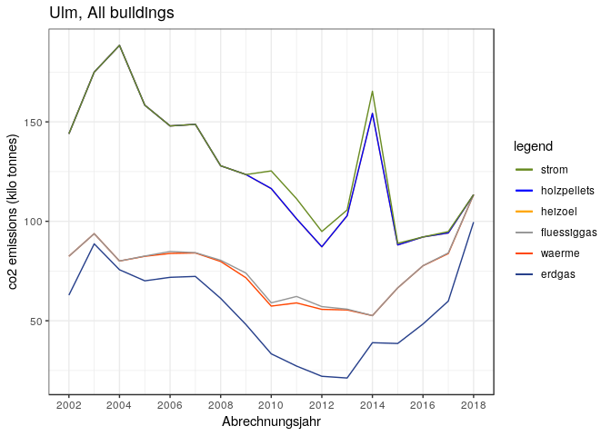

##### filled graph:

``` r
ggplot()+geom_line(data=co2cumsums,aes(x=abrechnungsjahr,y=get(et_list[2]),color=et_list[2])
)+geom_line(data=co2cumsums,aes(x=abrechnungsjahr,y=get(et_list[3]),color=et_list[3])
)+geom_line(data=co2cumsums,aes(x=abrechnungsjahr,y=get(et_list[4]),color=et_list[4])
)+geom_line(data=co2cumsums,aes(x=abrechnungsjahr,y=get(et_list[5]),color=et_list[5])
)+geom_line(data=co2cumsums,aes(x=abrechnungsjahr,y=get(et_list[6]),color=et_list[6])
)+geom_line(data=co2cumsums,aes(x=abrechnungsjahr,y=get(et_list[7]),color=et_list[7])
)+scale_color_manual(name=" ",values=cols,breaks=order_legend_2
)+geom_ribbon(data=co2cumsums,aes(x=abrechnungsjahr,ymin=0,ymax=get(et_list[7])),fill=col_list[7]
)+geom_ribbon(data=co2cumsums,aes(x=abrechnungsjahr,ymin=0,ymax=get(et_list[6])),fill=col_list[6]
)+geom_ribbon(data=co2cumsums,aes(x=abrechnungsjahr,ymin=0,ymax=get(et_list[5])),fill=col_list[5]
)+geom_ribbon(data=co2cumsums,aes(x=abrechnungsjahr,ymin=0,ymax=get(et_list[4])),fill=col_list[4]
)+geom_ribbon(data=co2cumsums,aes(x=abrechnungsjahr,ymin=0,ymax=get(et_list[3])),fill=col_list[3]
)+geom_ribbon(data=co2cumsums,aes(x=abrechnungsjahr,ymin=0,ymax=get(et_list[2])),fill=col_list[2]
)+theme_bw()+ labs(x="Abrechnungsjahr",y="co2 emissions (kilo tonnes)",title=plot_title)+scale_x_continuous(breaks=seq(2002,2018,2))
```

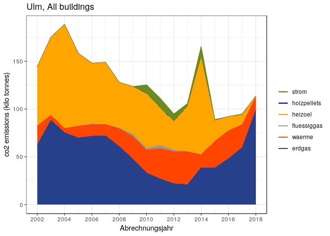

``` r
#ggsave("co2emissions_absolute.jpg")
```

### 3i. relative shares of CO<sub>2</sub> emissions according to energietraeger

**do the witterungsbereinigung later. 1. first address these issues: Area in 2018 (see email from Johannes) and 2. the skype chat regarding waerme, fernwaerme and nahwaerme and 3. linearizing the graphs**

``` r
co2anteile_cumsums <- as.data.frame(sapply(co2cumsums[,names(co2cumsums)!="abrechnungsjahr"] , function(obj) obj/co2cumsums$strom))
co2anteile_cumsums$abrechnungsjahr <- years_for_which_data_exists
co2anteile_cumsums
```

    ##       erdgas    waerme fluessiggas   heizoel holzpellets strom
    ## 1  0.4367401 0.5725273   0.5725273 1.0000000   1.0000000     1
    ## 2  0.5066983 0.5359388   0.5359388 1.0000000   1.0000000     1
    ## 3  0.4013802 0.4247130   0.4247130 1.0000000   1.0000000     1
    ## 4  0.4425101 0.5203179   0.5211512 1.0000000   1.0000000     1
    ## 5  0.4855498 0.5667670   0.5733335 1.0000000   1.0000000     1
    ## 6  0.4860374 0.5652885   0.5663236 1.0000000   1.0000000     1
    ## 7  0.4789187 0.6239221   0.6286665 1.0000000   1.0000000     1
    ## 8  0.3893953 0.5797899   0.5988844 1.0000000   1.0000000     1
    ## 9  0.2663146 0.4577659   0.4710220 0.9286546   0.9292776     1
    ## 10 0.2445042 0.5296350   0.5587200 0.9091918   0.9095819     1
    ## 11 0.2328223 0.5873033   0.6020485 0.9186086   0.9190611     1
    ## 12 0.2008031 0.5245528   0.5282879 0.9726010   0.9726010     1
    ## 13 0.2356441 0.3179698   0.3179698 0.9326356   0.9326356     1
    ## 14 0.4336729 0.7478898   0.7482735 0.9904301   0.9905852     1
    ## 15 0.5250427 0.8428127   0.8431996 0.9999607   1.0000000     1
    ## 16 0.6314318 0.8835497   0.8867872 0.9924804   0.9930104     1
    ## 17 0.8784119 1.0000000   1.0000000 1.0000000   1.0000000     1
    ##    abrechnungsjahr
    ## 1             2002
    ## 2             2003
    ## 3             2004
    ## 4             2005
    ## 5             2006
    ## 6             2007
    ## 7             2008
    ## 8             2009
    ## 9             2010
    ## 10            2011
    ## 11            2012
    ## 12            2013
    ## 13            2014
    ## 14            2015
    ## 15            2016
    ## 16            2017
    ## 17            2018

``` r
ggplot()+geom_line(data=co2anteile_cumsums,aes(x=abrechnungsjahr,y=get(et_list[2]),color=et_list[2])
)+geom_line(data=co2anteile_cumsums,aes(x=abrechnungsjahr,y=get(et_list[3]),color=et_list[3])
)+geom_line(data=co2anteile_cumsums,aes(x=abrechnungsjahr,y=get(et_list[4]),color=et_list[4])
)+geom_line(data=co2anteile_cumsums,aes(x=abrechnungsjahr,y=get(et_list[5]),color=et_list[5])
)+geom_line(data=co2anteile_cumsums,aes(x=abrechnungsjahr,y=get(et_list[6]),color=et_list[6])
)+geom_line(data=co2anteile_cumsums,aes(x=abrechnungsjahr,y=get(et_list[7]),color=et_list[7])
)+scale_color_manual(name=" ",values=cols,breaks=order_legend_2
)+geom_ribbon(data=co2anteile_cumsums,aes(x=abrechnungsjahr,ymin=0,ymax=get(et_list[7])),fill=col_list[7]
)+geom_ribbon(data=co2anteile_cumsums,aes(x=abrechnungsjahr,ymin=0,ymax=get(et_list[6])),fill=col_list[6]
)+geom_ribbon(data=co2anteile_cumsums,aes(x=abrechnungsjahr,ymin=0,ymax=get(et_list[5])),fill=col_list[5]
)+geom_ribbon(data=co2anteile_cumsums,aes(x=abrechnungsjahr,ymin=0,ymax=get(et_list[4])),fill=col_list[4]
)+geom_ribbon(data=co2anteile_cumsums,aes(x=abrechnungsjahr,ymin=0,ymax=get(et_list[3])),fill=col_list[3]
)+geom_ribbon(data=co2anteile_cumsums,aes(x=abrechnungsjahr,ymin=0,ymax=get(et_list[2])),fill=col_list[2]
)+theme_bw()+ labs(x="Abrechnungsjahr",y="co2 emissions (relative)",title=plot_title)+scale_x_continuous(breaks=seq(2002,2018,2))
```

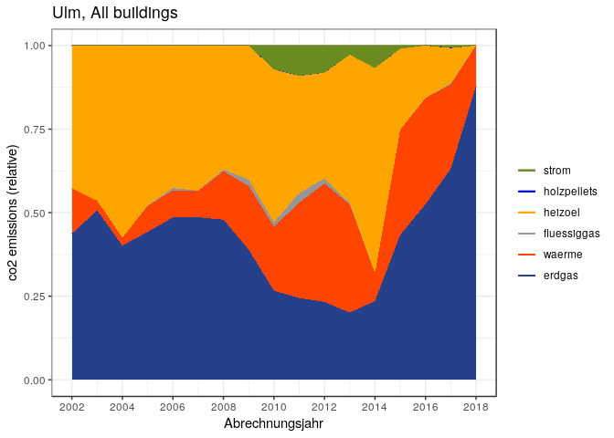

``` r
#ggsave("co2emissions_relative.jpg")
```

### 3j. Specific CO<sub>2</sub> emissions

Now we calculate the total CO<sub>2</sub> emissions per square meter for each year in kg/m<sup>2</sup>

``` r
spez_co2_emission <- data.frame(abrechnungsjahr = years_for_which_data_exists , spez_co2 = 0.001*rowSums(co2_emissions)/totalArea$totArea)
spez_co2_emission
```

    ##    abrechnungsjahr spez_co2
    ## 1             2002 32.65938
    ## 2             2003 39.46766
    ## 3             2004 42.04500
    ## 4             2005 35.09345
    ## 5             2006 32.62481
    ## 6             2007 32.58219
    ## 7             2008 27.88817
    ## 8             2009 26.83472
    ## 9             2010 26.37523
    ## 10            2011 23.27029
    ## 11            2012 19.72866
    ## 12            2013 21.81276
    ## 13            2014 33.79045
    ## 14            2015 17.95872
    ## 15            2016 18.42662
    ## 16            2017 18.85331
    ## 17            2018 22.37539

``` r
linmod_spez <- lm(data=spez_co2_emission,formula=spez_co2~abrechnungsjahr)
a_spez <- as.numeric(coefficients(linmod_spez)[1])
b_spez <- as.numeric(coefficients(linmod_spez)[2])
if (a_spez<0) {
  asign_spez <- " "
} else {asign_spez <- "+"}
if (b_spez<0) {
  bsign_spez <- " "
} else {bsign_spez <- " "}
ggplot()+geom_line(data=spez_co2_emission,aes(x=abrechnungsjahr,y=spez_co2),color="blue")+geom_point(
  data=spez_co2_emission,aes(x=abrechnungsjahr,y=spez_co2),color="blue")+theme_bw()+labs(x="Abrechnungsjahr",
  y="co2 emissions (kg/sq. m)",title=plot_title)+ylim(0,max(spez_co2_emission$spez_co2))+geom_smooth(
  method="lm",data=spez_co2_emission,aes(x=abrechnungsjahr,y=spez_co2),se=FALSE)+annotate(
  geom="text",label=paste0(bsign_spez,as.character(round(b_spez,2)),"x",asign_spez,as.character(round(a_spez,0))
  ),x=2010,y=30)+scale_x_continuous(breaks=seq(2002,2018,2))
```

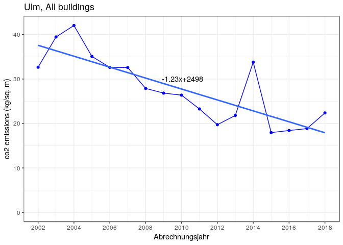

Make linear trends
==================

-   for co2 emissions absolute and relative.

-   show both the points and linear fits for the absolute in one graph and relative in another.

-   Then show the fills for the linear trends- one in absolute and one in relative

`co2anteile_cumsums` and `co2cumsums`

``` r
co2cumsums
```

    ##      erdgas    waerme fluessiggas   heizoel holzpellets     strom
    ## 1  62.89068  82.44408    82.44408 144.00025   144.00025 144.00025
    ## 2  88.67055  93.78754    93.78754 174.99673   174.99673 174.99673
    ## 3  75.64449  80.04181    80.04181 188.46093   188.46093 188.46093
    ## 4  70.08612  82.40955    82.54153 158.38308   158.38308 158.38308
    ## 5  71.83944  83.85591    84.82746 147.95483   147.95483 147.95483
    ## 6  72.29737  84.08586    84.23982 148.74857   148.74857 148.74857
    ## 7  61.26068  79.80874    80.41561 127.91458   127.91458 127.91458
    ## 8  48.09251  71.60731    73.96560 123.50562   123.50562 123.50562
    ## 9  33.38042  57.37732    59.03886 116.39946   116.47755 125.34204
    ## 10 27.22699  58.97799    62.21678 101.24389   101.28733 111.35592
    ## 11 22.09119  55.72590    57.12498  87.16159    87.20453  94.88436
    ## 12 21.22562  55.44716    55.84196 102.80748   102.80748 105.70366
    ## 13 38.97455  52.59089    52.59089 154.25407   154.25407 165.39587
    ## 14 38.57835  66.53021    66.56434  88.10592    88.11972  88.95723
    ## 15 48.37592  77.65434    77.68998  92.13349    92.13712  92.13712
    ## 16 59.88098  83.79025    84.09727  94.12053    94.17080  94.83365
    ## 17 99.60870 113.39636   113.39636 113.39636   113.39636 113.39636
    ##    abrechnungsjahr
    ## 1             2002
    ## 2             2003
    ## 3             2004
    ## 4             2005
    ## 5             2006
    ## 6             2007
    ## 7             2008
    ## 8             2009
    ## 9             2010
    ## 10            2011
    ## 11            2012
    ## 12            2013
    ## 13            2014
    ## 14            2015
    ## 15            2016
    ## 16            2017
    ## 17            2018

``` r
co2anteile_cumsums
```

    ##       erdgas    waerme fluessiggas   heizoel holzpellets strom
    ## 1  0.4367401 0.5725273   0.5725273 1.0000000   1.0000000     1
    ## 2  0.5066983 0.5359388   0.5359388 1.0000000   1.0000000     1
    ## 3  0.4013802 0.4247130   0.4247130 1.0000000   1.0000000     1
    ## 4  0.4425101 0.5203179   0.5211512 1.0000000   1.0000000     1
    ## 5  0.4855498 0.5667670   0.5733335 1.0000000   1.0000000     1
    ## 6  0.4860374 0.5652885   0.5663236 1.0000000   1.0000000     1
    ## 7  0.4789187 0.6239221   0.6286665 1.0000000   1.0000000     1
    ## 8  0.3893953 0.5797899   0.5988844 1.0000000   1.0000000     1
    ## 9  0.2663146 0.4577659   0.4710220 0.9286546   0.9292776     1
    ## 10 0.2445042 0.5296350   0.5587200 0.9091918   0.9095819     1
    ## 11 0.2328223 0.5873033   0.6020485 0.9186086   0.9190611     1
    ## 12 0.2008031 0.5245528   0.5282879 0.9726010   0.9726010     1
    ## 13 0.2356441 0.3179698   0.3179698 0.9326356   0.9326356     1
    ## 14 0.4336729 0.7478898   0.7482735 0.9904301   0.9905852     1
    ## 15 0.5250427 0.8428127   0.8431996 0.9999607   1.0000000     1
    ## 16 0.6314318 0.8835497   0.8867872 0.9924804   0.9930104     1
    ## 17 0.8784119 1.0000000   1.0000000 1.0000000   1.0000000     1
    ##    abrechnungsjahr
    ## 1             2002
    ## 2             2003
    ## 3             2004
    ## 4             2005
    ## 5             2006
    ## 6             2007
    ## 7             2008
    ## 8             2009
    ## 9             2010
    ## 10            2011
    ## 11            2012
    ## 12            2013
    ## 13            2014
    ## 14            2015
    ## 15            2016
    ## 16            2017
    ## 17            2018

``` r
#co2cumsums
#co2anteile_cumsums
et_list_2 <- names(co2cumsums)[names(co2cumsums)!="abrechnungsjahr"]
co2cumsums_linear <- co2cumsums
storage_co2 <- list()
for (et in et_list_2) {
  storage_co2[[et]] <- lm(get(et) ~ abrechnungsjahr , data = co2cumsums)
}
for (et in et_list_2) {
  #colname <- paste0(et,"_lm")
  co2cumsums_linear[[et]] <- predict(storage_co2[[et]] , newdata = co2cumsums)
}


storage_co2_anteile <- list()
co2anteile_cumsums_linear <- co2anteile_cumsums
for (et in et_list_2) {
  storage_co2_anteile[[et]] <- lm(get(et) ~ abrechnungsjahr , data = co2anteile_cumsums)
}
for (et in et_list_2) {
  #colname <- paste0(et,"_lm")
  co2anteile_cumsums_linear[[et]] <- predict(storage_co2_anteile[[et]] , newdata = co2anteile_cumsums)
}
```

``` r
slopes_co2 <- NULL
intercepts_co2 <- NULL
for (et in et_list_2) {
  intercepts_co2 <- c(intercepts_co2 , as.numeric(coefficients(storage_co2[[et]])[1]))
  slopes_co2     <-     c(slopes_co2 , as.numeric(coefficients(storage_co2[[et]])[2]))
}
slopes_co2_anteile <- NULL
intercepts_co2_anteile <- NULL
for (et in et_list_2) {
  intercepts_co2_anteile <- c(intercepts_co2_anteile , as.numeric(coefficients(storage_co2_anteile[[et]])[1]))
  slopes_co2_anteile     <- c(slopes_co2_anteile , as.numeric(coefficients(storage_co2_anteile[[et]])[2]))
}
```

``` r
require(ggplot2)
ggplot()+geom_point(data=co2cumsums,aes(x=abrechnungsjahr,y=get(et_list[2]),color=et_list[2])
)+geom_point(data=co2cumsums,aes(x=abrechnungsjahr,y=get(et_list[3]),color=et_list[3])
)+geom_point(data=co2cumsums,aes(x=abrechnungsjahr,y=get(et_list[4]),color=et_list[4])
)+geom_point(data=co2cumsums,aes(x=abrechnungsjahr,y=get(et_list[5]),color=et_list[5])
)+geom_point(data=co2cumsums,aes(x=abrechnungsjahr,y=get(et_list[6]),color=et_list[6])
)+geom_point(data=co2cumsums,aes(x=abrechnungsjahr,y=get(et_list[7]),color=et_list[7])
)+geom_abline(intercept=intercepts_co2[1],slope=slopes_co2[1],colour=col_list[2]
)+geom_abline(intercept=intercepts_co2[2],slope=slopes_co2[2],colour=col_list[3]
)+geom_abline(intercept=intercepts_co2[3],slope=slopes_co2[3],colour=col_list[4]
)+geom_abline(intercept=intercepts_co2[4],slope=slopes_co2[4],colour=col_list[5]
)+geom_abline(intercept=intercepts_co2[5],slope=slopes_co2[5],colour=col_list[6]
)+geom_abline(intercept=intercepts_co2[6],slope=slopes_co2[6],colour=col_list[7]
)+labs(x="Abrechnungsjahr",y="co2 emissions (kilo tonnes)"
)+scale_color_manual(name=" ",values=cols,breaks=order_legend_2) + theme_bw()+scale_x_continuous(breaks=seq(2002,2018,2))
```

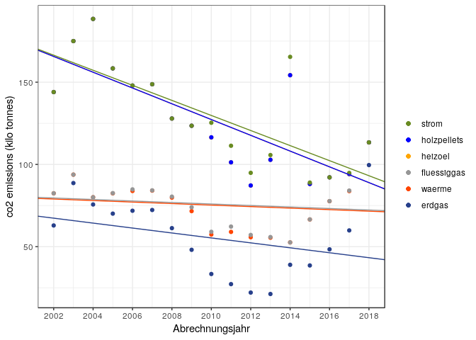

``` r
#ggsave("co2emissions_absolute_real_and_linearized.jpg")
```

``` r
require(ggplot2)
ggplot()+geom_point(data=co2anteile_cumsums,aes(x=abrechnungsjahr,y=get(et_list[2]),color=et_list[2])
)+geom_point(data=co2anteile_cumsums,aes(x=abrechnungsjahr,y=get(et_list[3]),color=et_list[3])
)+geom_point(data=co2anteile_cumsums,aes(x=abrechnungsjahr,y=get(et_list[4]),color=et_list[4])
)+geom_point(data=co2anteile_cumsums,aes(x=abrechnungsjahr,y=get(et_list[5]),color=et_list[5])
)+geom_point(data=co2anteile_cumsums,aes(x=abrechnungsjahr,y=get(et_list[6]),color=et_list[6])
)+geom_point(data=co2anteile_cumsums,aes(x=abrechnungsjahr,y=get(et_list[7]),color=et_list[7])
)+geom_abline(intercept=intercepts_co2_anteile[1],slope=slopes_co2_anteile[1],colour=col_list[2]
)+geom_abline(intercept=intercepts_co2_anteile[2],slope=slopes_co2_anteile[2],colour=col_list[3]
)+geom_abline(intercept=intercepts_co2_anteile[3],slope=slopes_co2_anteile[3],colour=col_list[4]
)+geom_abline(intercept=intercepts_co2_anteile[4],slope=slopes_co2_anteile[4],colour=col_list[5]
)+geom_abline(intercept=intercepts_co2_anteile[5],slope=slopes_co2_anteile[5],colour=col_list[6]
)+geom_abline(intercept=intercepts_co2_anteile[6],slope=slopes_co2_anteile[6],colour=col_list[7]
)+labs(x="Abrechnungsjahr",y="co2 emissions (relative)"
)+scale_color_manual(name=" ",values=cols,breaks=order_legend_2) + theme_bw()+scale_x_continuous(breaks=seq(2002,2018,2))
```

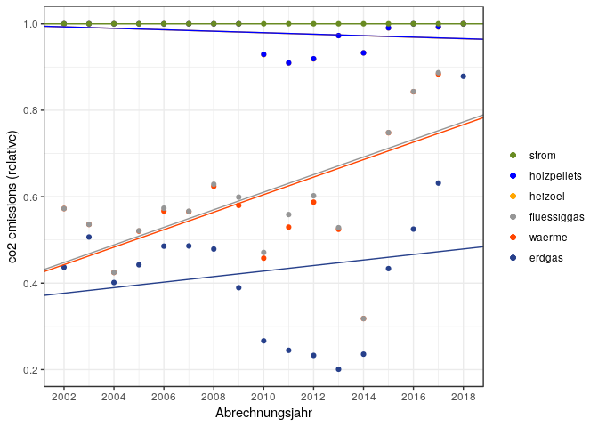

``` r
#ggsave("co2emissions_absolute_real_and_linearized.jpg")
```

Graph of linear trends of absolute CO<sub>2</sub> emissions:
------------------------------------------------------------

``` r
ggplot()+geom_line(data=co2cumsums_linear,aes(x=abrechnungsjahr,y=get(et_list[2]),color=et_list[2])
)+geom_line(data=co2cumsums_linear,aes(x=abrechnungsjahr,y=get(et_list[3]),color=et_list[3])
)+geom_line(data=co2cumsums_linear,aes(x=abrechnungsjahr,y=get(et_list[4]),color=et_list[4])
)+geom_line(data=co2cumsums_linear,aes(x=abrechnungsjahr,y=get(et_list[5]),color=et_list[5])
)+geom_line(data=co2cumsums_linear,aes(x=abrechnungsjahr,y=get(et_list[6]),color=et_list[6])
)+geom_line(data=co2cumsums_linear,aes(x=abrechnungsjahr,y=get(et_list[7]),color=et_list[7])
)+scale_color_manual(name=" ",values=cols,breaks=order_legend_2
)+geom_ribbon(data=co2cumsums_linear,aes(x=abrechnungsjahr,ymin=0,ymax=get(et_list[7])),fill=col_list[7]
)+geom_ribbon(data=co2cumsums_linear,aes(x=abrechnungsjahr,ymin=0,ymax=get(et_list[6])),fill=col_list[6]
)+geom_ribbon(data=co2cumsums_linear,aes(x=abrechnungsjahr,ymin=0,ymax=get(et_list[5])),fill=col_list[5]
)+geom_ribbon(data=co2cumsums_linear,aes(x=abrechnungsjahr,ymin=0,ymax=get(et_list[4])),fill=col_list[4]
)+geom_ribbon(data=co2cumsums_linear,aes(x=abrechnungsjahr,ymin=0,ymax=get(et_list[3])),fill=col_list[3]
)+geom_ribbon(data=co2cumsums_linear,aes(x=abrechnungsjahr,ymin=0,ymax=get(et_list[2])),fill=col_list[2]
)+theme_bw()+ labs(x="Abrechnungsjahr",y="linearized co2 emissions (kilo tonnes)",title=plot_title)+scale_x_continuous(breaks=seq(2002,2018,2))
```

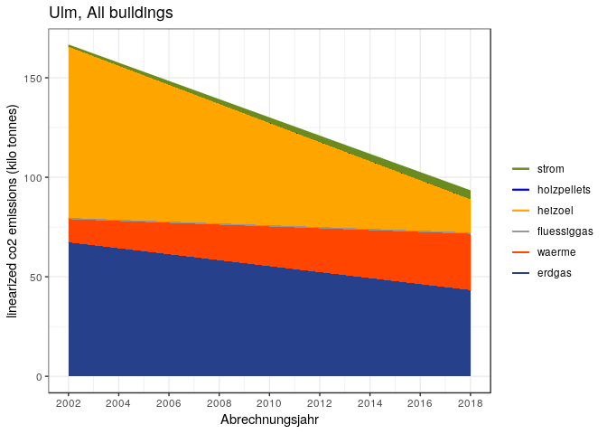

``` r
#ggsave("co2emissions_absolute_linearized.jpg")
```

Graph of linear trends of relative CO<sub>2</sub> emissions:
------------------------------------------------------------

``` r
ggplot()+geom_line(data=co2anteile_cumsums_linear,aes(x=abrechnungsjahr,y=get(et_list[2]),color=et_list[2])
)+geom_line(data=co2anteile_cumsums_linear,aes(x=abrechnungsjahr,y=get(et_list[3]),color=et_list[3])
)+geom_line(data=co2anteile_cumsums_linear,aes(x=abrechnungsjahr,y=get(et_list[4]),color=et_list[4])
)+geom_line(data=co2anteile_cumsums_linear,aes(x=abrechnungsjahr,y=get(et_list[5]),color=et_list[5])
)+geom_line(data=co2anteile_cumsums_linear,aes(x=abrechnungsjahr,y=get(et_list[6]),color=et_list[6])
)+geom_line(data=co2anteile_cumsums_linear,aes(x=abrechnungsjahr,y=get(et_list[7]),color=et_list[7])
)+scale_color_manual(name=" ",values=cols,breaks=order_legend_2
)+geom_ribbon(data=co2anteile_cumsums_linear,aes(x=abrechnungsjahr,ymin=0,ymax=get(et_list[7])),fill=col_list[7]
)+geom_ribbon(data=co2anteile_cumsums_linear,aes(x=abrechnungsjahr,ymin=0,ymax=get(et_list[6])),fill=col_list[6]
)+geom_ribbon(data=co2anteile_cumsums_linear,aes(x=abrechnungsjahr,ymin=0,ymax=get(et_list[5])),fill=col_list[5]
)+geom_ribbon(data=co2anteile_cumsums_linear,aes(x=abrechnungsjahr,ymin=0,ymax=get(et_list[4])),fill=col_list[4]
)+geom_ribbon(data=co2anteile_cumsums_linear,aes(x=abrechnungsjahr,ymin=0,ymax=get(et_list[3])),fill=col_list[3]
)+geom_ribbon(data=co2anteile_cumsums_linear,aes(x=abrechnungsjahr,ymin=0,ymax=get(et_list[2])),fill=col_list[2]
)+theme_bw()+ labs(x="Abrechnungsjahr",y="linearized co2 emissions (relative)",title=plot_title)+scale_x_continuous(breaks=seq(2002,2018,2))
```

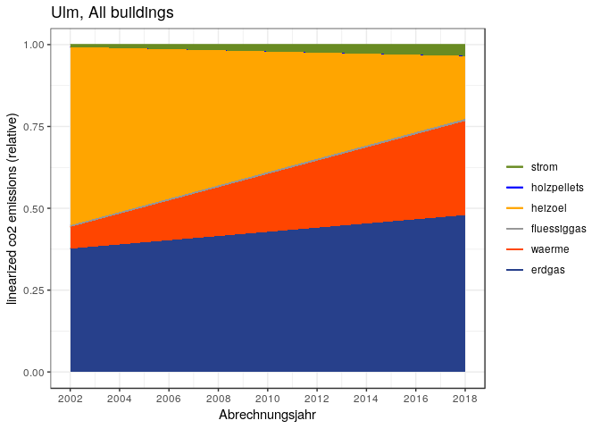

``` r
#ggsave("co2emissions_relative_linearized.jpg")
```

Save the data
-------------

``` r
write.csv(final_prop_table , file = "./data/ulm/all/ET_anteile_verbrauch_mfh.csv") #comes from co2online data
write.csv(spz_verbrauch_mean , file = "./data/ulm/all/spz_verbrauch_mfh.csv")      #comes from co2online data
# total area: wohngebaeude_2002_2018.txt contains the total area
write.csv(totalConsumption , file = "./data/ulm/all/gesamt_verbrauch_mfh.csv")     #comes from co2online and area data
write.csv(co2_emissions_in_kilo_tons , file = "./data/ulm/all/co2_emissions_kilo_tons_mfh.csv") #comes from co2online, coeff. and area data
```

<https://ggplot2.tidyverse.org/reference/scale_manual.html> <https://stackoverflow.com/questions/14762181/adding-a-y-axis-label-to-secondary-y-axis-in-matplotlib>
