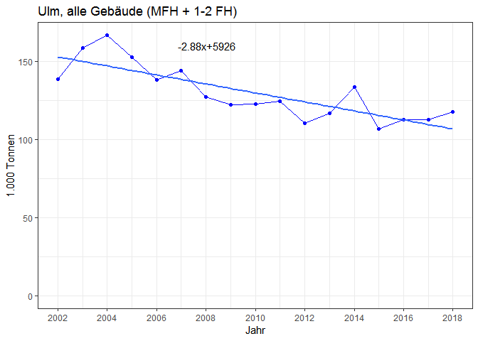
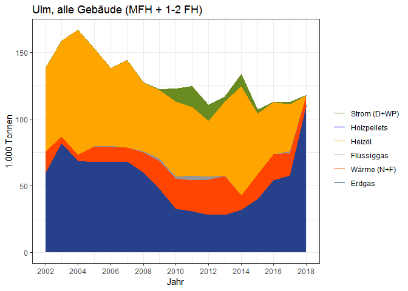
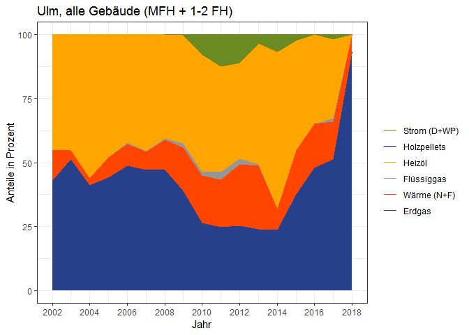
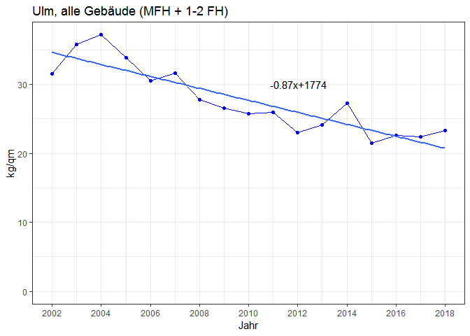
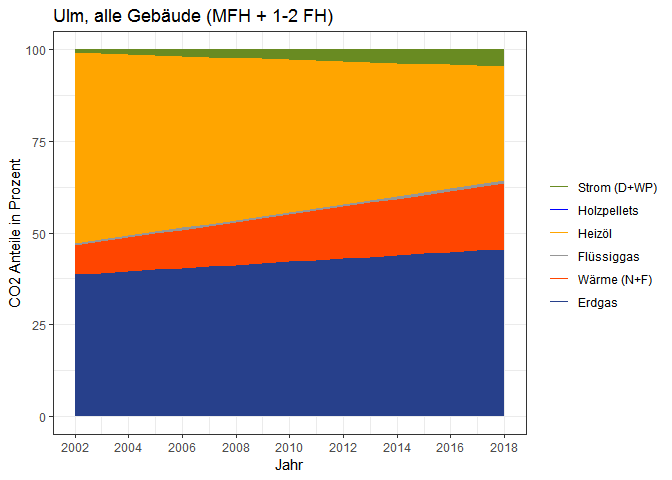
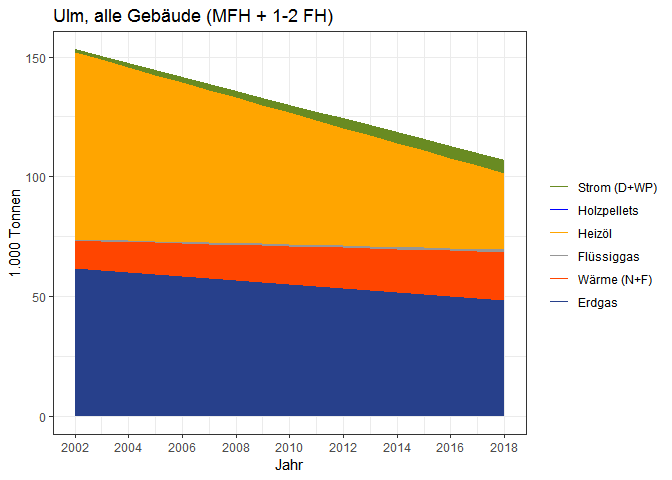

Ulm co2 balance all buildings
================
Bhaskar Kamble
1 März 2019

``` r
setwd("D:/GITHUB_REPOS/co2emissions")
co2_absolut_mfh <- read.csv("./data/ulm/mfh/04_co2_absolut_nachET.csv")
co2_absolut_mfh
```

    ##    abrechnungsjahr    erdgas    waerme fluessiggas   heizoel holzpellets
    ## 1             2002 27.119433 16.050594    0.000000 13.943834  0.00000000
    ## 2             2003 43.562080  4.902285    0.000000 29.950714  0.00000000
    ## 3             2004 36.344260  3.572955    0.000000 43.077238  0.00000000
    ## 4             2005 42.013424 10.346625    0.000000 22.635482  0.00000000
    ## 5             2006 38.724139 10.034640    0.000000 15.958853  0.00000000
    ## 6             2007 39.181268  8.595820    0.000000 23.095355  0.00000000
    ## 7             2008 29.442459 12.092504    0.000000 18.266430  0.00000000
    ## 8             2009 19.504529 18.017865    1.623144 12.639378  0.00000000
    ## 9             2010 11.215037 20.658355    0.000000 13.952505  0.05431954
    ## 10            2011  9.297099 22.565647    1.188485  6.456196  0.01974306
    ## 11            2012  6.584070 25.374555    0.000000  5.839555  0.00000000
    ## 12            2013  1.552679 27.768367    0.000000 13.727484  0.00000000
    ## 13            2014  3.991711 10.340217    0.000000 31.698876  0.00000000
    ## 14            2015 18.808860 17.675485    0.000000  1.502516  0.00000000
    ## 15            2016 24.919949 18.171295    0.000000  2.064151  0.00000000
    ## 16            2017 33.053302 14.123455    0.000000  1.887100  0.02489436
    ## 17            2018 56.948452  8.053784    0.000000  0.000000  0.00000000
    ##        strom    total
    ## 1  0.0000000 57.11386
    ## 2  0.0000000 78.41508
    ## 3  0.0000000 82.99445
    ## 4  0.0000000 74.99553
    ## 5  0.0000000 64.71763
    ## 6  0.0000000 70.87244
    ## 7  0.0000000 59.80139
    ## 8  0.0000000 51.78492
    ## 9  0.0000000 45.88022
    ## 10 0.0000000 39.52717
    ## 11 0.0000000 37.79818
    ## 12 0.0000000 43.04853
    ## 13 0.0000000 46.03080
    ## 14 0.0000000 37.98686
    ## 15 0.0000000 45.15539
    ## 16 0.2469977 49.33575
    ## 17 0.0000000 65.00224

``` r
co2_absolut_sfh <- read.csv("./data/ulm/sfh/04_co2_absolut_nachET.csv")
co2_absolut_sfh
```

    ##    abrechnungsjahr   erdgas    waerme fluessiggas  heizoel holzpellets
    ## 1             2002 32.80998 0.0000000  0.00000000 48.98421  0.00000000
    ## 2             2003 38.05987 0.4954935  0.00000000 41.93995  0.00000000
    ## 3             2004 32.11872 1.1504571  0.00000000 50.45878  0.00000000
    ## 4             2005 25.62191 1.5408317  0.12750003 50.59294  0.00000000
    ## 5             2006 28.92557 1.5056462  0.88182072 42.34592  0.00000000
    ## 6             2007 29.05391 1.6338806  0.17920148 42.60784  0.00000000
    ## 7             2008 30.69513 2.6700624  0.91195469 33.30748  0.00000000
    ## 8             2009 28.22430 2.6191533  0.50505935 38.89842  0.00000000
    ## 9             2010 21.29199 2.0000731  1.64956376 42.20737  0.02013812
    ## 10            2011 21.42989 0.7209492  2.37831048 44.93986  0.02402878
    ## 11            2012 21.53357 1.1638401  2.22277279 35.69047  0.06822359
    ## 12            2013 26.30766 1.5604222  0.53603667 41.56795  0.00000000
    ## 13            2014 27.59805 0.5855725  0.00000000 50.43835  0.00000000
    ## 14            2015 21.15114 0.7748135  0.07853122 44.16401  0.03175235
    ## 15            2016 29.15982 1.2768956  0.11878429 37.19871  0.01207957
    ## 16            2017 24.63946 2.4950277  1.47029098 33.03496  0.04327940
    ## 17            2018 52.95911 0.0000000  0.00000000  0.00000  0.00000000
    ##         strom    total
    ## 1   0.0000000 81.79419
    ## 2   0.0000000 80.49532
    ## 3   0.0000000 83.72795
    ## 4   0.0000000 77.88317
    ## 5   0.0000000 73.65896
    ## 6   0.0000000 73.47484
    ## 7   0.0000000 67.58462
    ## 8   0.2732919 70.52023
    ## 9   9.4994982 76.66863
    ## 10 15.4165022 84.90954
    ## 11 12.2012257 72.88010
    ## 12  3.9321949 73.90426
    ## 13  9.0447839 87.66675
    ## 14  2.5135290 68.71377
    ## 15  0.0000000 67.76629
    ## 16  1.7256496 63.40867
    ## 17  0.0000000 52.95911

Get the total co2 emissions:

``` r
is_no_year <- names(co2_absolut_mfh)[names(co2_absolut_mfh)!="abrechnungsjahr"]
co2_absolut_all <- co2_absolut_mfh[,is_no_year] + co2_absolut_sfh[,is_no_year]
co2_absolut_all$abrechnungsjahr <- 2002:2018
co2_absolut_all
```

    ##       erdgas    waerme fluessiggas  heizoel holzpellets      strom
    ## 1   59.92941 16.050594  0.00000000 62.92804  0.00000000  0.0000000
    ## 2   81.62195  5.397778  0.00000000 71.89066  0.00000000  0.0000000
    ## 3   68.46298  4.723412  0.00000000 93.53601  0.00000000  0.0000000
    ## 4   67.63533 11.887457  0.12750003 73.22842  0.00000000  0.0000000
    ## 5   67.64971 11.540286  0.88182072 58.30477  0.00000000  0.0000000
    ## 6   68.23518 10.229701  0.17920148 65.70320  0.00000000  0.0000000
    ## 7   60.13759 14.762566  0.91195469 51.57391  0.00000000  0.0000000
    ## 8   47.72883 20.637018  2.12820362 51.53780  0.00000000  0.2732919
    ## 9   32.50703 22.658428  1.64956376 56.15987  0.07445767  9.4994982
    ## 10  30.72699 23.286597  3.56679595 51.39606  0.04377183 15.4165022
    ## 11  28.11764 26.538395  2.22277279 41.53002  0.06822359 12.2012257
    ## 12  27.86034 29.328789  0.53603667 55.29543  0.00000000  3.9321949
    ## 13  31.58976 10.925789  0.00000000 82.13722  0.00000000  9.0447839
    ## 14  39.96000 18.450298  0.07853122 45.66652  0.03175235  2.5135290
    ## 15  54.07977 19.448190  0.11878429 39.26286  0.01207957  0.0000000
    ## 16  57.69277 16.618482  1.47029098 34.92206  0.06817376  1.9726473
    ## 17 109.90756  8.053784  0.00000000  0.00000  0.00000000  0.0000000
    ##       total abrechnungsjahr
    ## 1  138.9081            2002
    ## 2  158.9104            2003
    ## 3  166.7224            2004
    ## 4  152.8787            2005
    ## 5  138.3766            2006
    ## 6  144.3473            2007
    ## 7  127.3860            2008
    ## 8  122.3051            2009
    ## 9  122.5489            2010
    ## 10 124.4367            2011
    ## 11 110.6783            2012
    ## 12 116.9528            2013
    ## 13 133.6976            2014
    ## 14 106.7006            2015
    ## 15 112.9217            2016
    ## 16 112.7444            2017
    ## 17 117.9613            2018

Make a plot of the total emissions with the linear trend:

``` r
require(ggplot2)
plot_title <- "Ulm, alle Gebäude (MFH + 1-2 FH)"
linmod <- lm(data=co2_absolut_all,formula=total~abrechnungsjahr)
a <- as.numeric(coefficients(linmod)[1])
b <- as.numeric(coefficients(linmod)[2])
if (a<0) {
  asign <- " "
} else {asign <- "+"}
if (b<0) {
  bsign <- " "
} else {bsign <- " "}
ggplot()+geom_line(data=co2_absolut_all,aes(x=abrechnungsjahr,y=total),color="blue")+geom_point(data=co2_absolut_all,aes(x=abrechnungsjahr,y=total),color="blue")+theme_bw()+labs(x="Jahr",y="1.000 Tonnen",title=plot_title)+ylim(0,max(co2_absolut_all$total))+geom_smooth(method="lm",data=co2_absolut_all,aes(x=abrechnungsjahr,y=total),se=FALSE)+annotate(geom="text",label=paste0(bsign,as.character(round(b,2)),"x",asign,as.character(round(a,0))),x=2008,y=160)+scale_x_continuous(breaks=seq(2002,2018,2))
```



``` r
ggsave("Ulm_all_co2emissions.jpg")
#write.csv2(co2_emissions_kilo_tons_all,file="01_alle_absolut_nachET.csv",row.names = FALSE)
```

build the cumulative co2 emissions:
===================================

``` r
co2_all_cumsum <- t(apply(co2_absolut_all[, !(names(co2_absolut_all)%in%c("abrechnungsjahr","total"))] 
                                    , 1 , cumsum))
co2_all_cumsum <- as.data.frame(co2_all_cumsum)
co2_all_cumsum$abrechnungsjahr <- 2002:2018
co2_all_cumsum
```

    ##       erdgas    waerme fluessiggas   heizoel holzpellets    strom
    ## 1   59.92941  75.98001    75.98001 138.90805   138.90805 138.9081
    ## 2   81.62195  87.01973    87.01973 158.91039   158.91039 158.9104
    ## 3   68.46298  73.18639    73.18639 166.72240   166.72240 166.7224
    ## 4   67.63533  79.52279    79.65029 152.87870   152.87870 152.8787
    ## 5   67.64971  79.19000    80.07182 138.37659   138.37659 138.3766
    ## 6   68.23518  78.46488    78.64409 144.34728   144.34728 144.3473
    ## 7   60.13759  74.90015    75.81211 127.38602   127.38602 127.3860
    ## 8   47.72883  68.36585    70.49405 122.03185   122.03185 122.3051
    ## 9   32.50703  55.16546    56.81502 112.97490   113.04935 122.5489
    ## 10  30.72699  54.01359    57.58039 108.97644   109.02021 124.4367
    ## 11  28.11764  54.65603    56.87880  98.40883    98.47705 110.6783
    ## 12  27.86034  57.18913    57.72516 113.02059   113.02059 116.9528
    ## 13  31.58976  42.51555    42.51555 124.65277   124.65277 133.6976
    ## 14  39.96000  58.41030    58.48883 104.15535   104.18710 106.7006
    ## 15  54.07977  73.52796    73.64675 112.90961   112.92169 112.9217
    ## 16  57.69277  74.31125    75.78154 110.70360   110.77178 112.7444
    ## 17 109.90756 117.96135   117.96135 117.96135   117.96135 117.9613
    ##    abrechnungsjahr
    ## 1             2002
    ## 2             2003
    ## 3             2004
    ## 4             2005
    ## 5             2006
    ## 6             2007
    ## 7             2008
    ## 8             2009
    ## 9             2010
    ## 10            2011
    ## 11            2012
    ## 12            2013
    ## 13            2014
    ## 14            2015
    ## 15            2016
    ## 16            2017
    ## 17            2018

``` r
datawide <- co2_all_cumsum
datawide
```

    ##       erdgas    waerme fluessiggas   heizoel holzpellets    strom
    ## 1   59.92941  75.98001    75.98001 138.90805   138.90805 138.9081
    ## 2   81.62195  87.01973    87.01973 158.91039   158.91039 158.9104
    ## 3   68.46298  73.18639    73.18639 166.72240   166.72240 166.7224
    ## 4   67.63533  79.52279    79.65029 152.87870   152.87870 152.8787
    ## 5   67.64971  79.19000    80.07182 138.37659   138.37659 138.3766
    ## 6   68.23518  78.46488    78.64409 144.34728   144.34728 144.3473
    ## 7   60.13759  74.90015    75.81211 127.38602   127.38602 127.3860
    ## 8   47.72883  68.36585    70.49405 122.03185   122.03185 122.3051
    ## 9   32.50703  55.16546    56.81502 112.97490   113.04935 122.5489
    ## 10  30.72699  54.01359    57.58039 108.97644   109.02021 124.4367
    ## 11  28.11764  54.65603    56.87880  98.40883    98.47705 110.6783
    ## 12  27.86034  57.18913    57.72516 113.02059   113.02059 116.9528
    ## 13  31.58976  42.51555    42.51555 124.65277   124.65277 133.6976
    ## 14  39.96000  58.41030    58.48883 104.15535   104.18710 106.7006
    ## 15  54.07977  73.52796    73.64675 112.90961   112.92169 112.9217
    ## 16  57.69277  74.31125    75.78154 110.70360   110.77178 112.7444
    ## 17 109.90756 117.96135   117.96135 117.96135   117.96135 117.9613
    ##    abrechnungsjahr
    ## 1             2002
    ## 2             2003
    ## 3             2004
    ## 4             2005
    ## 5             2006
    ## 6             2007
    ## 7             2008
    ## 8             2009
    ## 9             2010
    ## 10            2011
    ## 11            2012
    ## 12            2013
    ## 13            2014
    ## 14            2015
    ## 15            2016
    ## 16            2017
    ## 17            2018

``` r
col_list <- c("royalblue4","orangered1","gray59","orange","blue","olivedrab4")
cols <- c(
          "erdgas"      = "royalblue4",
          "waerme"      = "orangered1",
          "fluessiggas" = "gray59",
          "heizoel"     = "orange",
          "holzpellets" = "blue",
          "strom"       = "olivedrab4"
          )
et_list <- c("erdgas","waerme","fluessiggas","heizoel","holzpellets","strom")
order_legend <- rev(c("erdgas","waerme","fluessiggas","heizoel","holzpellets","strom"))
order_labels <- rev(c("Erdgas","Wärme (N+F)","Flüssiggas","Heizöl","Holzpellets","Strom (D+WP)"))
ggplot()+geom_line(data=datawide,aes(x=abrechnungsjahr,y=get(et_list[1]),color=et_list[1])
)+geom_line(data=datawide,aes(x=abrechnungsjahr,y=get(et_list[2]),color=et_list[2])
)+geom_line(data=datawide,aes(x=abrechnungsjahr,y=get(et_list[3]),color=et_list[3])
)+geom_line(data=datawide,aes(x=abrechnungsjahr,y=get(et_list[4]),color=et_list[4])
)+geom_line(data=datawide,aes(x=abrechnungsjahr,y=get(et_list[5]),color=et_list[5])
)+geom_line(data=datawide,aes(x=abrechnungsjahr,y=get(et_list[6]),color=et_list[6])
)+scale_color_manual(labels=order_labels,name=" ",values=cols,breaks=order_legend
)+geom_ribbon(data=datawide,aes(x=abrechnungsjahr,ymin=0,ymax=get(et_list[6])),fill=col_list[6]
)+geom_ribbon(data=datawide,aes(x=abrechnungsjahr,ymin=0,ymax=get(et_list[5])),fill=col_list[5]
)+geom_ribbon(data=datawide,aes(x=abrechnungsjahr,ymin=0,ymax=get(et_list[4])),fill=col_list[4]
)+geom_ribbon(data=datawide,aes(x=abrechnungsjahr,ymin=0,ymax=get(et_list[3])),fill=col_list[3]
)+geom_ribbon(data=datawide,aes(x=abrechnungsjahr,ymin=0,ymax=get(et_list[2])),fill=col_list[2]
)+geom_ribbon(data=datawide,aes(x=abrechnungsjahr,ymin=0,ymax=get(et_list[1])),fill=col_list[1])+theme_bw()+ labs(x="Jahr",y="1.000 Tonnen",title=plot_title
)+scale_x_continuous(breaks=seq(2002,2018,2))
```



``` r
#ggsave("Ulm_all_co2emissions_absolute_nachET.jpg")
#write.csv2(datawide , "02_alle_absolut_nachET_kumulativ.csv",row.names=FALSE)
```

``` r
datawide
```

    ##       erdgas    waerme fluessiggas   heizoel holzpellets    strom
    ## 1   59.92941  75.98001    75.98001 138.90805   138.90805 138.9081
    ## 2   81.62195  87.01973    87.01973 158.91039   158.91039 158.9104
    ## 3   68.46298  73.18639    73.18639 166.72240   166.72240 166.7224
    ## 4   67.63533  79.52279    79.65029 152.87870   152.87870 152.8787
    ## 5   67.64971  79.19000    80.07182 138.37659   138.37659 138.3766
    ## 6   68.23518  78.46488    78.64409 144.34728   144.34728 144.3473
    ## 7   60.13759  74.90015    75.81211 127.38602   127.38602 127.3860
    ## 8   47.72883  68.36585    70.49405 122.03185   122.03185 122.3051
    ## 9   32.50703  55.16546    56.81502 112.97490   113.04935 122.5489
    ## 10  30.72699  54.01359    57.58039 108.97644   109.02021 124.4367
    ## 11  28.11764  54.65603    56.87880  98.40883    98.47705 110.6783
    ## 12  27.86034  57.18913    57.72516 113.02059   113.02059 116.9528
    ## 13  31.58976  42.51555    42.51555 124.65277   124.65277 133.6976
    ## 14  39.96000  58.41030    58.48883 104.15535   104.18710 106.7006
    ## 15  54.07977  73.52796    73.64675 112.90961   112.92169 112.9217
    ## 16  57.69277  74.31125    75.78154 110.70360   110.77178 112.7444
    ## 17 109.90756 117.96135   117.96135 117.96135   117.96135 117.9613
    ##    abrechnungsjahr
    ## 1             2002
    ## 2             2003
    ## 3             2004
    ## 4             2005
    ## 5             2006
    ## 6             2007
    ## 7             2008
    ## 8             2009
    ## 9             2010
    ## 10            2011
    ## 11            2012
    ## 12            2013
    ## 13            2014
    ## 14            2015
    ## 15            2016
    ## 16            2017
    ## 17            2018

``` r
co2_anteile <- as.data.frame(sapply(datawide[,names(datawide)!="abrechnungsjahr"] , function(obj) obj/datawide$strom)) 
co2_anteile$abrechnungsjahr <- 2002:2018
co2_anteile[,names(co2_anteile)!="abrechnungsjahr"] <- 100.0*co2_anteile[,names(co2_anteile)!="abrechnungsjahr"]
co2_anteile
```

    ##      erdgas    waerme fluessiggas   heizoel holzpellets strom
    ## 1  43.14323  54.69806    54.69806 100.00000   100.00000   100
    ## 2  51.36351  54.76025    54.76025 100.00000   100.00000   100
    ## 3  41.06405  43.89715    43.89715 100.00000   100.00000   100
    ## 4  44.24117  52.01692    52.10031 100.00000   100.00000   100
    ## 5  48.88812  57.22789    57.86515 100.00000   100.00000   100
    ## 6  47.27154  54.35841    54.48255 100.00000   100.00000   100
    ## 7  47.20894  58.79778    59.51368 100.00000   100.00000   100
    ## 8  39.02438  55.89777    57.63785  99.77655    99.77655   100
    ## 9  26.52577  45.01508    46.36112  92.18764    92.24840   100
    ## 10 24.69287  43.40647    46.27283  87.57579    87.61097   100
    ## 11 25.40484  49.38280    51.39112  88.91431    88.97595   100
    ## 12 23.82187  48.89933    49.35766  96.63779    96.63779   100
    ## 13 23.62778  31.79979    31.79979  93.23489    93.23489   100
    ## 14 37.45057  54.74222    54.81582  97.61456    97.64432   100
    ## 15 47.89140  65.11412    65.21931  99.98930   100.00000   100
    ## 16 51.17128  65.91124    67.21533  98.18987    98.25034   100
    ## 17 93.17252 100.00000   100.00000 100.00000   100.00000   100
    ##    abrechnungsjahr
    ## 1             2002
    ## 2             2003
    ## 3             2004
    ## 4             2005
    ## 5             2006
    ## 6             2007
    ## 7             2008
    ## 8             2009
    ## 9             2010
    ## 10            2011
    ## 11            2012
    ## 12            2013
    ## 13            2014
    ## 14            2015
    ## 15            2016
    ## 16            2017
    ## 17            2018

``` r
ggplot()+geom_line(data=co2_anteile,aes(x=abrechnungsjahr,y=get(et_list[1]),color=et_list[1])
)+geom_line(data=co2_anteile,aes(x=abrechnungsjahr,y=get(et_list[2]),color=et_list[2])
)+geom_line(data=co2_anteile,aes(x=abrechnungsjahr,y=get(et_list[3]),color=et_list[3])
)+geom_line(data=co2_anteile,aes(x=abrechnungsjahr,y=get(et_list[4]),color=et_list[4])
)+geom_line(data=co2_anteile,aes(x=abrechnungsjahr,y=get(et_list[5]),color=et_list[5])
)+geom_line(data=co2_anteile,aes(x=abrechnungsjahr,y=get(et_list[6]),color=et_list[6])
)+scale_color_manual(labels=order_labels,name=" ",values=cols,breaks=order_legend
)+geom_ribbon(data=co2_anteile,aes(x=abrechnungsjahr,ymin=0,ymax=get(et_list[6])),fill=col_list[6]
)+geom_ribbon(data=co2_anteile,aes(x=abrechnungsjahr,ymin=0,ymax=get(et_list[5])),fill=col_list[5]
)+geom_ribbon(data=co2_anteile,aes(x=abrechnungsjahr,ymin=0,ymax=get(et_list[4])),fill=col_list[4]
)+geom_ribbon(data=co2_anteile,aes(x=abrechnungsjahr,ymin=0,ymax=get(et_list[3])),fill=col_list[3]
)+geom_ribbon(data=co2_anteile,aes(x=abrechnungsjahr,ymin=0,ymax=get(et_list[2])),fill=col_list[2]
)+geom_ribbon(data=co2_anteile,aes(x=abrechnungsjahr,ymin=0,ymax=get(et_list[1])),fill=col_list[1])+theme_bw()+ labs(x="Jahr",y="Anteile in Prozent",title=plot_title
)+scale_x_continuous(breaks=seq(2002,2018,2))
```



``` r
#ggsave("Ulm_all_co2emissions_relative_nachET.jpg")
#write.csv2(co2_anteile , "03_alle_relativ_nachET_kumulativ.csv",row.names=FALSE)
```

``` r
totalArea <- read.csv("Ulm_wohngebaeude_zahl_flaeche.csv",sep=";")
totalArea$totArea <- totalArea$Flaeche_MFH + totalArea$Flaeche_SFH
totalArea <- totalArea[ , c("Year","totArea")]
names(totalArea) <- c("Abrechnungsjahr","totArea")
totalArea
```

    ##    Abrechnungsjahr totArea
    ## 1             2002 4409155
    ## 2             2003 4433927
    ## 3             2004 4482363
    ## 4             2005 4513180
    ## 5             2006 4535041
    ## 6             2007 4565333
    ## 7             2008 4586697
    ## 8             2009 4602457
    ## 9             2010 4752264
    ## 10            2011 4785326
    ## 11            2012 4809467
    ## 12            2013 4845956
    ## 13            2014 4894752
    ## 14            2015 4953429
    ## 15            2016 5000217
    ## 16            2017 5030079
    ## 17            2018 5067906

Specific CO2 emissions:

``` r
spez_co2_emission <- data.frame(abrechnungsjahr = 2002:2018 , spez_co2 = 1e6* co2_absolut_all$total/totalArea$totArea) #0.001*rowSums(co2_emissions)/totalArea$totArea)
spez_co2_emission
```

    ##    abrechnungsjahr spez_co2
    ## 1             2002 31.50446
    ## 2             2003 35.83965
    ## 3             2004 37.19520
    ## 4             2005 33.87383
    ## 5             2006 30.51275
    ## 6             2007 31.61813
    ## 7             2008 27.77293
    ## 8             2009 26.57388
    ## 9             2010 25.78747
    ## 10            2011 26.00381
    ## 11            2012 23.01259
    ## 12            2013 24.13410
    ## 13            2014 27.31447
    ## 14            2015 21.54076
    ## 15            2016 22.58336
    ## 16            2017 22.41405
    ## 17            2018 23.27615

``` r
linmod_spez <- lm(data=spez_co2_emission,formula=spez_co2~abrechnungsjahr)
a_spez <- as.numeric(coefficients(linmod_spez)[1])
b_spez <- as.numeric(coefficients(linmod_spez)[2])
if (a_spez<0) {
  asign_spez <- " "
} else {asign_spez <- "+"}
if (b_spez<0) {
  bsign_spez <- " "
} else {bsign_spez <- " "}
ggplot()+geom_line(data=spez_co2_emission,aes(x=abrechnungsjahr,y=spez_co2),color="blue")+geom_point(
  data=spez_co2_emission,aes(x=abrechnungsjahr,y=spez_co2),color="blue")+theme_bw()+labs(x="Jahr",
  y="kg/qm",title=plot_title)+ylim(0,max(spez_co2_emission$spez_co2))+geom_smooth(
  method="lm",data=spez_co2_emission,aes(x=abrechnungsjahr,y=spez_co2),se=FALSE)+annotate(
  geom="text",label=paste0(bsign_spez,as.character(round(b_spez,2)),"x",asign_spez,as.character(round(a_spez,0))
  ),x=2012,y=30)+scale_x_continuous(breaks=seq(2002,2018,2))
```



``` r
#ggsave("Ulm_co2_spez.jpg")
#write.csv2(spez_co2_emission , "04_alle_co2_spez.csv",row.names=FALSE)
```

``` r
et_list
```

    ## [1] "erdgas"      "waerme"      "fluessiggas" "heizoel"     "holzpellets"
    ## [6] "strom"

``` r
et_list
```

    ## [1] "erdgas"      "waerme"      "fluessiggas" "heizoel"     "holzpellets"
    ## [6] "strom"

``` r
co2cumsums_linear <- datawide
storage_co2 <- list()
for (et in et_list) {
  storage_co2[[et]] <- lm(get(et) ~ abrechnungsjahr , data = datawide)
}
for (et in et_list) {
  co2cumsums_linear[[et]] <- predict(storage_co2[[et]] , newdata = datawide)
}


storage_co2_anteile <- list()
co2anteile_cumsums_linear <- co2_anteile
for (et in et_list) {
  storage_co2_anteile[[et]] <- lm(get(et) ~ abrechnungsjahr , data = co2_anteile)
}
for (et in et_list) {
  co2anteile_cumsums_linear[[et]] <- predict(storage_co2_anteile[[et]] , newdata = co2_anteile)
}
```

``` r
ggplot()+geom_line(data=co2anteile_cumsums_linear,aes(x=abrechnungsjahr,y=get(et_list[1]),color=et_list[1])
)+geom_line(data=co2anteile_cumsums_linear,aes(x=abrechnungsjahr,y=get(et_list[2]),color=et_list[2])
)+geom_line(data=co2anteile_cumsums_linear,aes(x=abrechnungsjahr,y=get(et_list[3]),color=et_list[3])
)+geom_line(data=co2anteile_cumsums_linear,aes(x=abrechnungsjahr,y=get(et_list[4]),color=et_list[4])
)+geom_line(data=co2anteile_cumsums_linear,aes(x=abrechnungsjahr,y=get(et_list[5]),color=et_list[5])
)+geom_line(data=co2anteile_cumsums_linear,aes(x=abrechnungsjahr,y=get(et_list[6]),color=et_list[6])
)+scale_color_manual(labels=order_labels,name=" ",values=cols,breaks=order_legend
)+geom_ribbon(data=co2anteile_cumsums_linear,aes(x=abrechnungsjahr,ymin=0,ymax=get(et_list[6])),fill=col_list[6]
)+geom_ribbon(data=co2anteile_cumsums_linear,aes(x=abrechnungsjahr,ymin=0,ymax=get(et_list[5])),fill=col_list[5]
)+geom_ribbon(data=co2anteile_cumsums_linear,aes(x=abrechnungsjahr,ymin=0,ymax=get(et_list[4])),fill=col_list[4]
)+geom_ribbon(data=co2anteile_cumsums_linear,aes(x=abrechnungsjahr,ymin=0,ymax=get(et_list[3])),fill=col_list[3]
)+geom_ribbon(data=co2anteile_cumsums_linear,aes(x=abrechnungsjahr,ymin=0,ymax=get(et_list[2])),fill=col_list[2]
)+geom_ribbon(data=co2anteile_cumsums_linear,aes(x=abrechnungsjahr,ymin=0,ymax=get(et_list[1])),fill=col_list[1]
)+theme_bw()+ labs(x="Jahr",y="CO2 Anteile in Prozent",title=plot_title)+scale_x_continuous(breaks=seq(2002,2018,2))
```



``` r
#ggsave("Ulm_CO2_anteile_all_linear.jpg")
#write.csv2(co2anteile_cumsums_linear , "05_alle_relativ_nachET_kumulativ_linear.csv",row.names=FALSE)
```

``` r
ggplot()+geom_line(data=co2cumsums_linear,aes(x=abrechnungsjahr,y=get(et_list[1]),color=et_list[1])
)+geom_line(data=co2cumsums_linear,aes(x=abrechnungsjahr,y=get(et_list[2]),color=et_list[2])
)+geom_line(data=co2cumsums_linear,aes(x=abrechnungsjahr,y=get(et_list[3]),color=et_list[3])
)+geom_line(data=co2cumsums_linear,aes(x=abrechnungsjahr,y=get(et_list[4]),color=et_list[4])
)+geom_line(data=co2cumsums_linear,aes(x=abrechnungsjahr,y=get(et_list[5]),color=et_list[5])
)+geom_line(data=co2cumsums_linear,aes(x=abrechnungsjahr,y=get(et_list[6]),color=et_list[6])
)+scale_color_manual(labels=order_labels,name=" ",values=cols,breaks=order_legend
)+geom_ribbon(data=co2cumsums_linear,aes(x=abrechnungsjahr,ymin=0,ymax=get(et_list[6])),fill=col_list[6]
)+geom_ribbon(data=co2cumsums_linear,aes(x=abrechnungsjahr,ymin=0,ymax=get(et_list[5])),fill=col_list[5]
)+geom_ribbon(data=co2cumsums_linear,aes(x=abrechnungsjahr,ymin=0,ymax=get(et_list[4])),fill=col_list[4]
)+geom_ribbon(data=co2cumsums_linear,aes(x=abrechnungsjahr,ymin=0,ymax=get(et_list[3])),fill=col_list[3]
)+geom_ribbon(data=co2cumsums_linear,aes(x=abrechnungsjahr,ymin=0,ymax=get(et_list[2])),fill=col_list[2]
)+geom_ribbon(data=co2cumsums_linear,aes(x=abrechnungsjahr,ymin=0,ymax=get(et_list[1])),fill=col_list[1]
)+theme_bw()+ labs(x="Jahr",y="1.000 Tonnen",title=plot_title)+scale_x_continuous(breaks=seq(2002,2018,2))
```



``` r
#ggsave("Ulm_CO2_absolute_all_linear.jpg")
#write.csv2(co2cumsums_linear , "06_alle_absolut_nachET_kumulativ_linear.csv",row.names=FALSE)
```

save co2\_absolut\_all and the data obtained by dividing by the total for each year.

``` r
is_not_year <- names(co2_absolut_all) != "abrechnungsjahr"
co2_shares <- co2_absolut_all[, names(co2_absolut_all)[ is_not_year] ] / co2_absolut_all$total
co2_shares$abrechnungsjahr <- 2002:2018
write.csv(co2_absolut_all[,c("abrechnungsjahr",names(co2_absolut_all)[is_not_year])],
          file="./data/ulm/all/01_co2_absolut_by_ET.csv",row.names=FALSE)
write.csv2(co2_absolut_all[,c("abrechnungsjahr",names(co2_absolut_all)[is_not_year])],
          file="./data/ulm/all/01_co2_absolut_by_ET_2.csv",row.names=FALSE)

write.csv(co2_shares[,c("abrechnungsjahr",names(co2_absolut_all)[is_not_year])],
          file="./data/ulm/all/02_co2_shares_by_ET.csv",row.names=FALSE)
write.csv2(co2_shares[,c("abrechnungsjahr",names(co2_absolut_all)[is_not_year])],
          file="./data/ulm/all/02_co2_shares_by_ET_2.csv",row.names=FALSE)
```
