CO<sub>2</sub> emissions in Ulm for 1-2FH
================
Bhaskar Kamble and Johannes Hengstenberg
20 Februar 2019

The aim of this report is to calculate CO<sub>2</sub> emissions in the city of Ulm, Germany, caused by energy consumption for heating by 1-2FH. The calculations are primarily based on the data from [co2online](www.co2online.de). Official statistics from Ulm are also used in the calculations. The data from [co2online](www.co2online.de) is available at [my github repo](https://github.com/bhaskar-kamble/co2online_stats) as R-images.

*Notes to myself:*

-   *`Wohngebaeude 2002 - 2018.xlsx` - the sheet `result` contains data on areas for each year.*

-   *the column for `waerme` in the coefficients file refers includes both `fernmaerme` `nahwaerme`. In practice `nahwaerme` is so insignificant that it is to be neglected.*

The co2online data consists of data from different households in Germany with information on energy consumption within a specific year (`abrechnungsjahr`) and on the building (area, year of construction, fuel type etc.) Each year has a different sample and the sample size also varies from year to year. To find the CO<sub>2</sub> emissions in Ulm, we first extract the data for Ulm for 1-2FH. For each year we find the relative shares of energy produced by the different fuels. We also have the data for the energy consumed per square kilometer from the co2online data (the specific heat energy consumption). From the official statistics of Ulm we know the total heated surface area for each year. The specific heat energy consumption is multiplied with the total heated area for each year to find the total energy consumption for that. We also know the relative shares of the different fuels from the co2online data, so we know how much energy was produced by the different fuels for that year. For the same amount of energy produced, each fuel produces a different amount of CO<sub>2</sub>. This amount is given by the CO<sub>2</sub> coefficient of that fuel, whose units are kWh/g. Hence, the number of grams of CO<sub>2</sub> produced by a fuel equals the kWh of energy produced times the coefficients. Since the amount of energy produced by each fuel is known, the amount of CO<sub>2</sub> produced can be calculated.

The structure of this report is as follows:

1.  **Preliminary steps**

            1a. Get the data

            1b. Introduce some functions

            1c. Get weather data and subset the data for Ulm and 1-2FH

2.  **Absolute and relative shares of energy split according to energy sources**

            2a. Get the absolute consumption of energy split by energietraeger for each year and convert to wide format

            2b. Get the relative shares of energy consumption of each `energietraeger` per year

            2c. Find the cumulative sums of the relative shares of energy consumption according to energietraeger per year

            2d. Add linear trends to the above cumulative data

            2e. collect parameters of linear models

            2f. Plotting preparations

3.  **CO<sub>2</sub> emissions**

            3a. Find the mean spezifischer verbrauch for each year

            3b. Find the total area in Ulm - New Method from official data

            3c. Find the total energy consumption (total area times spezifischer verbrauch)

            3d. Break up the total energy consumption according to the `energietraegers`

            3e. The CO<sub>2</sub> coefficients

            3f. The CO<sub>2</sub> emissions - coefficients times energy

            3g. total CO<sub>2</sub> emissions

            3h. CO<sub>2</sub> emissions according to energietraeger (absolute value)

            3i. relative shares of CO<sub>2</sub> emissions according to energietraeger

            3j. The specific CO<sub>2</sub> emissions (CO<sub>2</sub> emitted per unit surface area)

Now the report starts.

1. Preliminary steps
--------------------

*Note to myself:*

-   *These calculations come from the `03_linearmodels.R` file in the same folder.*

### 1a. Get the data:

The R-image files used here consist of the co2online data and are also available at my github repo.

``` r
setwd("/home/kbhaskar/CO2ONLINE/co2emissions_github")
load("MFH20022018.RData")
load("SFH20022018.RData")
#In SFH20022018, abrechnungsjahr and verbrauch_gesamt_kwh are character - change then to int and numeric
SFH20022018$abrechnungsjahr <- as.integer(SFH20022018$abrechnungsjahr)
SFH20022018$verbrauch_gesamt_kwh <- gsub("," , "." , SFH20022018$verbrauch_gesamt_kwh)
SFH20022018$verbrauch_gesamt_kwh <- as.numeric(SFH20022018$verbrauch_gesamt_kwh)
SFH20022018$gtype <- "SFH"
MFH20022018$gtype <- "MFH"
```

### 1b. Introduce some functions:

``` r
find_ET_shares_by_year <- function(inputdata) {
  require(dplyr)
  by_year_ET <- group_by(inputdata,abrechnungsjahr,energietraeger)
  return(as.data.frame(summarize(by_year_ET,sum(verbrauch_gesamt_kwh))))
}

find_et_list <- function(inputdata) {
  ET_list <- unique(inputdata$energietraeger)  
  return(ET_list)
}
subset_data_by_region <- function(inputdata , region) {
  outputdata <- inputdata[inputdata$Landkreis_von_GS == region , ]
  return(outputdata)
}
readweather <- function(filename) {
  weather_data <- read.csv(filename,header=TRUE , sep=";" , dec="," )
  names(weather_data) <- c("Year","wind","sun","bedeckung","temperatur")
  no_of_years <- 17
  if (dim(weather_data)[1] != no_of_years) {
    stop("check number of years in weather data")
  }
  return(weather_data)
}
```

### 1c. Get weather data and subset the data for Ulm and 1-2FH

*This weather data is not used at present*

``` r
weather_ulm <- readweather("ulm_weather.csv")
ulm_sfh <- subset_data_by_region(SFH20022018,"Ulm")
ulm_sfh$energietraeger[ulm_sfh$energietraeger=="fernwaerme"] <- "waerme"
et_list <- find_et_list(ulm_sfh)
#et_list <- c("erdgas","waerme","fluessiggas","heizoel","holzpellets","strom","waermepumpe")
```

2. Absolute and relative shares of energy split according to energy sources (`energietraeger`) per year
-------------------------------------------------------------------------------------------------------

### 2a. Get the absolute consumption of energy split by energietraeger for each year and convert to wide format

``` r
#get the data:
ET_shares_by_year <- find_ET_shares_by_year(ulm_sfh)
names(ET_shares_by_year) <- c("abrechnungsjahr" ,"energietraeger" ,"sum_verbrauch_gesamt_kwh")
#change to wide format
detach(package:dplyr)
library(reshape2)
ET_shares_by_year_wide <- dcast(ET_shares_by_year , abrechnungsjahr ~ energietraeger , value.var = "sum_verbrauch_gesamt_kwh")
ET_shares_by_year_wide[is.na(ET_shares_by_year_wide)]=0.0
drop_cols <- "abrechnungsjahr"
ET_shares_by_year_wide$Yearlysum <- rowSums(ET_shares_by_year_wide[ , !(names(ET_shares_by_year_wide) %in% drop_cols)])
ET_shares_by_year_wide
```

    ##    abrechnungsjahr    erdgas fluessiggas   heizoel holzpellets  strom
    ## 1             2002  393228.0        0.00  448031.9           0      0
    ## 2             2003 1432109.8        0.00 1204345.9           0      0
    ## 3             2004 2454372.2        0.00 2982614.1           0      0
    ## 4             2005 2443543.6    10732.16 3717527.2           0      0
    ## 5             2006 2813231.4    75695.84 3169244.9           0      0
    ## 6             2007 2410064.8    13120.00 2697292.1           0      0
    ## 7             2008 1982276.7    51980.00 1641538.1           0      0
    ## 8             2009 1792725.5    28314.00 1885545.4           0      0
    ## 9             2010 1171256.8    78720.00 1771897.0       37480 175805
    ## 10            2011  987968.6    95120.00 1581136.0       37480 247409
    ## 11            2012  879074.7    78720.00 1111927.5       94230 176156
    ## 12            2013  736346.4    13120.00  880235.0           0  38800
    ## 13            2014  588070.2        0.00  786353.8           0  69300
    ## 14            2015  486008.3        0.00  861245.3       23350  23000
    ## 15            2016  369594.0        0.00  414197.3           0      0
    ## 16            2017  176494.5    19996.87  108379.8           0      0
    ## 17            2018   18053.1        0.00       0.0           0      0
    ##      waerme waermepumpe Yearlysum
    ## 1       0.0           0  841259.9
    ## 2   49800.0           0 2686255.7
    ## 3  234820.0           0 5671806.3
    ## 4  392506.0           0 6564308.9
    ## 5  391137.0           0 6449309.1
    ## 6  362015.2           0 5482492.0
    ## 7  460573.2           0 4136368.0
    ## 8  444359.0        6193 4157136.9
    ## 9  293876.0       13962 3542996.8
    ## 10  88779.0        6158 3044050.6
    ## 11 126907.0           0 2467015.2
    ## 12 116086.0           0 1784587.4
    ## 13  33000.0           0 1476723.9
    ## 14  26328.0        7000 1426931.6
    ## 15  24100.0           0  807891.3
    ## 16  35580.0           0  340451.1
    ## 17      0.0           0   18053.1

### 2b. Get the relative shares of energy consumption of each `energietraeger` per year

``` r
drop_cols <- c("abrechnungsjahr","Yearlysum")
final_prop_table <- as.data.frame(sapply(ET_shares_by_year_wide[ , !(names(ET_shares_by_year_wide) %in% drop_cols)],function(obj) obj/ET_shares_by_year_wide$Yearlysum))
final_prop_table$abrechnungsjahr <- 2002:2018
```

This is what it looks like:

``` r
final_prop_table
```

    ##       erdgas fluessiggas   heizoel holzpellets      strom     waerme
    ## 1  0.4674275 0.000000000 0.5325725  0.00000000 0.00000000 0.00000000
    ## 2  0.5331249 0.000000000 0.4483363  0.00000000 0.00000000 0.01853882
    ## 3  0.4327320 0.000000000 0.5258667  0.00000000 0.00000000 0.04140127
    ## 4  0.3722469 0.001634926 0.5663242  0.00000000 0.00000000 0.05979396
    ## 5  0.4362066 0.011737046 0.4914084  0.00000000 0.00000000 0.06064789
    ## 6  0.4395929 0.002393072 0.4919829  0.00000000 0.00000000 0.06603114
    ## 7  0.4792312 0.012566580 0.3968549  0.00000000 0.00000000 0.11134725
    ## 8  0.4312404 0.006810938 0.4535683  0.00000000 0.00000000 0.10689063
    ## 9  0.3305836 0.022218479 0.5001125  0.01057862 0.04962042 0.08294560
    ## 10 0.3245572 0.031247838 0.5194184  0.01231254 0.08127624 0.02916476
    ## 11 0.3563313 0.031909004 0.4507177  0.03819595 0.07140450 0.05144151
    ## 12 0.4126144 0.007351839 0.4932429  0.00000000 0.02174172 0.06504921
    ## 13 0.3982262 0.000000000 0.5324988  0.00000000 0.04692820 0.02234676
    ## 14 0.3405968 0.000000000 0.6035645  0.01636378 0.01611850 0.01845078
    ## 15 0.4574799 0.000000000 0.5126894  0.00000000 0.00000000 0.02983075
    ## 16 0.5184136 0.058736387 0.3183416  0.00000000 0.00000000 0.10450839
    ## 17 1.0000000 0.000000000 0.0000000  0.00000000 0.00000000 0.00000000
    ##    waermepumpe abrechnungsjahr
    ## 1  0.000000000            2002
    ## 2  0.000000000            2003
    ## 3  0.000000000            2004
    ## 4  0.000000000            2005
    ## 5  0.000000000            2006
    ## 6  0.000000000            2007
    ## 7  0.000000000            2008
    ## 8  0.001489727            2009
    ## 9  0.003940732            2010
    ## 10 0.002022962            2011
    ## 11 0.000000000            2012
    ## 12 0.000000000            2013
    ## 13 0.000000000            2014
    ## 14 0.004905631            2015
    ## 15 0.000000000            2016
    ## 16 0.000000000            2017
    ## 17 0.000000000            2018

### 2c. Find the cumulative sums of the relative shares of energy consumption according to energietraeger per year

``` r
final_prop_table <- final_prop_table[,c("waermepumpe","erdgas","waerme","fluessiggas","heizoel","holzpellets","strom","abrechnungsjahr")]
final_prop_table_cumsums <- t(apply(final_prop_table[, !(names(final_prop_table)=="abrechnungsjahr")] 
                                    , 1 , cumsum))
final_prop_table_cumsums <- as.data.frame(final_prop_table_cumsums)
final_prop_table_cumsums$abrechnungsjahr <- final_prop_table$abrechnungsjahr
final_prop_table_cumsums
```

    ##    waermepumpe    erdgas    waerme fluessiggas   heizoel holzpellets strom
    ## 1  0.000000000 0.4674275 0.4674275   0.4674275 1.0000000   1.0000000     1
    ## 2  0.000000000 0.5331249 0.5516637   0.5516637 1.0000000   1.0000000     1
    ## 3  0.000000000 0.4327320 0.4741333   0.4741333 1.0000000   1.0000000     1
    ## 4  0.000000000 0.3722469 0.4320408   0.4336758 1.0000000   1.0000000     1
    ## 5  0.000000000 0.4362066 0.4968545   0.5085916 1.0000000   1.0000000     1
    ## 6  0.000000000 0.4395929 0.5056241   0.5080171 1.0000000   1.0000000     1
    ## 7  0.000000000 0.4792312 0.5905785   0.6031451 1.0000000   1.0000000     1
    ## 8  0.001489727 0.4327302 0.5396208   0.5464317 1.0000000   1.0000000     1
    ## 9  0.003940732 0.3345244 0.4174700   0.4396885 0.9398010   0.9503796     1
    ## 10 0.002022962 0.3265802 0.3557449   0.3869928 0.9064112   0.9187238     1
    ## 11 0.000000000 0.3563313 0.4077728   0.4396818 0.8903995   0.9285955     1
    ## 12 0.000000000 0.4126144 0.4776636   0.4850154 0.9782583   0.9782583     1
    ## 13 0.000000000 0.3982262 0.4205730   0.4205730 0.9530718   0.9530718     1
    ## 14 0.004905631 0.3455024 0.3639532   0.3639532 0.9675177   0.9838815     1
    ## 15 0.000000000 0.4574799 0.4873106   0.4873106 1.0000000   1.0000000     1
    ## 16 0.000000000 0.5184136 0.6229220   0.6816584 1.0000000   1.0000000     1
    ## 17 0.000000000 1.0000000 1.0000000   1.0000000 1.0000000   1.0000000     1
    ##    abrechnungsjahr
    ## 1             2002
    ## 2             2003
    ## 3             2004
    ## 4             2005
    ## 5             2006
    ## 6             2007
    ## 7             2008
    ## 8             2009
    ## 9             2010
    ## 10            2011
    ## 11            2012
    ## 12            2013
    ## 13            2014
    ## 14            2015
    ## 15            2016
    ## 16            2017
    ## 17            2018

### 2d. Add linear trends to the above cumulative data

``` r
#final_prop_table_cumsums_omit2018 <- final_prop_table_cumsums[final_prop_table_cumsums$abrechnungsjahr!=2018 , ]
et_list <- names(final_prop_table_cumsums)[names(final_prop_table_cumsums)!="abrechnungsjahr"]
storage <- list()
for (et in et_list) {
  storage[[et]] <- lm(get(et) ~ abrechnungsjahr , data = final_prop_table_cumsums)
}
for (et in et_list) {
  colname <- paste0(et,"_lm")
  final_prop_table_cumsums[[colname]] <- predict(storage[[et]] , newdata = final_prop_table_cumsums)
}#in the predictions, replace any negative numbers by zeros
#final_prop_table_cumsums
```

### 2e. collect parameters of linear models

``` r
slopes <- NULL
intercepts <- NULL
for (et in et_list) {
  intercepts <- c(intercepts , as.numeric(coefficients(storage[[et]])[1]))
  slopes <- c(slopes , as.numeric(coefficients(storage[[et]])[2]))
}
```

### 2f. Plotting preparations

Define the color scheme:

``` r
datawide <- final_prop_table_cumsums
col_list <- c("black","royalblue4","orangered1","gray59","orange","blue","olivedrab4")
cols <- c("waermepumpe" = "black",
          "erdgas"      = "royalblue4",
          "waerme"      = "orangered1",
          "fluessiggas" = "gray59",
          "heizoel"     = "orange",
          "holzpellets" = "blue",
          "strom"       = "olivedrab4")
```

Test plot:

``` r
require(ggplot2)
ggplot()+geom_point(data=datawide,aes(x=abrechnungsjahr,y=get(et_list[1]),color=et_list[1])
)+geom_point(data=datawide,aes(x=abrechnungsjahr,y=get(et_list[2]),color=et_list[2])
)+geom_point(data=datawide,aes(x=abrechnungsjahr,y=get(et_list[3]),color=et_list[3])
)+geom_point(data=datawide,aes(x=abrechnungsjahr,y=get(et_list[4]),color=et_list[4])
)+geom_point(data=datawide,aes(x=abrechnungsjahr,y=get(et_list[5]),color=et_list[5])
)+geom_point(data=datawide,aes(x=abrechnungsjahr,y=get(et_list[6]),color=et_list[6])
)+geom_point(data=datawide,aes(x=abrechnungsjahr,y=get(et_list[7]),color=et_list[7])
)+geom_abline(intercept=intercepts[1],slope=slopes[1],colour=col_list[1]
)+geom_abline(intercept=intercepts[2],slope=slopes[2],colour=col_list[2]
)+geom_abline(intercept=intercepts[3],slope=slopes[3],colour=col_list[3]
)+geom_abline(intercept=intercepts[4],slope=slopes[4],colour=col_list[4]
)+geom_abline(intercept=intercepts[5],slope=slopes[5],colour=col_list[5]
)+geom_abline(intercept=intercepts[6],slope=slopes[6],colour=col_list[6]
)+geom_abline(intercept=intercepts[7],slope=slopes[7],colour=col_list[7])+labs(
x="Abrechnungsjahr",y="energy consumption (relative)",title="Ulm, 1-2FH"
)+scale_color_manual(name="legend",values=cols,breaks=rev(
c("erdgas","waerme","fluessiggas","heizoel","holzpellets","strom","waermepumpe"))
) + theme_bw()+scale_x_continuous(breaks=seq(2002,2018,2))
```

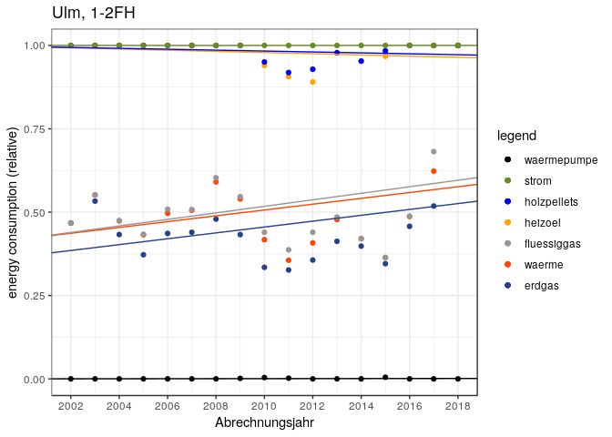

#### Save some of the graphs

#### Cumulative Energietraeger Anteile, simple line-plot:

``` r
ggplot()+geom_line(data=datawide,aes(x=abrechnungsjahr,y=get(et_list[1]),color=et_list[1])
)+geom_line(data=datawide,aes(x=abrechnungsjahr,y=get(et_list[2]),color=et_list[2])
)+geom_line(data=datawide,aes(x=abrechnungsjahr,y=get(et_list[3]),color=et_list[3])
)+geom_line(data=datawide,aes(x=abrechnungsjahr,y=get(et_list[4]),color=et_list[4])
)+geom_line(data=datawide,aes(x=abrechnungsjahr,y=get(et_list[5]),color=et_list[5])
)+geom_line(data=datawide,aes(x=abrechnungsjahr,y=get(et_list[6]),color=et_list[6])
)+geom_line(data=datawide,aes(x=abrechnungsjahr,y=get(et_list[7]),color=et_list[7])
)+scale_color_manual(name="legend",values=cols,breaks=rev(
c("erdgas","waerme","fluessiggas","heizoel","holzpellets","strom","waermepumpe"))) + labs(
x="Abrechnungsjahr",y="energy consumption (relative)",title="Ulm, 1-2FH")+theme_bw(
)+scale_x_continuous(breaks=seq(2002,2018,2))
```

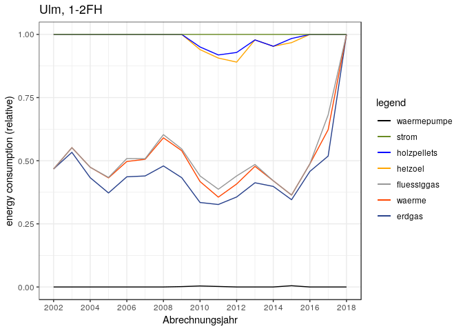

#### Cumulative Energietraeger Anteile, filled plot:

``` r
ggplot()+geom_line(data=datawide,aes(x=abrechnungsjahr,y=get(et_list[1]),color=et_list[1])
)+geom_line(data=datawide,aes(x=abrechnungsjahr,y=get(et_list[2]),color=et_list[2])
)+geom_line(data=datawide,aes(x=abrechnungsjahr,y=get(et_list[3]),color=et_list[3])
)+geom_line(data=datawide,aes(x=abrechnungsjahr,y=get(et_list[4]),color=et_list[4])
)+geom_line(data=datawide,aes(x=abrechnungsjahr,y=get(et_list[5]),color=et_list[5])
)+geom_line(data=datawide,aes(x=abrechnungsjahr,y=get(et_list[6]),color=et_list[6])
)+geom_line(data=datawide,aes(x=abrechnungsjahr,y=get(et_list[7]),color=et_list[7])
)+scale_color_manual(name=" ",values=cols,breaks=rev(
c("erdgas","waerme","fluessiggas","heizoel","holzpellets","strom","waermepumpe"))
)+geom_ribbon(data=datawide,aes(x=abrechnungsjahr,ymin=0,ymax=get(et_list[7])),fill=col_list[7]
)+geom_ribbon(data=datawide,aes(x=abrechnungsjahr,ymin=0,ymax=get(et_list[6])),fill=col_list[6]
)+geom_ribbon(data=datawide,aes(x=abrechnungsjahr,ymin=0,ymax=get(et_list[5])),fill=col_list[5]
)+geom_ribbon(data=datawide,aes(x=abrechnungsjahr,ymin=0,ymax=get(et_list[4])),fill=col_list[4]
)+geom_ribbon(data=datawide,aes(x=abrechnungsjahr,ymin=0,ymax=get(et_list[3])),fill=col_list[3]
)+geom_ribbon(data=datawide,aes(x=abrechnungsjahr,ymin=0,ymax=get(et_list[2])),fill=col_list[2]
)+geom_ribbon(data=datawide,aes(x=abrechnungsjahr,ymin=0,ymax=get(et_list[1])),fill=col_list[1])+theme_bw()+ labs(x="Abrechnungsjahr",y="energy consumption (relative)",title="Ulm, 1-2FH"
)+scale_x_continuous(breaks=seq(2002,2018,2))
```

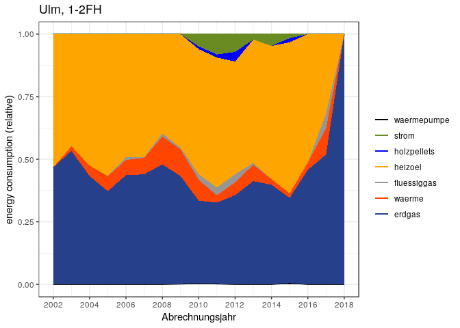

3. Now for the CO<sub>2</sub> emissions
---------------------------------------

### 3a. Find the mean spezifischer verbrauch for each year

**Important point: Take the `witterungsbereinigter spezifischer Verbrauch` in the next iteration instead of the raw numbers. Right I've just taken the raw numbers in the first iteration**

``` r
# point - take it for the witterungsbereinigt
#ulm_sfh_omit2018 <- ulm_sfh[ulm_sfh$abrechnungsjahr!=2018 , ]
#detach(package:ggplot2)
#detach(package:dplyr)
#detach(package:reshape2)
library(dplyr)
by_year <- group_by(ulm_sfh , abrechnungsjahr)
spz_verbrauch_mean <- as.data.frame(summarize(by_year,mean(verbrauch_gesamt_kwh_spez)))
names(spz_verbrauch_mean) <- c("abrechnungsjahr" , "mean_spz_verberauch")
#nutzflaeche_mean <- as.data.frame(summarize(by_year,mean(gebaeude_nutzflaeche)))
#names(nutzflaeche_mean) <- c("abrechnungsjahr" , "mean_nutzflaeche")
```

``` r
spz_verbrauch_mean
```

    ##    abrechnungsjahr mean_spz_verberauch
    ## 1             2002            189.0947
    ## 2             2003            190.7076
    ## 3             2004            194.8712
    ## 4             2005            179.1011
    ## 5             2006            170.9461
    ## 6             2007            169.5213
    ## 7             2008            163.7512
    ## 8             2009            166.5581
    ## 9             2010            156.2149
    ## 10            2011            158.5341
    ## 11            2012            144.2672
    ## 12            2013            152.0769
    ## 13            2014            166.4071
    ## 14            2015            141.8149
    ## 15            2016            146.5008
    ## 16            2017            146.3912
    ## 17            2018            120.3500

### 3b. Find the total area in Ulm - New Method from official data

`Wohngebaeude 2002 - 2018.xlsx` - the sheet `result` contains data on areas for each year.

``` r
totalArea <- read.table("wohngebaeude_2002_2018.txt",header=TRUE)
totalArea <- totalArea[ , c("abrechnungsjahr","totArea")]
totalArea
```

    ##    abrechnungsjahr totArea
    ## 1             2002 1828590
    ## 2             2003 1844057
    ## 3             2004 1864416
    ## 4             2005 1882860
    ## 5             2006 1901300
    ## 6             2007 1920586
    ## 7             2008 1926832
    ## 8             2009 1935717
    ## 9             2010 2031031
    ## 10            2011 2051682
    ## 11            2012 2063471
    ## 12            2013 2075502
    ## 13            2014 2100844
    ## 14            2015 2119416
    ## 15            2016 2139915
    ## 16            2017 2156116
    ## 17            2018 2189266

### 3c. Find the total energy consumption (total area times spezifischer verbrauch)

``` r
totalConsumption <- data.frame(abrechnungsjahr = 2002:2018,gesamtVerbrauch = totalArea$totArea*spz_verbrauch_mean$mean_spz_verberauch)
totalConsumption$inTWh <- totalConsumption$gesamtVerbrauch/1e9
totalConsumption
```

    ##    abrechnungsjahr gesamtVerbrauch     inTWh
    ## 1             2002       345776688 0.3457767
    ## 2             2003       351675692 0.3516757
    ## 3             2004       363320893 0.3633209
    ## 4             2005       337222283 0.3372223
    ## 5             2006       325019863 0.3250199
    ## 6             2007       325580151 0.3255802
    ## 7             2008       315521034 0.3155210
    ## 8             2009       322409387 0.3224094
    ## 9             2010       317277240 0.3172772
    ## 10            2011       325261541 0.3252615
    ## 11            2012       297691176 0.2976912
    ## 12            2013       315635979 0.3156360
    ## 13            2014       349595351 0.3495954
    ## 14            2015       300564822 0.3005648
    ## 15            2016       313499152 0.3134992
    ## 16            2017       315636358 0.3156364
    ## 17            2018       263478163 0.2634782

``` r
#ggplot()+geom_point(data=totalConsumption,aes(x=abrechnungsjahr,y=gesamtVerbrauch))+theme_bw()+labs(y="Energy consumption in kWh")
#ggplot()+geom_point(data=totalConsumption,aes(x=abrechnungsjahr,y=inTWh))+theme_bw()+labs(y="Energy consumption in TWh")
```

### 3d. Break up the total energy consumption according to the `energietraegers`

The shares are in the `final_prop_table`.

``` r
#final_prop_table_omit2018 <- final_prop_table[final_prop_table$abrechnungsjahr!=2018 , ]
is_not_year <- names(final_prop_table) != "abrechnungsjahr"
energy_shares_absolute <- totalConsumption$gesamtVerbrauch * final_prop_table[,is_not_year]
energy_shares_absolute$abrechnungsjahr <- 2002:2018
energy_shares_absolute
```

    ##    waermepumpe    erdgas   waerme fluessiggas   heizoel holzpellets
    ## 1          0.0 161625524        0         0.0 184151164           0
    ## 2          0.0 187487067  6519651         0.0 157668974           0
    ## 3          0.0 157220583 15041947         0.0 191058363           0
    ## 4          0.0 125529947 20163854    551333.5 190977148           0
    ## 5          0.0 141775819 19711769   3814773.2 159717501           0
    ## 6          0.0 143122734 21498429    779136.8 160179852           0
    ## 7          0.0 151207532 35132400   3965020.4 125216082           0
    ## 8     480302.0 139035961 34462544   2195910.2 146234670           0
    ## 9    1250304.5 104886668 26316752   7049417.8 158674313     3356354
    ## 10    657991.9 105565982  9486174  10163720.0 168946840     4004796
    ## 11         0.0 106076678 15313685   9499029.0 134174695    11370598
    ## 12         0.0 130235940 20531871   2320505.0 155685193           0
    ## 13         0.0 139218031  7812325         0.0 186159114           0
    ## 14   1474460.1 102371413  5545655         0.0 181410261     4918378
    ## 15         0.0 143419558  9351913         0.0 160727681           0
    ## 16         0.0 163630180 32986647  18539339.3 100480192           0
    ## 17         0.0 263478163        0         0.0         0           0
    ##       strom abrechnungsjahr
    ## 1         0            2002
    ## 2         0            2003
    ## 3         0            2004
    ## 4         0            2005
    ## 5         0            2006
    ## 6         0            2007
    ## 7         0            2008
    ## 8         0            2009
    ## 9  15743431            2010
    ## 10 26436037            2011
    ## 11 21256491            2012
    ## 12  6862469            2013
    ## 13 16405881            2014
    ## 14  4844655            2015
    ## 15        0            2016
    ## 16        0            2017
    ## 17        0            2018

### 3e. The CO<sub>2</sub> coefficients

I'm using the preliminary coefficients from <https://www.dropbox.com/s/j63ednj6tmzakou/4.3.2.15.3.%20CO2-Koeffizienten%202018.xlsx?dl=0>

I've saved the above as `MunichCO2Koeffizienten.txt`.

``` r
co2_coeff <- read.table("MunichCO2Koeffizienten.txt",header=TRUE)
names(co2_coeff) <- c("abrechnungsjahr","erdgas","waerme","fluessiggas","heizoel","holzpellets","strom")
co2_coeff
```

    ##    abrechnungsjahr erdgas waerme fluessiggas heizoel holzpellets strom
    ## 1             2002    203    156         230     266           6   654
    ## 2             2003    203    156         230     266           6   635
    ## 3             2004    203    156         230     266           6   615
    ## 4             2005    203    156         230     266           6   611
    ## 5             2006    203    156         230     266           6   604
    ## 6             2007    203    156         230     266           6   623
    ## 7             2008    203    156         230     266           6   584
    ## 8             2009    203    156         230     266           6   569
    ## 9             2010    203    156         234     266           6   559
    ## 10            2011    203    156         234     266           6   569
    ## 11            2012    203    156         234     266           6   574
    ## 12            2013    202    156         231     267           6   573
    ## 13            2014    201    156         229     268           6   559
    ## 14            2015    201    156         230     268           6   528
    ## 15            2016    201    156         230     268           6   516
    ## 16            2017    201    156         230     268           6   489
    ## 17            2018    201    156         230     268           6   467

The units for the above coefficients are *g*/*k**W**h*.

### 3f. The CO<sub>2</sub> emissions - coefficients × energy

``` r
co2_coeff_subset <- co2_coeff#[ , names(co2_coeff)!="waerme"]
co2_coeff_subset
```

    ##    abrechnungsjahr erdgas waerme fluessiggas heizoel holzpellets strom
    ## 1             2002    203    156         230     266           6   654
    ## 2             2003    203    156         230     266           6   635
    ## 3             2004    203    156         230     266           6   615
    ## 4             2005    203    156         230     266           6   611
    ## 5             2006    203    156         230     266           6   604
    ## 6             2007    203    156         230     266           6   623
    ## 7             2008    203    156         230     266           6   584
    ## 8             2009    203    156         230     266           6   569
    ## 9             2010    203    156         234     266           6   559
    ## 10            2011    203    156         234     266           6   569
    ## 11            2012    203    156         234     266           6   574
    ## 12            2013    202    156         231     267           6   573
    ## 13            2014    201    156         229     268           6   559
    ## 14            2015    201    156         230     268           6   528
    ## 15            2016    201    156         230     268           6   516
    ## 16            2017    201    156         230     268           6   489
    ## 17            2018    201    156         230     268           6   467

``` r
names(energy_shares_absolute)
```

    ## [1] "waermepumpe"     "erdgas"          "waerme"          "fluessiggas"    
    ## [5] "heizoel"         "holzpellets"     "strom"           "abrechnungsjahr"

``` r
names(co2_coeff_subset)
```

    ## [1] "abrechnungsjahr" "erdgas"          "waerme"          "fluessiggas"    
    ## [5] "heizoel"         "holzpellets"     "strom"

So you have to multiply the coefficents with the energy consumption:

``` r
###########multiply coefficients with energy consumption##################
# IT is very important that the names of the variables be the same (not 
#necessarily in the same order, but for example the erdgas in both should 
#be named erdgas, and not erdgas in one and Erdgas in another) in the 
#coefficients file and the consumption (energy_shares_absolute) file
#make same names:
#names(energy_shares_absolute)[names(energy_shares_absolute)=="fernwaerme"] <- "waerme"
#same names made
energy_shares_absolute_matchcoeff <- energy_shares_absolute[,names(co2_coeff_subset)]
energy_shares_absolute_matchcoeff
```

    ##    abrechnungsjahr    erdgas   waerme fluessiggas   heizoel holzpellets
    ## 1             2002 161625524        0         0.0 184151164           0
    ## 2             2003 187487067  6519651         0.0 157668974           0
    ## 3             2004 157220583 15041947         0.0 191058363           0
    ## 4             2005 125529947 20163854    551333.5 190977148           0
    ## 5             2006 141775819 19711769   3814773.2 159717501           0
    ## 6             2007 143122734 21498429    779136.8 160179852           0
    ## 7             2008 151207532 35132400   3965020.4 125216082           0
    ## 8             2009 139035961 34462544   2195910.2 146234670           0
    ## 9             2010 104886668 26316752   7049417.8 158674313     3356354
    ## 10            2011 105565982  9486174  10163720.0 168946840     4004796
    ## 11            2012 106076678 15313685   9499029.0 134174695    11370598
    ## 12            2013 130235940 20531871   2320505.0 155685193           0
    ## 13            2014 139218031  7812325         0.0 186159114           0
    ## 14            2015 102371413  5545655         0.0 181410261     4918378
    ## 15            2016 143419558  9351913         0.0 160727681           0
    ## 16            2017 163630180 32986647  18539339.3 100480192           0
    ## 17            2018 263478163        0         0.0         0           0
    ##       strom
    ## 1         0
    ## 2         0
    ## 3         0
    ## 4         0
    ## 5         0
    ## 6         0
    ## 7         0
    ## 8         0
    ## 9  15743431
    ## 10 26436037
    ## 11 21256491
    ## 12  6862469
    ## 13 16405881
    ## 14  4844655
    ## 15        0
    ## 16        0
    ## 17        0

``` r
co2_emissions <- (energy_shares_absolute_matchcoeff[,
          names(energy_shares_absolute_matchcoeff)!="abrechnungsjahr"])*co2_coeff_subset[,names(co2_coeff_subset)!="abrechnungsjahr"]
co2_emissions
```

    ##         erdgas     waerme fluessiggas     heizoel holzpellets       strom
    ## 1  32809981413          0           0 48984209632           0           0
    ## 2  38059874696 1017065542           0 41939947095           0           0
    ## 3  31915778442 2346543787           0 50821524453           0           0
    ## 4  25482579174 3145561279   126806708 50799921467           0           0
    ## 5  28780491278 3075036023   877397833 42484855252           0           0
    ## 6  29053914915 3353754852   179201475 42607840540           0           0
    ## 7  30695128925 5480654423   911954685 33307477727           0           0
    ## 8  28224300129 5376156801   505059345 38898422131           0           0
    ## 9  21291993629 4105413278  1649563761 42207367328    20138123  8800577965
    ## 10 21429894364 1479843188  2378310479 44939859320    24028778 15042104821
    ## 11 21533565615 2388934845  2222772790 35690468798    68223590 12201225719
    ## 12 26307659972 3202971895   536036666 41567946656           0  3932194851
    ## 13 27982824223 1218722624           0 49890642514           0  9170887749
    ## 14 20576653955  865122211           0 48617950052    29510266  2557977693
    ## 15 28827331255 1458898493           0 43075018384           0           0
    ## 16 32889666086 5145916949  4264048050 26928691419           0           0
    ## 17 52959110783          0           0           0           0           0

The above answer is in grams. Divide by 1e9 to get the answer in kilo tonnes.

``` r
co2_emissions_in_kilo_tons <- co2_emissions/1e9
co2_emissions_in_kilo_tons$abrechnungsjahr <- 2002:2018
co2_emissions_in_kilo_tons$total <- rowSums(co2_emissions_in_kilo_tons[,names(co2_emissions_in_kilo_tons)!="abrechnungsjahr"])
co2_emissions_in_kilo_tons
```

    ##      erdgas    waerme fluessiggas  heizoel holzpellets     strom
    ## 1  32.80998 0.0000000   0.0000000 48.98421  0.00000000  0.000000
    ## 2  38.05987 1.0170655   0.0000000 41.93995  0.00000000  0.000000
    ## 3  31.91578 2.3465438   0.0000000 50.82152  0.00000000  0.000000
    ## 4  25.48258 3.1455613   0.1268067 50.79992  0.00000000  0.000000
    ## 5  28.78049 3.0750360   0.8773978 42.48486  0.00000000  0.000000
    ## 6  29.05391 3.3537549   0.1792015 42.60784  0.00000000  0.000000
    ## 7  30.69513 5.4806544   0.9119547 33.30748  0.00000000  0.000000
    ## 8  28.22430 5.3761568   0.5050593 38.89842  0.00000000  0.000000
    ## 9  21.29199 4.1054133   1.6495638 42.20737  0.02013812  8.800578
    ## 10 21.42989 1.4798432   2.3783105 44.93986  0.02402878 15.042105
    ## 11 21.53357 2.3889348   2.2227728 35.69047  0.06822359 12.201226
    ## 12 26.30766 3.2029719   0.5360367 41.56795  0.00000000  3.932195
    ## 13 27.98282 1.2187226   0.0000000 49.89064  0.00000000  9.170888
    ## 14 20.57665 0.8651222   0.0000000 48.61795  0.02951027  2.557978
    ## 15 28.82733 1.4588985   0.0000000 43.07502  0.00000000  0.000000
    ## 16 32.88967 5.1459169   4.2640480 26.92869  0.00000000  0.000000
    ## 17 52.95911 0.0000000   0.0000000  0.00000  0.00000000  0.000000
    ##    abrechnungsjahr    total
    ## 1             2002 81.79419
    ## 2             2003 81.01689
    ## 3             2004 85.08385
    ## 4             2005 79.55487
    ## 5             2006 75.21778
    ## 6             2007 75.19471
    ## 7             2008 70.39522
    ## 8             2009 73.00394
    ## 9             2010 78.07505
    ## 10            2011 85.29404
    ## 11            2012 74.10519
    ## 12            2013 75.54681
    ## 13            2014 88.26308
    ## 14            2015 72.64721
    ## 15            2016 73.36125
    ## 16            2017 69.22832
    ## 17            2018 52.95911

### 3g. Total CO<sub>2</sub> emissions

``` r
linmod <- lm(data=co2_emissions_in_kilo_tons,formula=total~abrechnungsjahr)
a <- as.numeric(coefficients(linmod)[1])
b <- as.numeric(coefficients(linmod)[2])
if (a<0) {
  asign <- " "
} else {asign <- "+"}
if (b<0) {
  bsign <- " "
} else {bsign <- " "}
ggplot()+geom_line(data=co2_emissions_in_kilo_tons,aes(x=abrechnungsjahr,y=total),color="blue")+geom_point(data=co2_emissions_in_kilo_tons,aes(x=abrechnungsjahr,y=total),color="blue")+theme_bw()+labs(x="Abrechnungsjahr",y="co2 emissions (kilo tonnes)",title="Ulm, 1-2FH")+ylim(0,max(co2_emissions_in_kilo_tons$total))+geom_smooth(method="lm",data=co2_emissions_in_kilo_tons,aes(x=abrechnungsjahr,y=total),se=FALSE)+annotate(geom="text",label=paste0(bsign,as.character(round(b,2)),"x",asign,as.character(round(a,0))),x=2008,y=60)+scale_x_continuous(breaks=seq(2002,2018,2))
```

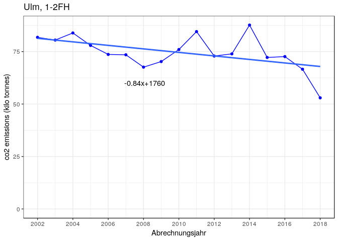

``` r
#https://stackoverflow.com/questions/15633714/adding-a-regression-line-on-a-ggplot  
#ggsave("total_co2_emission.jpg")
```

### 3h. CO<sub>2</sub> emissions according to energietraeger (absolute value):

``` r
co2cumsums <- co2_emissions_in_kilo_tons
#co2cumsums <- co2cumsums[,c("abrechnungsjahr","holzpellets","strom","fluessiggas","erdgas","heizoel")]
co2cumsums <- as.data.frame(t(apply(co2cumsums[,!(names(co2cumsums)%in%c("abrechnungsjahr","total"))],1,cumsum)))
co2cumsums$abrechnungsjahr <- 2002:2018
co2cumsums
```

    ##      erdgas   waerme fluessiggas  heizoel holzpellets    strom
    ## 1  32.80998 32.80998    32.80998 81.79419    81.79419 81.79419
    ## 2  38.05987 39.07694    39.07694 81.01689    81.01689 81.01689
    ## 3  31.91578 34.26232    34.26232 85.08385    85.08385 85.08385
    ## 4  25.48258 28.62814    28.75495 79.55487    79.55487 79.55487
    ## 5  28.78049 31.85553    32.73293 75.21778    75.21778 75.21778
    ## 6  29.05391 32.40767    32.58687 75.19471    75.19471 75.19471
    ## 7  30.69513 36.17578    37.08774 70.39522    70.39522 70.39522
    ## 8  28.22430 33.60046    34.10552 73.00394    73.00394 73.00394
    ## 9  21.29199 25.39741    27.04697 69.25434    69.27448 78.07505
    ## 10 21.42989 22.90974    25.28805 70.22791    70.25194 85.29404
    ## 11 21.53357 23.92250    26.14527 61.83574    61.90397 74.10519
    ## 12 26.30766 29.51063    30.04667 71.61462    71.61462 75.54681
    ## 13 27.98282 29.20155    29.20155 79.09219    79.09219 88.26308
    ## 14 20.57665 21.44178    21.44178 70.05973    70.08924 72.64721
    ## 15 28.82733 30.28623    30.28623 73.36125    73.36125 73.36125
    ## 16 32.88967 38.03558    42.29963 69.22832    69.22832 69.22832
    ## 17 52.95911 52.95911    52.95911 52.95911    52.95911 52.95911
    ##    abrechnungsjahr
    ## 1             2002
    ## 2             2003
    ## 3             2004
    ## 4             2005
    ## 5             2006
    ## 6             2007
    ## 7             2008
    ## 8             2009
    ## 9             2010
    ## 10            2011
    ## 11            2012
    ## 12            2013
    ## 13            2014
    ## 14            2015
    ## 15            2016
    ## 16            2017
    ## 17            2018

##### simple line curve:

``` r
ggplot()+geom_line(data=co2cumsums,aes(x=abrechnungsjahr,y=get(et_list[2]),color=et_list[2])
)+geom_line(data=co2cumsums,aes(x=abrechnungsjahr,y=get(et_list[3]),color=et_list[3])
)+geom_line(data=co2cumsums,aes(x=abrechnungsjahr,y=get(et_list[4]),color=et_list[4])
)+geom_line(data=co2cumsums,aes(x=abrechnungsjahr,y=get(et_list[5]),color=et_list[5])
)+geom_line(data=co2cumsums,aes(x=abrechnungsjahr,y=get(et_list[6]),color=et_list[6])
)+geom_line(data=co2cumsums,aes(x=abrechnungsjahr,y=get(et_list[7]),color=et_list[7])
)+scale_color_manual(name="legend",values=cols,breaks=rev(c("erdgas","waerme","fluessiggas","heizoel","holzpellets","strom"))) + labs(x="Abrechnungsjahr",y="co2 emissions (kilo tonnes)",title="Ulm, 1-2FH")+theme_bw()+scale_x_continuous(breaks=seq(2002,2018,2))
```

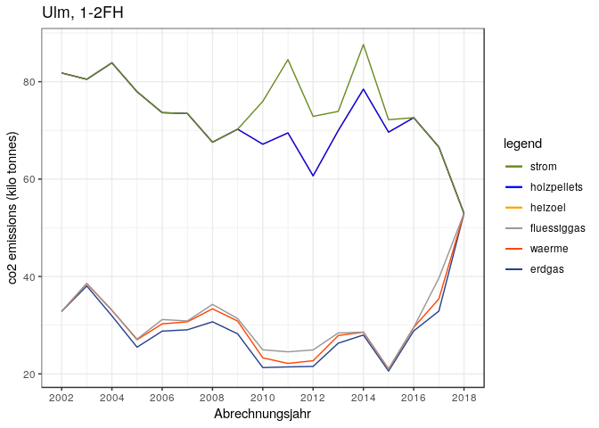

##### filled graph:

``` r
ggplot()+geom_line(data=co2cumsums,aes(x=abrechnungsjahr,y=get(et_list[2]),color=et_list[2])
)+geom_line(data=co2cumsums,aes(x=abrechnungsjahr,y=get(et_list[3]),color=et_list[3])
)+geom_line(data=co2cumsums,aes(x=abrechnungsjahr,y=get(et_list[4]),color=et_list[4])
)+geom_line(data=co2cumsums,aes(x=abrechnungsjahr,y=get(et_list[5]),color=et_list[5])
)+geom_line(data=co2cumsums,aes(x=abrechnungsjahr,y=get(et_list[6]),color=et_list[6])
)+geom_line(data=co2cumsums,aes(x=abrechnungsjahr,y=get(et_list[7]),color=et_list[7])
)+scale_color_manual(name=" ",values=cols,breaks=rev(c("erdgas","waerme","fluessiggas","heizoel","holzpellets","strom"))
)+geom_ribbon(data=co2cumsums,aes(x=abrechnungsjahr,ymin=0,ymax=get(et_list[7])),fill=col_list[7]
)+geom_ribbon(data=co2cumsums,aes(x=abrechnungsjahr,ymin=0,ymax=get(et_list[6])),fill=col_list[6]
)+geom_ribbon(data=co2cumsums,aes(x=abrechnungsjahr,ymin=0,ymax=get(et_list[5])),fill=col_list[5]
)+geom_ribbon(data=co2cumsums,aes(x=abrechnungsjahr,ymin=0,ymax=get(et_list[4])),fill=col_list[4]
)+geom_ribbon(data=co2cumsums,aes(x=abrechnungsjahr,ymin=0,ymax=get(et_list[3])),fill=col_list[3]
)+geom_ribbon(data=co2cumsums,aes(x=abrechnungsjahr,ymin=0,ymax=get(et_list[2])),fill=col_list[2]
)+theme_bw()+ labs(x="Abrechnungsjahr",y="co2 emissions (kilo tonnes)",title="Ulm, 1-2FH")+scale_x_continuous(breaks=seq(2002,2018,2))
```

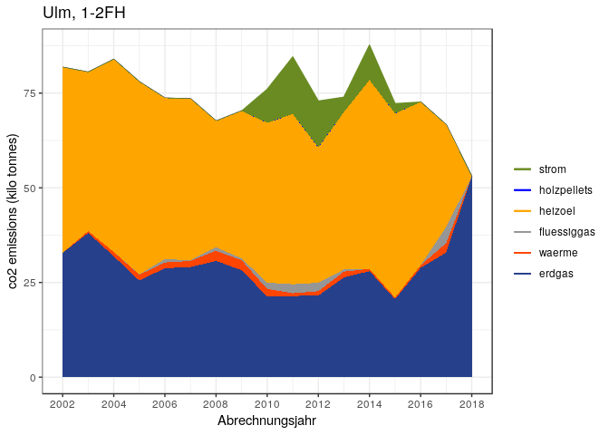

``` r
#ggsave("co2emissions_absolute.jpg")
```

### 3i. relative shares of CO<sub>2</sub> emissions according to energietraeger

**do the witterungsbereinigung later. 1. first address these issues: Area in 2018 (see email from Johannes) and 2. the skype chat regarding waerme, fernwaerme and nahwaerme and 3. linearizing the graphs**

``` r
co2anteile_cumsums <- as.data.frame(sapply(co2cumsums[,names(co2cumsums)!="abrechnungsjahr"] , function(obj) obj/co2cumsums$strom))
co2anteile_cumsums$abrechnungsjahr <- 2002:2018
co2anteile_cumsums
```

    ##       erdgas    waerme fluessiggas   heizoel holzpellets strom
    ## 1  0.4011285 0.4011285   0.4011285 1.0000000   1.0000000     1
    ## 2  0.4697771 0.4823308   0.4823308 1.0000000   1.0000000     1
    ## 3  0.3751097 0.4026889   0.4026889 1.0000000   1.0000000     1
    ## 4  0.3203145 0.3598540   0.3614480 1.0000000   1.0000000     1
    ## 5  0.3826288 0.4235106   0.4351754 1.0000000   1.0000000     1
    ## 6  0.3863824 0.4309834   0.4333665 1.0000000   1.0000000     1
    ## 7  0.4360400 0.5138955   0.5268503 1.0000000   1.0000000     1
    ## 8  0.3866134 0.4602554   0.4671736 1.0000000   1.0000000     1
    ## 9  0.2727119 0.3252948   0.3464227 0.8870226   0.8872805     1
    ## 10 0.2512473 0.2685972   0.2964808 0.8233624   0.8236441     1
    ## 11 0.2905811 0.3228181   0.3528130 0.8344320   0.8353526     1
    ## 12 0.3482299 0.3906271   0.3977225 0.9479502   0.9479502     1
    ## 13 0.3170388 0.3308467   0.3308467 0.8960960   0.8960960     1
    ## 14 0.2832408 0.2951493   0.2951493 0.9643828   0.9647890     1
    ## 15 0.3929504 0.4128369   0.4128369 1.0000000   1.0000000     1
    ## 16 0.4750897 0.5494223   0.6110163 1.0000000   1.0000000     1
    ## 17 1.0000000 1.0000000   1.0000000 1.0000000   1.0000000     1
    ##    abrechnungsjahr
    ## 1             2002
    ## 2             2003
    ## 3             2004
    ## 4             2005
    ## 5             2006
    ## 6             2007
    ## 7             2008
    ## 8             2009
    ## 9             2010
    ## 10            2011
    ## 11            2012
    ## 12            2013
    ## 13            2014
    ## 14            2015
    ## 15            2016
    ## 16            2017
    ## 17            2018

``` r
ggplot()+geom_line(data=co2anteile_cumsums,aes(x=abrechnungsjahr,y=get(et_list[2]),color=et_list[2])
)+geom_line(data=co2anteile_cumsums,aes(x=abrechnungsjahr,y=get(et_list[3]),color=et_list[3])
)+geom_line(data=co2anteile_cumsums,aes(x=abrechnungsjahr,y=get(et_list[4]),color=et_list[4])
)+geom_line(data=co2anteile_cumsums,aes(x=abrechnungsjahr,y=get(et_list[5]),color=et_list[5])
)+geom_line(data=co2anteile_cumsums,aes(x=abrechnungsjahr,y=get(et_list[6]),color=et_list[6])
)+geom_line(data=co2anteile_cumsums,aes(x=abrechnungsjahr,y=get(et_list[7]),color=et_list[7])
)+scale_color_manual(name=" ",values=cols,breaks=rev(c("erdgas","waerme","fluessiggas","heizoel","holzpellets","strom"))
)+geom_ribbon(data=co2anteile_cumsums,aes(x=abrechnungsjahr,ymin=0,ymax=get(et_list[7])),fill=col_list[7]
)+geom_ribbon(data=co2anteile_cumsums,aes(x=abrechnungsjahr,ymin=0,ymax=get(et_list[6])),fill=col_list[6]
)+geom_ribbon(data=co2anteile_cumsums,aes(x=abrechnungsjahr,ymin=0,ymax=get(et_list[5])),fill=col_list[5]
)+geom_ribbon(data=co2anteile_cumsums,aes(x=abrechnungsjahr,ymin=0,ymax=get(et_list[4])),fill=col_list[4]
)+geom_ribbon(data=co2anteile_cumsums,aes(x=abrechnungsjahr,ymin=0,ymax=get(et_list[3])),fill=col_list[3]
)+geom_ribbon(data=co2anteile_cumsums,aes(x=abrechnungsjahr,ymin=0,ymax=get(et_list[2])),fill=col_list[2]
)+theme_bw()+ labs(x="Abrechnungsjahr",y="co2 emissions (relative)",title="Ulm, 1-2FH")+scale_x_continuous(breaks=seq(2002,2018,2))
```


``` r
#ggsave("co2emissions_relative.jpg")
```

### changing the order of items in the legend:

``` r
ggplot()+geom_line(data=co2anteile_cumsums,aes(x=abrechnungsjahr,y=get(et_list[2]),color=et_list[2])
)+geom_line(data=co2anteile_cumsums,aes(x=abrechnungsjahr,y=get(et_list[3]),color=et_list[3])
)+geom_line(data=co2anteile_cumsums,aes(x=abrechnungsjahr,y=get(et_list[4]),color=et_list[4])
)+geom_line(data=co2anteile_cumsums,aes(x=abrechnungsjahr,y=get(et_list[5]),color=et_list[5])
)+geom_line(data=co2anteile_cumsums,aes(x=abrechnungsjahr,y=get(et_list[6]),color=et_list[6])
)+geom_line(data=co2anteile_cumsums,aes(x=abrechnungsjahr,y=get(et_list[7]),color=et_list[7])
)+scale_color_manual(name=" ",values=cols,breaks=rev(c("erdgas","waerme","fluessiggas","heizoel","holzpellets","strom"))
)+geom_ribbon(data=co2anteile_cumsums,aes(x=abrechnungsjahr,ymin=0,ymax=get(et_list[7])),fill=col_list[7]
)+geom_ribbon(data=co2anteile_cumsums,aes(x=abrechnungsjahr,ymin=0,ymax=get(et_list[6])),fill=col_list[6]
)+geom_ribbon(data=co2anteile_cumsums,aes(x=abrechnungsjahr,ymin=0,ymax=get(et_list[5])),fill=col_list[5]
)+geom_ribbon(data=co2anteile_cumsums,aes(x=abrechnungsjahr,ymin=0,ymax=get(et_list[4])),fill=col_list[4]
)+geom_ribbon(data=co2anteile_cumsums,aes(x=abrechnungsjahr,ymin=0,ymax=get(et_list[3])),fill=col_list[3]
)+geom_ribbon(data=co2anteile_cumsums,aes(x=abrechnungsjahr,ymin=0,ymax=get(et_list[2])),fill=col_list[2]
)+theme_bw()+ labs(x="Abrechnungsjahr",y="co2 emissions (relative)",title="Ulm, 1-2FH")+scale_x_continuous(breaks=seq(2002,2018,2))
```

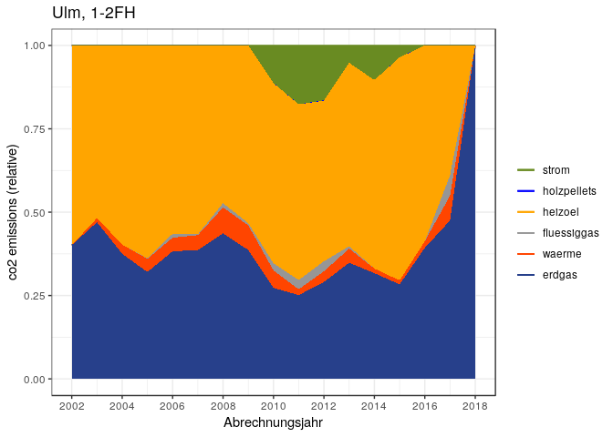

``` r
#ggsave("04_co2emissions_proportions_rawdata.jpg")
```

### 3j. Specific CO<sub>2</sub> emissions

Now we calculate the total CO<sub>2</sub> emissions per square meter for each year in kg/m<sup>2</sup>

``` r
spez_co2_emission <- data.frame(abrechnungsjahr = 2002:2018 , spez_co2 = 0.001*rowSums(co2_emissions)/totalArea$totArea)
spez_co2_emission
```

    ##    abrechnungsjahr spez_co2
    ## 1             2002 44.73074
    ## 2             2003 43.93405
    ## 3             2004 45.63566
    ## 4             2005 42.25214
    ## 5             2006 39.56124
    ## 6             2007 39.15196
    ## 7             2008 36.53417
    ## 8             2009 37.71416
    ## 9             2010 38.44109
    ## 10            2011 41.57274
    ## 11            2012 35.91288
    ## 12            2013 36.39930
    ## 13            2014 42.01315
    ## 14            2015 34.27700
    ## 15            2016 34.28232
    ## 16            2017 32.10788
    ## 17            2018 24.19035

``` r
linmod_spez <- lm(data=spez_co2_emission,formula=spez_co2~abrechnungsjahr)
a_spez <- as.numeric(coefficients(linmod_spez)[1])
b_spez <- as.numeric(coefficients(linmod_spez)[2])
if (a_spez<0) {
  asign_spez <- " "
} else {asign_spez <- "+"}
if (b_spez<0) {
  bsign_spez <- " "
} else {bsign_spez <- " "}
ggplot()+geom_line(data=spez_co2_emission,aes(x=abrechnungsjahr,y=spez_co2),color="blue")+geom_point(
  data=spez_co2_emission,aes(x=abrechnungsjahr,y=spez_co2),color="blue")+theme_bw()+labs(x="Abrechnungsjahr",
  y="co2 emissions (kg/sq. m)",title="Ulm, 1-2FH")+ylim(0,max(spez_co2_emission$spez_co2))+geom_smooth(
  method="lm",data=spez_co2_emission,aes(x=abrechnungsjahr,y=spez_co2),se=FALSE)+annotate(
  geom="text",label=paste0(bsign_spez,as.character(round(b_spez,2)),"x",asign_spez,as.character(round(a_spez,0))
  ),x=2008,y=30)+scale_x_continuous(breaks=seq(2002,2018,2))
```

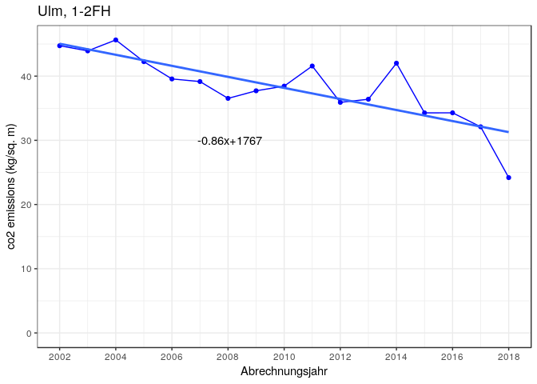

Make linear trends
==================

-   for co2 emissions absolute and relative.

-   show both the points and linear fits for the absolute in one graph and relative in another.

-   Then show the fills for the linear trends- one in absolute and one in relative

`co2anteile_cumsums` and `co2cumsums`

``` r
co2cumsums
```

    ##      erdgas   waerme fluessiggas  heizoel holzpellets    strom
    ## 1  32.80998 32.80998    32.80998 81.79419    81.79419 81.79419
    ## 2  38.05987 39.07694    39.07694 81.01689    81.01689 81.01689
    ## 3  31.91578 34.26232    34.26232 85.08385    85.08385 85.08385
    ## 4  25.48258 28.62814    28.75495 79.55487    79.55487 79.55487
    ## 5  28.78049 31.85553    32.73293 75.21778    75.21778 75.21778
    ## 6  29.05391 32.40767    32.58687 75.19471    75.19471 75.19471
    ## 7  30.69513 36.17578    37.08774 70.39522    70.39522 70.39522
    ## 8  28.22430 33.60046    34.10552 73.00394    73.00394 73.00394
    ## 9  21.29199 25.39741    27.04697 69.25434    69.27448 78.07505
    ## 10 21.42989 22.90974    25.28805 70.22791    70.25194 85.29404
    ## 11 21.53357 23.92250    26.14527 61.83574    61.90397 74.10519
    ## 12 26.30766 29.51063    30.04667 71.61462    71.61462 75.54681
    ## 13 27.98282 29.20155    29.20155 79.09219    79.09219 88.26308
    ## 14 20.57665 21.44178    21.44178 70.05973    70.08924 72.64721
    ## 15 28.82733 30.28623    30.28623 73.36125    73.36125 73.36125
    ## 16 32.88967 38.03558    42.29963 69.22832    69.22832 69.22832
    ## 17 52.95911 52.95911    52.95911 52.95911    52.95911 52.95911
    ##    abrechnungsjahr
    ## 1             2002
    ## 2             2003
    ## 3             2004
    ## 4             2005
    ## 5             2006
    ## 6             2007
    ## 7             2008
    ## 8             2009
    ## 9             2010
    ## 10            2011
    ## 11            2012
    ## 12            2013
    ## 13            2014
    ## 14            2015
    ## 15            2016
    ## 16            2017
    ## 17            2018

``` r
co2anteile_cumsums
```

    ##       erdgas    waerme fluessiggas   heizoel holzpellets strom
    ## 1  0.4011285 0.4011285   0.4011285 1.0000000   1.0000000     1
    ## 2  0.4697771 0.4823308   0.4823308 1.0000000   1.0000000     1
    ## 3  0.3751097 0.4026889   0.4026889 1.0000000   1.0000000     1
    ## 4  0.3203145 0.3598540   0.3614480 1.0000000   1.0000000     1
    ## 5  0.3826288 0.4235106   0.4351754 1.0000000   1.0000000     1
    ## 6  0.3863824 0.4309834   0.4333665 1.0000000   1.0000000     1
    ## 7  0.4360400 0.5138955   0.5268503 1.0000000   1.0000000     1
    ## 8  0.3866134 0.4602554   0.4671736 1.0000000   1.0000000     1
    ## 9  0.2727119 0.3252948   0.3464227 0.8870226   0.8872805     1
    ## 10 0.2512473 0.2685972   0.2964808 0.8233624   0.8236441     1
    ## 11 0.2905811 0.3228181   0.3528130 0.8344320   0.8353526     1
    ## 12 0.3482299 0.3906271   0.3977225 0.9479502   0.9479502     1
    ## 13 0.3170388 0.3308467   0.3308467 0.8960960   0.8960960     1
    ## 14 0.2832408 0.2951493   0.2951493 0.9643828   0.9647890     1
    ## 15 0.3929504 0.4128369   0.4128369 1.0000000   1.0000000     1
    ## 16 0.4750897 0.5494223   0.6110163 1.0000000   1.0000000     1
    ## 17 1.0000000 1.0000000   1.0000000 1.0000000   1.0000000     1
    ##    abrechnungsjahr
    ## 1             2002
    ## 2             2003
    ## 3             2004
    ## 4             2005
    ## 5             2006
    ## 6             2007
    ## 7             2008
    ## 8             2009
    ## 9             2010
    ## 10            2011
    ## 11            2012
    ## 12            2013
    ## 13            2014
    ## 14            2015
    ## 15            2016
    ## 16            2017
    ## 17            2018

``` r
#co2cumsums
#co2anteile_cumsums
et_list_2 <- names(co2cumsums)[names(co2cumsums)!="abrechnungsjahr"]
co2cumsums_linear <- co2cumsums
storage_co2 <- list()
for (et in et_list_2) {
  storage_co2[[et]] <- lm(get(et) ~ abrechnungsjahr , data = co2cumsums)
}
for (et in et_list_2) {
  #colname <- paste0(et,"_lm")
  co2cumsums_linear[[et]] <- predict(storage_co2[[et]] , newdata = co2cumsums)
}


storage_co2_anteile <- list()
co2anteile_cumsums_linear <- co2anteile_cumsums
for (et in et_list_2) {
  storage_co2_anteile[[et]] <- lm(get(et) ~ abrechnungsjahr , data = co2anteile_cumsums)
}
for (et in et_list_2) {
  #colname <- paste0(et,"_lm")
  co2anteile_cumsums_linear[[et]] <- predict(storage_co2_anteile[[et]] , newdata = co2anteile_cumsums)
}
```

``` r
slopes_co2 <- NULL
intercepts_co2 <- NULL
for (et in et_list_2) {
  intercepts_co2 <- c(intercepts_co2 , as.numeric(coefficients(storage_co2[[et]])[1]))
  slopes_co2     <-     c(slopes_co2 , as.numeric(coefficients(storage_co2[[et]])[2]))
}
slopes_co2_anteile <- NULL
intercepts_co2_anteile <- NULL
for (et in et_list_2) {
  intercepts_co2_anteile <- c(intercepts_co2_anteile , as.numeric(coefficients(storage_co2_anteile[[et]])[1]))
  slopes_co2_anteile     <- c(slopes_co2_anteile , as.numeric(coefficients(storage_co2_anteile[[et]])[2]))
}
```

``` r
require(ggplot2)
ggplot()+geom_point(data=co2cumsums,aes(x=abrechnungsjahr,y=get(et_list[2]),color=et_list[2])
)+geom_point(data=co2cumsums,aes(x=abrechnungsjahr,y=get(et_list[3]),color=et_list[3])
)+geom_point(data=co2cumsums,aes(x=abrechnungsjahr,y=get(et_list[4]),color=et_list[4])
)+geom_point(data=co2cumsums,aes(x=abrechnungsjahr,y=get(et_list[5]),color=et_list[5])
)+geom_point(data=co2cumsums,aes(x=abrechnungsjahr,y=get(et_list[6]),color=et_list[6])
)+geom_point(data=co2cumsums,aes(x=abrechnungsjahr,y=get(et_list[7]),color=et_list[7])
)+geom_abline(intercept=intercepts_co2[1],slope=slopes_co2[1],colour=col_list[2]
)+geom_abline(intercept=intercepts_co2[2],slope=slopes_co2[2],colour=col_list[3]
)+geom_abline(intercept=intercepts_co2[3],slope=slopes_co2[3],colour=col_list[4]
)+geom_abline(intercept=intercepts_co2[4],slope=slopes_co2[4],colour=col_list[5]
)+geom_abline(intercept=intercepts_co2[5],slope=slopes_co2[5],colour=col_list[6]
)+geom_abline(intercept=intercepts_co2[6],slope=slopes_co2[6],colour=col_list[7]
)+labs(x="Abrechnungsjahr",y="co2 emissions (kilo tonnes)"
)+scale_color_manual(name=" ",values=cols,breaks=rev(c("erdgas","waerme","fluessiggas","heizoel","holzpellets","strom"))) + theme_bw()+scale_x_continuous(breaks=seq(2002,2018,2))
```

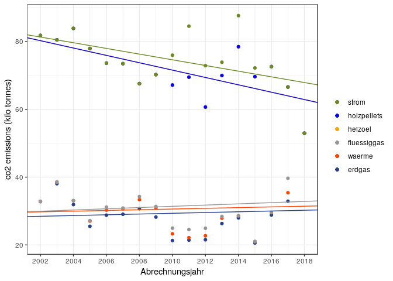

``` r
ggsave("co2emissions_absolute_real_and_linearized.jpg")
```

``` r
require(ggplot2)
ggplot()+geom_point(data=co2anteile_cumsums,aes(x=abrechnungsjahr,y=get(et_list[2]),color=et_list[2])
)+geom_point(data=co2anteile_cumsums,aes(x=abrechnungsjahr,y=get(et_list[3]),color=et_list[3])
)+geom_point(data=co2anteile_cumsums,aes(x=abrechnungsjahr,y=get(et_list[4]),color=et_list[4])
)+geom_point(data=co2anteile_cumsums,aes(x=abrechnungsjahr,y=get(et_list[5]),color=et_list[5])
)+geom_point(data=co2anteile_cumsums,aes(x=abrechnungsjahr,y=get(et_list[6]),color=et_list[6])
)+geom_point(data=co2anteile_cumsums,aes(x=abrechnungsjahr,y=get(et_list[7]),color=et_list[7])
)+geom_abline(intercept=intercepts_co2_anteile[1],slope=slopes_co2_anteile[1],colour=col_list[2]
)+geom_abline(intercept=intercepts_co2_anteile[2],slope=slopes_co2_anteile[2],colour=col_list[3]
)+geom_abline(intercept=intercepts_co2_anteile[3],slope=slopes_co2_anteile[3],colour=col_list[4]
)+geom_abline(intercept=intercepts_co2_anteile[4],slope=slopes_co2_anteile[4],colour=col_list[5]
)+geom_abline(intercept=intercepts_co2_anteile[5],slope=slopes_co2_anteile[5],colour=col_list[6]
)+geom_abline(intercept=intercepts_co2_anteile[6],slope=slopes_co2_anteile[6],colour=col_list[7]
)+labs(x="Abrechnungsjahr",y="co2 emissions (relative)"
)+scale_color_manual(name=" ",values=cols,breaks=rev(c("erdgas","waerme","fluessiggas","heizoel","holzpellets","strom"))) + theme_bw()+scale_x_continuous(breaks=seq(2002,2018,2))
```

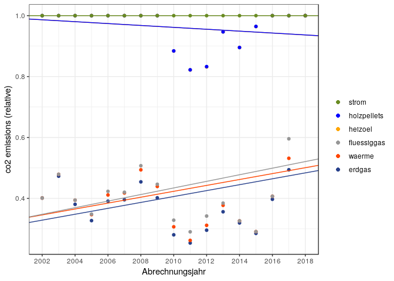

``` r
ggsave("co2emissions_absolute_real_and_linearized.jpg")
```

Graph of linear trends of absolute CO<sub>2</sub> emissions:
------------------------------------------------------------

``` r
ggplot()+geom_line(data=co2cumsums_linear,aes(x=abrechnungsjahr,y=get(et_list[2]),color=et_list[2])
)+geom_line(data=co2cumsums_linear,aes(x=abrechnungsjahr,y=get(et_list[3]),color=et_list[3])
)+geom_line(data=co2cumsums_linear,aes(x=abrechnungsjahr,y=get(et_list[4]),color=et_list[4])
)+geom_line(data=co2cumsums_linear,aes(x=abrechnungsjahr,y=get(et_list[5]),color=et_list[5])
)+geom_line(data=co2cumsums_linear,aes(x=abrechnungsjahr,y=get(et_list[6]),color=et_list[6])
)+geom_line(data=co2cumsums_linear,aes(x=abrechnungsjahr,y=get(et_list[7]),color=et_list[7])
)+scale_color_manual(name=" ",values=cols,breaks=rev(c("erdgas","waerme","fluessiggas","heizoel","holzpellets","strom"))
)+geom_ribbon(data=co2cumsums_linear,aes(x=abrechnungsjahr,ymin=0,ymax=get(et_list[7])),fill=col_list[7]
)+geom_ribbon(data=co2cumsums_linear,aes(x=abrechnungsjahr,ymin=0,ymax=get(et_list[6])),fill=col_list[6]
)+geom_ribbon(data=co2cumsums_linear,aes(x=abrechnungsjahr,ymin=0,ymax=get(et_list[5])),fill=col_list[5]
)+geom_ribbon(data=co2cumsums_linear,aes(x=abrechnungsjahr,ymin=0,ymax=get(et_list[4])),fill=col_list[4]
)+geom_ribbon(data=co2cumsums_linear,aes(x=abrechnungsjahr,ymin=0,ymax=get(et_list[3])),fill=col_list[3]
)+geom_ribbon(data=co2cumsums_linear,aes(x=abrechnungsjahr,ymin=0,ymax=get(et_list[2])),fill=col_list[2]
)+theme_bw()+ labs(x="Abrechnungsjahr",y="linearized co2 emissions (kilo tonnes)",title="Ulm, 1-2FH")+scale_x_continuous(breaks=seq(2002,2018,2))
```

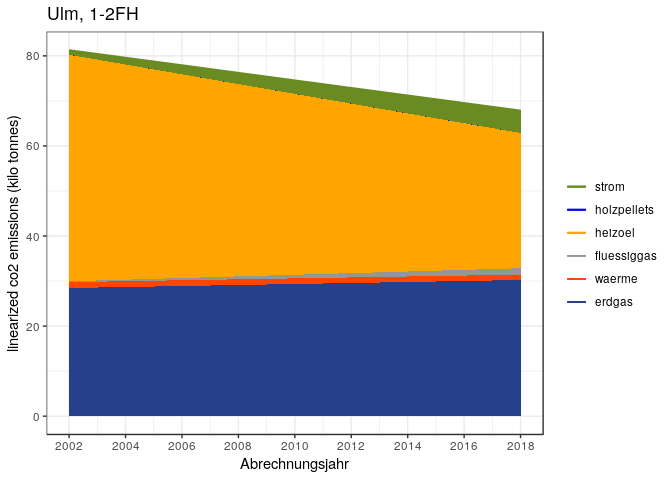

``` r
#ggsave("co2emissions_absolute_linearized.jpg")
```

Graph of linear trends of relative CO<sub>2</sub> emissions:
------------------------------------------------------------

``` r
ggplot()+geom_line(data=co2anteile_cumsums_linear,aes(x=abrechnungsjahr,y=get(et_list[2]),color=et_list[2])
)+geom_line(data=co2anteile_cumsums_linear,aes(x=abrechnungsjahr,y=get(et_list[3]),color=et_list[3])
)+geom_line(data=co2anteile_cumsums_linear,aes(x=abrechnungsjahr,y=get(et_list[4]),color=et_list[4])
)+geom_line(data=co2anteile_cumsums_linear,aes(x=abrechnungsjahr,y=get(et_list[5]),color=et_list[5])
)+geom_line(data=co2anteile_cumsums_linear,aes(x=abrechnungsjahr,y=get(et_list[6]),color=et_list[6])
)+geom_line(data=co2anteile_cumsums_linear,aes(x=abrechnungsjahr,y=get(et_list[7]),color=et_list[7])
)+scale_color_manual(name=" ",values=cols,breaks=rev(c("erdgas","waerme","fluessiggas","heizoel","holzpellets","strom"))
)+geom_ribbon(data=co2anteile_cumsums_linear,aes(x=abrechnungsjahr,ymin=0,ymax=get(et_list[7])),fill=col_list[7]
)+geom_ribbon(data=co2anteile_cumsums_linear,aes(x=abrechnungsjahr,ymin=0,ymax=get(et_list[6])),fill=col_list[6]
)+geom_ribbon(data=co2anteile_cumsums_linear,aes(x=abrechnungsjahr,ymin=0,ymax=get(et_list[5])),fill=col_list[5]
)+geom_ribbon(data=co2anteile_cumsums_linear,aes(x=abrechnungsjahr,ymin=0,ymax=get(et_list[4])),fill=col_list[4]
)+geom_ribbon(data=co2anteile_cumsums_linear,aes(x=abrechnungsjahr,ymin=0,ymax=get(et_list[3])),fill=col_list[3]
)+geom_ribbon(data=co2anteile_cumsums_linear,aes(x=abrechnungsjahr,ymin=0,ymax=get(et_list[2])),fill=col_list[2]
)+theme_bw()+ labs(x="Abrechnungsjahr",y="linearized co2 emissions (relative)",title="Ulm, 1-2FH")+scale_x_continuous(breaks=seq(2002,2018,2))
```

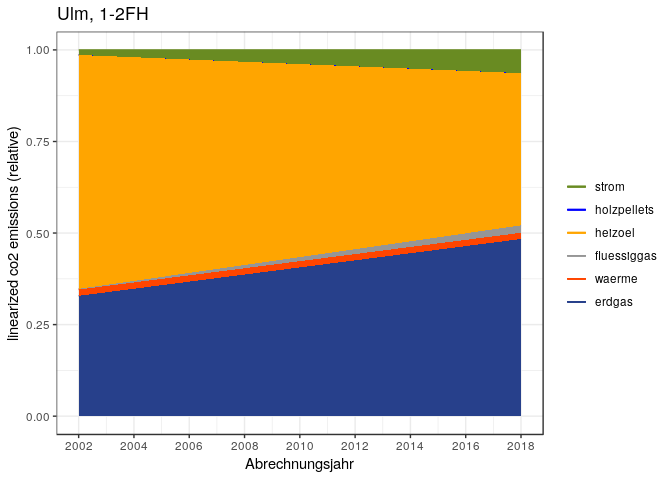

``` r
#ggsave("co2emissions_relative_linearized.jpg")
```

Save the data
-------------

``` r
write.csv(final_prop_table , file = "./data/ulm/sfh/ET_anteile_verbrauch.csv") #comes from co2online data
write.csv(spz_verbrauch_mean , file = "./data/ulm/sfh/spz_verbrauch.csv")      #comes from co2online data
# total area: wohngebaeude_2002_2018.txt contains the total area
write.csv(totalConsumption , file = "./data/ulm/sfh/gesamt_verbrauch.csv")     #comes from co2online and area data
write.csv(co2_emissions_in_kilo_tons , file = "./data/ulm/sfh/co2_emissions_kilo_tons.csv") #comes from co2online, coeff. and area data
```

<https://ggplot2.tidyverse.org/reference/scale_manual.html> <https://stackoverflow.com/questions/14762181/adding-a-y-axis-label-to-secondary-y-axis-in-matplotlib>
